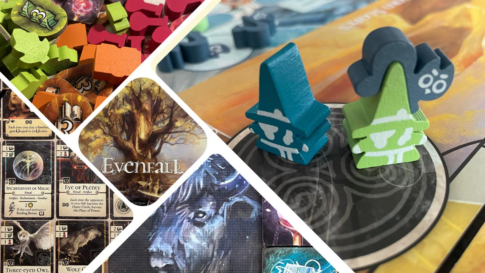

<InterviewIntro>
Il suo Evenfall si è fatto apprezzare per le meccaniche fresche e le sinergie, e ce lo ha fatto conoscere come un promettente autore nostrano; la sua passione per Magic lo ha instradato; la fiducia di Ghenos Games lo ha consacrato.
</InterviewIntro>

<InterviewItem type="question">
Please, state your name for the record. Ovvero, chi è veramente (ma veramente) Stefano Di Silvio?
</InterviewItem>

<InterviewItem type="answer" name="SD">
Mi chiamo Stefano, sono abruzzese ma vivo a Vienna da 10 anni. Sono un classico nerd degli anni ‘90, cresciuto a musica metal, film fantasy e, ovviamente, giochi di carte e da tavolo.
</InterviewItem>

<InterviewItem type="question">
Come nasce esattamente la tua passione per i giochi da tavolo?
</InterviewItem>

<InterviewItem type="answer" name="SD">
Probabilmente la curiosità per il gioco è cominciata con le partite a carte in famiglia durante le feste di natale, per poi realizzarsi come vera e propria passione grazie ai giochi di carte collezionabili durante l’adolescenza. Da Magic sono poi passato ai giochi di ruolo (soprattutto il nostrano Sine Requie), fino a comprare il mio primo gioco da tavolo “moderno” nei primi anni dell’università.
</InterviewItem>

<InterviewItem type="question">
Quanto è stato importante (se lo è stato) per la tua esperienza di creatore Magic e perché.
</InterviewItem>

<InterviewItem type="answer" name="SD">
Magic: The Gathering è stato un gioco fondamentale per la mia formazione, come per tanti autori di giochi. È un ecosistema che ti permette di sperimentare e prendere decisioni “da game designer” senza doverti preoccupare dei sistemi profondi. Durante la creazione del mazzo, non si fa altro che progettarne il funzionamento tramite la scelta delle carte. Proprio come un prototipo, il mazzo deve essere poi testato e migliorato in base alla sua performance. Magic mi ha quindi fornito – in maniera quasi accidentale – delle buone basi di game design.
</InterviewItem>

<InterviewItem type="question">
Cosa ti ha dato l’idea per Evenfall?
</InterviewItem>

<InterviewItem type="answer" name="SD">
 Stavo lavorando ad un altro gioco, stile dudes on a map, quando mi sono accorto che molti aspetti di quell’idea si sarebbero potuti trasporre bene in un gioco di carte. In particolare, l’idea di uno sviluppo su tre fasi (che divenne poi la struttura Posto del Potere – Rituale – Catalizzatore) mi sembrò una buona meccanica di partenza per generare un senso di soddisfazione nel giocatore.
</InterviewItem>

<InterviewItem type="question">
 Come si struttura un gioco del genere? Quanto playtest serve e come si fa a capire se i playtester stanno davvero andando a caccia di bug o esplorando tutte le possibilità tattico-strategiche?
</InterviewItem>

<InterviewItem type="answer" name="SD">
 Riguardo alla struttura del gioco, ogni autore ha un proprio processo. Alcuni partono da una meccanica senza grandi fondamenta e ci disegnano il gioco intorno, test dopo test. A me piace pianificare molto in partenza e fissare in anticipo i punti cardine dell’esperienza di gioco che intendo raggiungere: qual è l’obiettivo del gioco? Che tipo di sequenza di turno deve avere? Quali meccanismi psicologici deve andare a stimolare per essere divertente e soddisfacente? Il mio processo è più lento a partire ma risparmia un po’ di frustrazione nelle fasi successive.  
Ovviamente ci vogliono tanti playtest. Portare un prototipo ad essere un gioco da 7/10 non è troppo difficile in realtà. La sfida sta nel fare il salto di qualità. Quello è un processo molto più lungo, a cui segue poi la fase di bilanciamento che richiede ancora più test, praticamente in modalità grind. 
Riguardo ai playtester, bisogna saper riconoscere che ce ne sono di diversi tipi. C’è chi gioca per esplorare le possibilità del gioco, chi cerca di rompere i sistemi, chi semplicemente per divertirsi. Ciascun tipo di giocatore ha qualcosa da offrire in fasi diverse dello sviluppo. Giocatori “minmaxer” a caccia di combo sono utilissimi, ad esempio, durante il bilanciamento.
</InterviewItem>

<InterviewItem type="question">
 Che opportunità ti ha offerto l’Italia per passare dall’ideazione alla produzione del tuo gioco? E che opportunità ti ha offerto l’estero?
</InterviewItem>

<InterviewItem type="answer" name="SD">
 Avendo iniziato a sviluppare giochi dopo il trasferimento in Austria, non saprei commentare sulla scena italiana. La cosa fondamentale però, come in tutti i settori, sono le “connections”. Avere contatti con altri autori e con editori è fondamentale sia per imparare da loro che per arrivare più facilmente alla pubblicazione. In questo Vienna ha davvero tanto da offrire, grazie ad una scena con molti autori di grande esperienza e talento, da cui ho avuto la fortuna di imparare tantissimo.
</InterviewItem>

<InterviewItem type="question">
 Si è capito che sei anche un giocatore. Quali titoli ti piacciono (a parte il tuo)?
</InterviewItem>

<InterviewItem type="answer" name="SD">
 Sono particolarmente appassionato di giochi di carte: Forest Shuffle, Imperial Settlers, Mystic Vale e Seasons per citarne alcuni. Un gioco che trovo molto sottovalutato ma che io adoro e consiglio tantissimo è Kokopelli di Stefan Feld, perché riesce a fare tanto con poche regole.
</InterviewItem>

<InterviewItem type="question">
Un gioco di un tuo collega italiano che ci raccomandi di provare e perché.
</InterviewItem>

<InterviewItem type="answer" name="SD">
 Caesar! di Paolo Mori è per me un capolavoro, sia per eleganza che per profondità tattica. Ogni turno, a livello di meccaniche, devi semplicemente piazzare una tessera. Dove, quando e quale tessera piazzare però è una scelta agonizzante, perché il gioco offre tantissime opportunità tattiche ma gli errori si pagano molto cari.
</InterviewItem>

<InterviewItem type="question">
 Domanda di frontiera su giochi da tavolo e IA: quanto del lavoro di un inventore può essere agevolmente supportato e quanto bisogna invece lasciare rigorosamente nelle mani di un’intelligenza umana naturale?
</InterviewItem>

<InterviewItem type="answer" name="SD">
 Molti autori fanno già uso di IA durante lo sviluppo, ma per compiti di scarsa importanza. Ad esempio, si usa spesso l’IA per generare immagini placeholder che rendano i prototipi meno brutti da vedere o per generare nomi di carte o personaggi. Un ambito dove l’IA potrebbe essere davvero utile in futuro è invece il bilanciamento, perché porterebbe ad un notevole risparmio di tempo. Tutto il resto, almeno per ora, rimane appannaggio dell’intelligenza umana.
</InterviewItem>

<InterviewItem type="question">
 Dove, come e quando il tuo prossimo gioco?
</InterviewItem>

<InterviewItem type="answer" name="SD">
 Sto lavorando a diversi progetti, ma non mi metto fretta. Il mercato è già molto saturo, per cui preferisco aspettare di avere un gioco molto solido piuttosto che pubblicare velocemente un gioco carino ma dimenticabile. Inoltre da poco sono diventato padre, per cui ci vorrà un po’.
</InterviewItem>

Facciamo tanti auguri a Stefano per la paternità e per il suo futuro di autore ludico di spicco nel panorama nostrano e internazionale! A fronte di un mercato sempre più selvaggio, che tende a sfornare titoli con una fretta che talvolta rovina l’esperienza ludica, il suo elogio di un approccio ponderato e “rallentato” ci piace. Vi raccomandiamo, se non lo avete ancora fatto, di provare la sua opera Prima, Evenfall, di cui noi Dude abbiamo recensito base ed espansione.  
Buon gioco!

