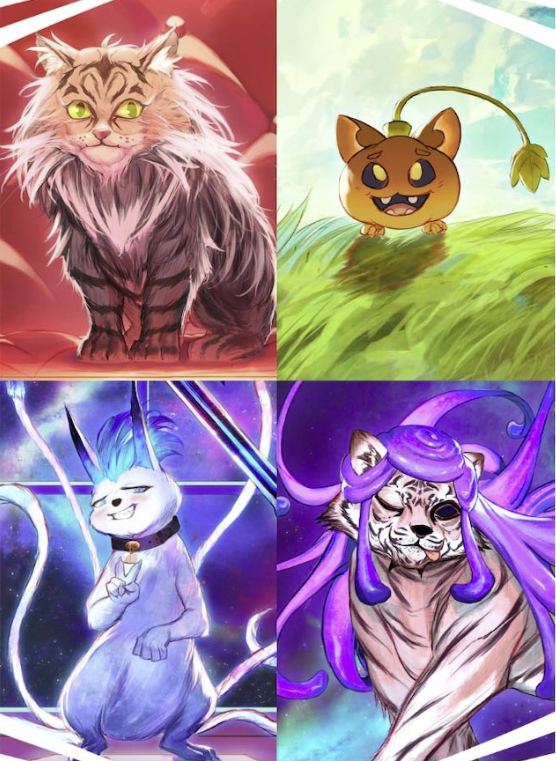
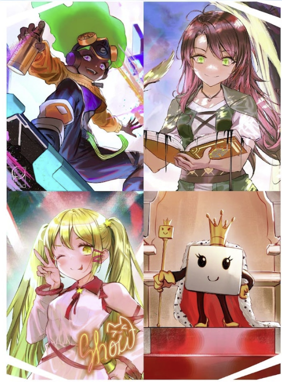
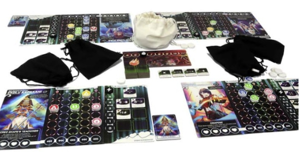

<Setting>

  Le eroine più forti dell’universo continuano ad affrontarsi in scontri all’ultimo proiettile. Le abbiamo apprezzate in
  ❤️, in <Link to="/reviews/bullet-star/">⭐</Link> e abbiamo visto delle eroine “vere" apparire in 🍊. Ora che cosa
  manca? Beh ovviamente gli animali di Bullet 🐾 e le artiste di Bullet 🎨! Questo universo si sta espandendo in una
  figata assurda!

</Setting>

<Rules>

  Bullet continua ad avere 4 modalità di gioco: Solitario, Cooperativo, Tutti contro Tutti e Scontro a Squadre. Si potrà
  giocare a tutte queste modalità praticamente senza cambiare le regole base del gioco in maniera drastica, ma solo
  aggiungendo o rimuovendo poteri speciali.  
  Il gioco segue un meccanismo che si ispira allo <em>shoot'em up</em> dei videogiochi. I giocatori avranno una griglia su
  cui scorreranno dei proiettili, ciascuno di tanti spazi verso il basso quanto indicato dal numero su di esso. Se c'è già
  un proiettile che blocca la strada, si scende allo spazio successivo. Se i proiettili arrivano in fondo, si è stati colpiti.
  E se si viene colpiti troppe volte? <strong>Game Over</strong>  
  Tutto il gioco si baserà sull'interazione dei giocatori con questa griglia. Ci saranno poteri speciali in grado di
  manipolare la posizione dei proiettili, effetti che faranno le cose più disparate e carte con dei pattern, che faranno
  dirottare i proiettili dalla propria plancia verso quella degli avversari.  
  All'inizio di ogni turno arriverà sulla plancia del giocatore un numero di proiettili definito dal livello di intensità
  del round corrente, più tutti i proiettili mandati dagli altri giocatori. Se si gioca contro giocatori umani, il tutto
  deve essere gestito nel limite di un timer. Si può anche rinunciare a questa possibilità, ma consiglio almeno di provarla.

</Rules>

<Feedback>

  Premessa: sono un amante di Bullet e ogni volta che esce qualcosa di inerente cerco di accaparrarmelo!  
  <strong> Bullet universe </strong> non fa eccezione!  
  Se le eroine aggiunte nella versione 🎨 sembrano davvero spettacolari, i favoriti di questo blocco di espansione
  sembrano gli animali di Bullet 🐾. Infatti, dalle immagini che circolano in giro si vedono carte con simboli nuovi…
  Una qualche nuova meccanica per caso? Chissà! Ed è quello che lo rende super interessante. Contando poi i costi di
  spedizione dal sito della Level99, qual è il modo migliore per recuperare tutto quello che manca se non attraverso
  questo Bullet Universe… E chissà cosa avranno in mente gli autori per una prossima espansione?? Perché sicuramente ci
  sarà… un next di un next!!!

</Feedback>

