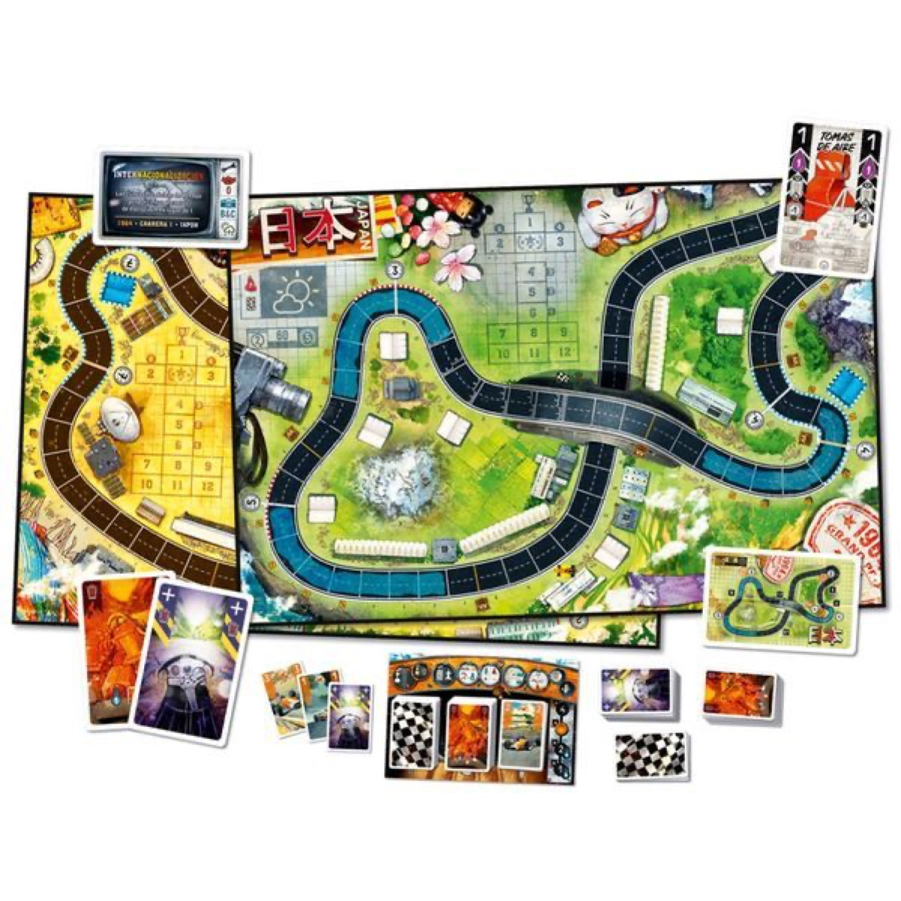
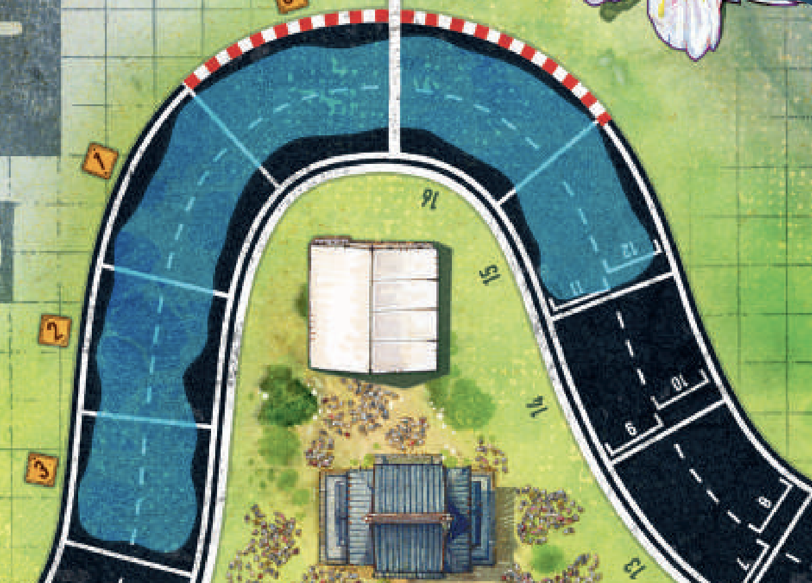
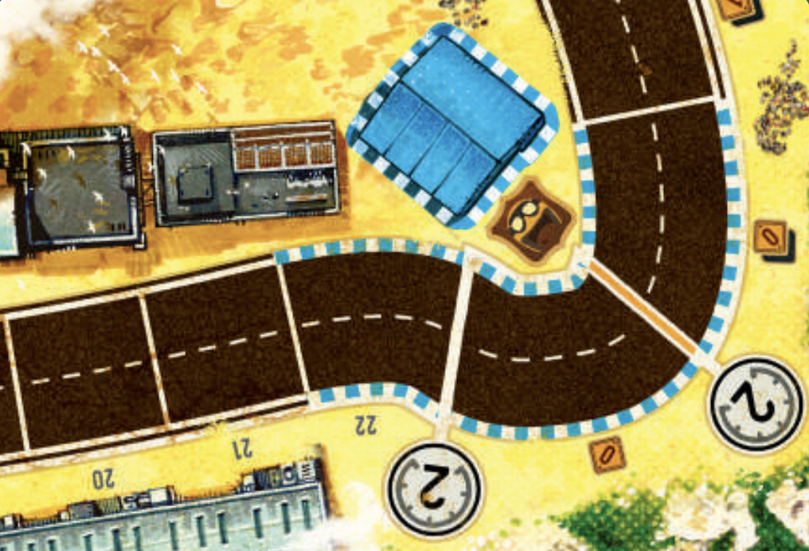

<Setting>

  Mentre i motori rombano e la <strong>pioggia</strong> cade incessantemente, l'atmosfera del Gran Premio del{" "}
  <strong>Giappone</strong> è carica di attesa e incertezza. La pista immacolata, che un tempo prometteva velocità e
  precisione, ora brilla di gocce di pioggia, diventando un insidioso nastro di asfalto che richiede la massima abilità
  e concentrazione da parte dei piloti.

</Setting>

<Rules>

  Eccoci qui: la prima espansione di <Link to="/reviews/heat-pedal-to-the-metal/">Heat: Pedal to the metal</Link> sta
  per arrivare il <strong>23 febbraio</strong>! 
  Le regole di questa espansione sono pressoché le stesse di prima!
   
  Pioggia battente introduce due nuovi circuiti:
  <ul>
    <li>
      il primo, il Gran Premio del <strong>Giappone</strong>, si svolge subito dopo una{" "}
      <strong>pioggia torrenziale e davanti alle curve insidiose</strong> rimangono grandi pozzanghere, che riducono la
      capacità di rallentare. A livello di regole, se iniziate il round in una casella allagata, cambiare la marcia
      verso il basso nel passo 1 costa 1 carta Heat aggiuntiva;
    </li>
    <li>
      il secondo è il famigerato circuito del <strong>Messico</strong>, che offre un'esperienza elettrizzante ai piloti
      veterani, con le sue <strong>molteplici chicane</strong> che richiedono velocità e abilità. Le chicane sono
      composte da 2 Linee di Curva consecutive aventi lo stesso Limite di Velocità e 1 o più caselle tra di esse.
    </li>
  </ul>
  Sarà presente anche la stagione del <strong>Campionato 1964</strong> con nuove carte potenziamento – come le prese d'aria
  (e il super raffreddamento) –, che aiuteranno a rinfrescare la tua auto e a superare i pericoli di queste nuove piste.
   
  L'espansione include anche un <strong>settimo colore</strong> (arancione) per i giocatori, con i relativi componenti, e
  nuove carte miglioria.

</Rules>

<Feedback>

  Che <Link to="/reviews/heat-pedal-to-the-metal/">Heat</Link> sarebbe stata <strong>una miniera d'oro</strong> era poco
  ma sicuro… ma così mi sembra che si stia tirando la corda un po' troppo: un solo pilota? Uffa!  
  Un dettaglio interessante è che la <strong>griglia di partenza sembra avere 12 posti</strong>, invece degli 8 a cui siamo
  abituati…Vogliamo leggerci qualcosa in questo dettaglio?
   
  Personalmente, prenderò questa espansione, non tanto per il 7 giocatore, quanto per i due circuiti: quello del <strong>
    Messico
  </strong>, in particolare, mi eccita parecchio!  
  Se siete degli amanti di Heat, come il sottoscritto, per quanto possa non andarvi a genio che per arrivare ai fatidici
  8 giocatori avrete bisogno di comprare 2 scatole, invece che una sola, so benissimo che spenderete questi soldi appena
  ne avrete l'occasione. Nevvero?

</Feedback>

