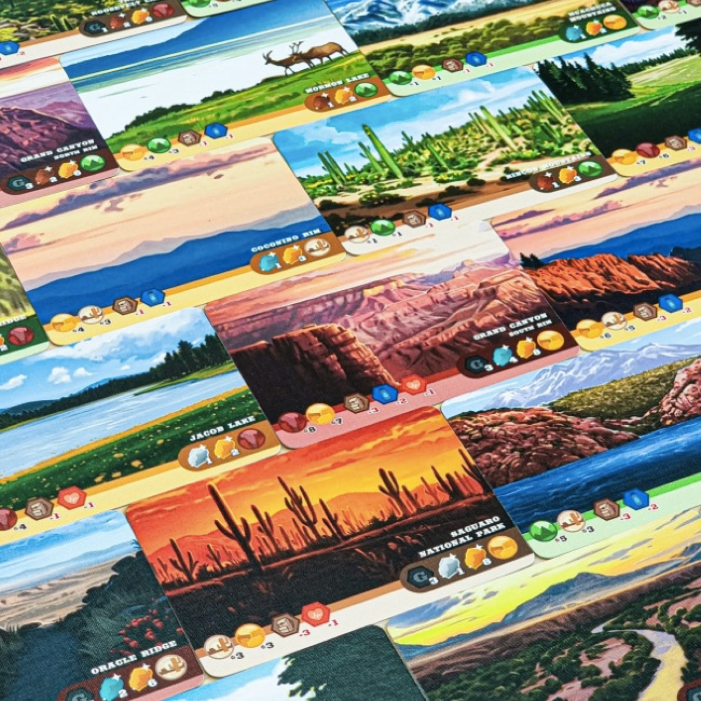
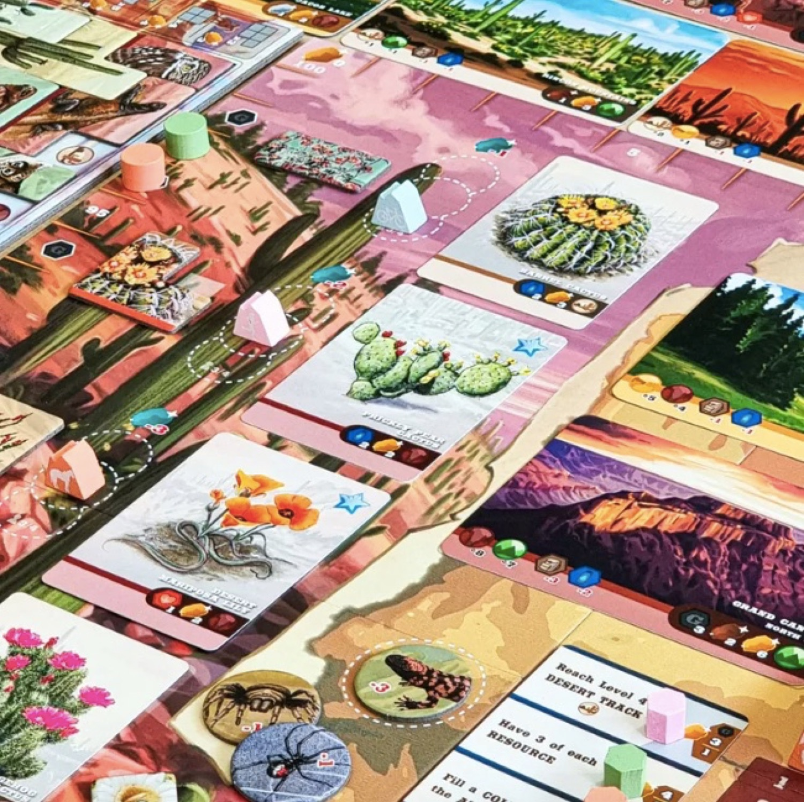
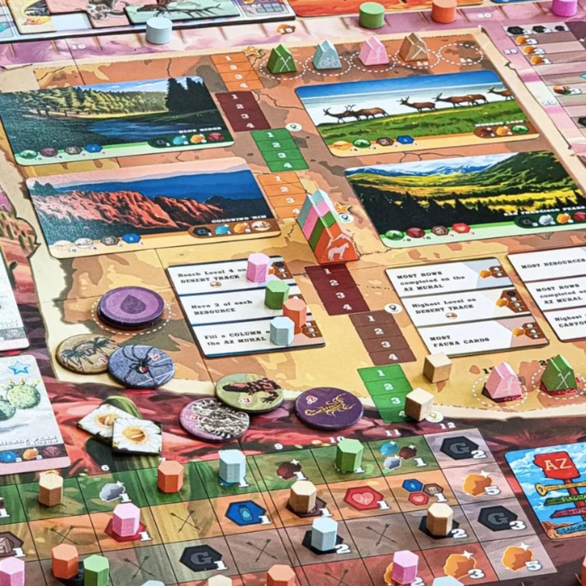

<Setting>

  Siete pronti per il <strong>prossimo percorso escursionistico</strong>? Era stato annunciato qualche tempo fa e
  finalmente eccolo in arrivo! In <em>Trailblazer: The Arizona Trail</em> dovrete percorrere le{" "}
  <strong>spettacolari 800 miglia dell’Arizona Trail</strong>, tra montagne, canyon, altipiani e deserti in cerca della
  stupefacente varietà di vita selvatica! Attraversate il Parco Nazionale dei Saguaro, il deserto di Sonora e il Gran
  Canyon! Raccogliete la Sabbia dell'Arizona e l'Oro della Superstizione!

</Setting>

<Rules>

  In questo secondo capitolo del ciclo di <em>Trailblazer</em>, i giocatori invocheranno l’aiuto della leggendaria Lepre
  Cornuta (Jackalope) e dell’Olandese (Lost Dutchman) per aiutarli nel loro viaggio. L’<strong>ordine di turno</strong>{" "}
  sarà determinato per ogni round in base a un <strong>nuovo e originale meccanismo</strong>, che terrà conto dei
  movimenti e delle osservazioni compiute. I giocatori avranno bisogno di procurarsi un’interessante miscela di{" "}
  <strong>risorse chiave</strong>, naturali e personali, per ottenere vantaggi e creare il loro personale{" "}
  <strong>murale di meraviglie dell’Arizona</strong>, attraverso un efficace piazzamento di raffigurazioni a forma di{" "}
  <strong>polimini</strong>. Dopo 8 round (= settimane di viaggio), il giocatore che avrà guadagnato la più ampia
  riserva di Sabbia dell’Arizona (Arizona Grit) e Oro della Superstizione (Superstition Gold) verrà dichiarato…
  Trailblazer!

</Rules>

<Feedback>

  L’editore <Link to="/publishers/mariposa-games">Mariposa Games</Link> ci stupisce con questo{" "}
  <strong>nuovo capitolo</strong> – <strong>standalone</strong>, ci sembra di capire – della linea Trailblazer,{" "}
  <strong>eurogame dalla forte coloritura naturalistica</strong>, in cui l’ambiente e la pratica dell’escursione sono
  fortemente e verosimilmente connotati. Come per il primo capitolo,{" "}
  <Link to="/reviews/trailblazer-the-john-muir-trail">Trailblazer: The John Muir Trail</Link>, anche in The Arizona
  Trail l’<strong>artwork</strong>, a firma <strong>Andrew Bosley</strong>, si presenta{" "}
  <strong>straordinariamente evocativo e iconico</strong>, promettendo ore e ore di stupefatta ammirazione. Il{" "}
  <strong>difetto del capitolo precedente</strong> era forse proprio quello di rendere pretestuosa questa ambientazione
  peculiare rispetto a un sistema di gioco intensamente incentrato sulle classiche meccaniche dei migliori eurogame.
  Dobbiamo aspettarci anche stavolta un intenso, ma soddisfacente, medio peso? Non vedo l’ora che parta la campagna
  Kickstarter per poterne sapere di più e potervelo recensire!
   
  Intanto, aspettiamo fiduciosi, illanguiditi dallo struggente ricordo <em>paperdinastico</em> della miniera perduta
  dell’Olandese…

</Feedback>

