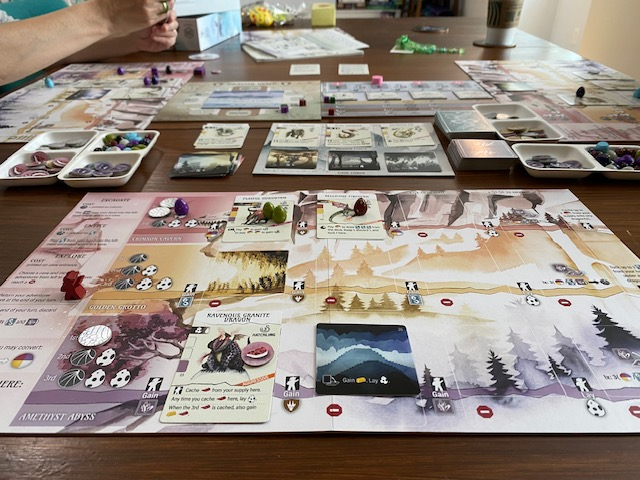

<Setting>

  E dopo aver scoperto il <em>birdwatching</em>, preparatevi al…{" "}<strong><em>dracologism</em></strong>! 
  Guadagnate il favore della Gilda dei Draghi, trovando posto a <strong>draghi di ogni misura, forma e colore</strong>:
  scavate in tre ambienti diversi (la Caverna Cremisi, la Grotta Dorata e l’Abisso di Ametista), per indurre queste
  indomite e maestose creature a posarsi presso i rifugi che costruirete per loro, concatenando le loro potenti abilità!{" "}<em>The early bird is<strong> the wyrm</strong></em>!

</Setting>

<Rules>

  Secondo la descrizione tratta dal sito di <Link to="/publishers/stonemaier-games">Stonemaier Games</Link> – unica
  fonte ufficiale, attualmente, per ricevere qualche barlume sul gioco, che è stato annunciato neanche un paio di giorni
  fa –, <strong>in una partita a Wyrmspan si costruirà un rifugio per draghi</strong>: chi ha già giocato a{" "}
  <Link to="/reviews/wingspan">Wingspan</Link> riconoscerà il classico trittico di file o righe che, nel “padre
  spirituale” del nostro, corrispondevano a tre habitat e che qui invece saranno <strong>tre caverne</strong>. Il primo
  spazio più a sinistra di ogni riga sarà quello inizialmente scavato (ovvero disponibile) per collocare draghi; nel
  corso del gioco, evidentemente, scavare ulteriori spazi lungo i tre diversi rifugi concederà spazi addizionali per
  ulteriori draghi (e ce ne sono 183). Come nel predecessore a ogni “habitat” corrispondeva un’azione specifica, così in
  Wyrmspan l’esplorazione di ogni caverna fornirà benefici associati a quella specifica zona e ai draghi lì allocati.
  Sono stati ripresi anche il sistema di <strong>obiettivi di fine round</strong> e la classica{" "}
  <strong>modalità Automa</strong>, ovvero il regolamento e i componenti per partite in solitario.
   A quanto sembra, però, <strong>le analogie tra i due giochi finiscono qui</strong>: carte cuccioli, carte caverna
  (75), gilde e personalità dei draghi sono tutti elementi che non trovano corrispettivi nel predecessore; lo stesso dicasi
  per la meccanica dello scavo, che innesca benefici del tipo “quando giocato”, in Wingspan associati solo a determinate
  carte uccello; infine, la novità più evidente sembra la Gilda dei Draghi (se ne seleziona una a partita, tra le 4 disponibili),
  avanzando sulla quale si riceverà una varietà di benefici, anche potenti, a ogni “half cycle” (così recita il sito di Stonemaier
  che, immaginiamo, si riferisca a una peculiare modalità di scorrimento del round di gioco).

</Rules>

<Feedback>

  La Stonemaier Games, con questo inatteso e gradito annuncio, torna a servirsi dell’esperienza della sviluppatrice{" "}
  <strong>Elizabeth Hargrave</strong> (già designer di Wingspan – Kennerspiel des Jahres 2019).
   
  Anche senza avere informazioni più approfondite sul gioco, al momento,{" "}
  <strong>l’ispirazione di Wyrmspan dai meccanismi di Wingspan appare inequivocabile</strong> – sin dal titolo, dove
  l’ala del <em>wing-span</em> (ovvero l’apertura alare) viene sostituita da <em>wyrm</em>, che in Antico Inglese
  significherebbe drago, serpente o viverna (come in Beowulf).
   
  Il gioco viene presentato non solo come uno <strong>standalone</strong> – dunque non compatibile con il celebre e
  fortunato predecessore –, ma anche diverso sotto molti aspetti, per quanto strizzi evidentemente l’occhio a tutti quei
  giocatori che hanno amato Wingspan (e, ci piacerebbe anche se non sarà proprio così, a tutti gli amanti del celebre{" "}
  <em>Dragonero</em> di Sergio BonelIi editore…). <strong>Quello che adesso occorrerà capire</strong> è quanto questo
  nuovo titolo riuscirà ad emanciparsi dall’ingombrante, ma pur sempre ricca e apprezzata, eredità del suo “padre
  spirituale”. Sarà interessante capire se Wyrmspan spremerà fino al midollo meccaniche fortunate per attirare i gonzi,
  colorandole con una veste più accattivante (qualcuno ha detto «Dracarys!!»?), oppure se avrà davvero innovato, o
  addirittura migliorato, un sistema estremamente accessibile e già molto gradito a un pubblico vasto e differenziato.
   
  Certo, la sola presenza di novità quali cuccioli, carte caverna, gilde e personalità dei draghi induce già a ritenere
  che alcune meccaniche di Wingspan siano state migliorate. E, in ogni caso, gli amanti dei prodotti Stonemaier Games,
  come il sottoscritto, potranno certamente sperare nella <strong>qualità del lavoro di questo editore</strong> che,
  fino ad oggi, si è dimostrato serio e affidabile.
   
  Il gioco circolerà tra la seconda metà di gennaio e il mese di marzo 2024: il suo <strong>rilascio</strong> è{" "}
  <strong>imminente</strong>. <strong>In Italia</strong> sarà localizzato da Ghenos e{" "}
  <strong>arriverà intorno a giugno 2024</strong>. Sul sito di Stonemaier saranno disponibili <strong>add-ons</strong>{" "}
  come monete in metallo, risorse in legno e playmats in gomma naturale, a partire dal lancio del gioco.
   
  Noi di Dudexpress non ci lasceremo di certo scappare l’occasione di mettere alla prova Wyrmspan! Restate sintonizzati
  con noi per saperne di più!

</Feedback>

