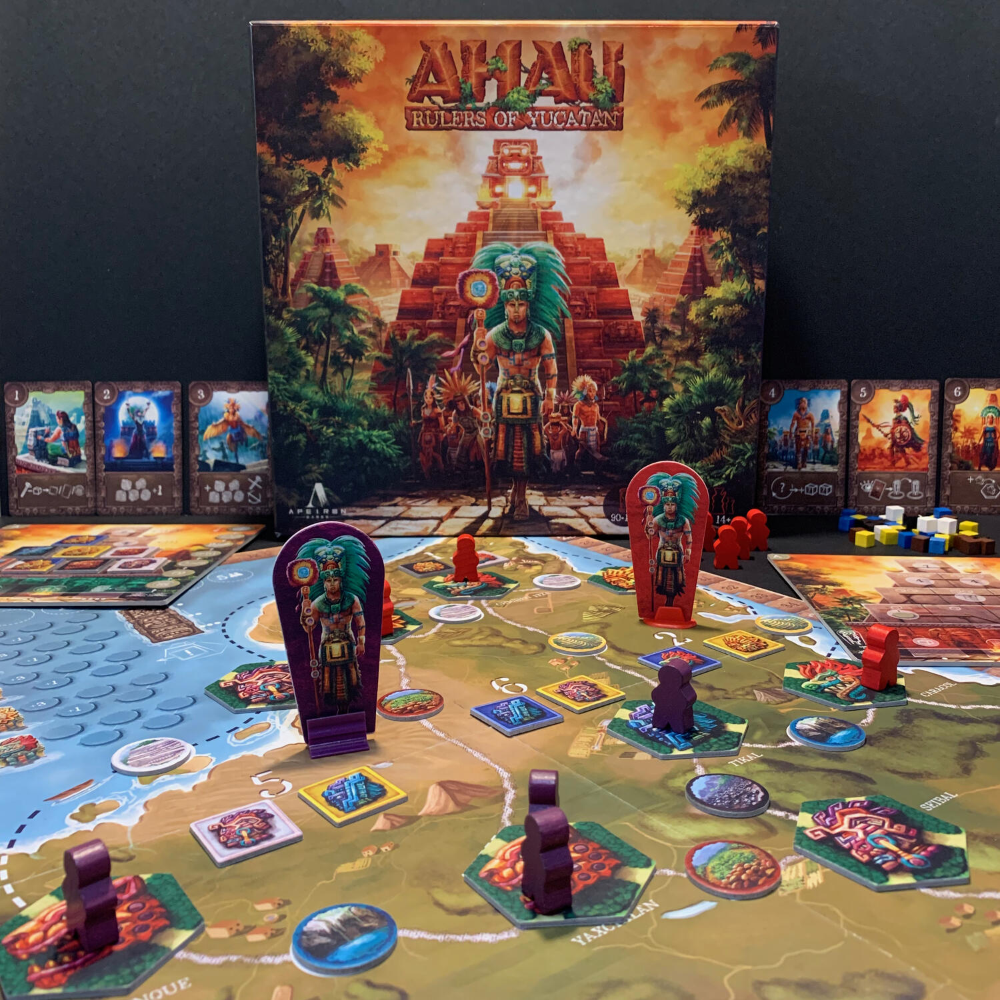
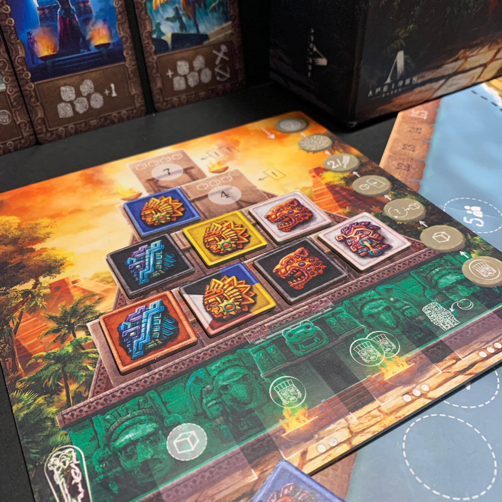

<Setting>

  È l'alba del periodo classico della civiltà Maya, vivida era con le città che raggiungono un livello di bellezza
  architettonica sbalorditivo e una popolazione che cresce a dismisura. Sorgono potenze regionali che iniziano a
  competere per il controllo delle scarse risorse e per l'influenza sulle altre città, formando alleanze, stati vassalli
  e sconfiggendo nemici lungo la strada. La continua guerra devasta la terra, le fortune vanno e vengono, le dinastie
  crescono e cadono.
   
  Per sopravvivere e rafforzare il loro potere, gli Ahau, i governanti, devono impressionare non solo i propri sudditi
  ma anche le città vicine. Questo richiede molto più che indossare copricapi di piume pruriginose e fare affidamento su
  un consiglio di nobili e sacerdoti: gli Ahau devono dimostrare le loro abilità militari, assicurarsi rifornimenti per
  evitare carestie e costruire enormi roccaforti.
   
  Queste strutture monumentali includevano templi piramidali dedicati a potenti divinità, utilizzati come luogo di
  eterno riposo per i governanti e prova delle loro origini divine.
   
  Vesti un copricapo di piume, sconfiggi i rivali, impressiona i vicini e soddisfa le divinità: solo così potrai
  governare lo Yucatán.

</Setting>

<Rules>

  Il gioco si svolge in più K'atun. Ogni K'atun è composto da round. Ogni round contiene una fase movimento e una fase
  azione.
   
  Durante la fase movimento si scelgono segretamente due carte: la prima indica la regione che si vorrebbe occupare con
  il proprio Ahau. Se più giocatori hanno preso di mira la stessa regione, si innescherà un conflitto che sarà deciso
  dalla propria potenza militare, rappresentata dal valore della seconda carta. Infine, ogni giocatore prende una
  tessera piramide dalla regione occupata e scarta le carte utilizzate.
   
  Durante la fase azione, ogni giocatore può piazzare un lavoratore in una città adiacente alla regione scelta
  precedentemente. Questa città stabilisce la divinità che potrà essere venerata e le reti commerciali attive. Se nella
  propria piramide è presente almeno una tessera raffigurante la stessa divinità della città, o se avete delle tessere
  piramide con la stessa raffigurazione non ancora utilizzate da poter scartare, potrete procedere con l'invocazione.
  Ogni divinità è diversa, ognuna forte a modo suo. Itzamna, il capo degli dei, vi permetterà di ottenere tessere
  piramide; Chaac, la divinità della pioggia, vi aiuterà facendovi produrre risorse; Jaguar, la divinità della guerra,
  darà forza ai vostri lavoratori per spostarsi nelle città adiacenti; Kinich Ahau, la divinità del sole, rimpinguerà la
  vostra mano con le carte scartate; infine, Kukulkán, il serpente piumato, vi donerà molta fama a patto del sacrificio
  di un vostro lavoratore. La potenza dell'invocazione dipenderà dalla presenza che la stessa divinità ha nella vostra
  piramide (assieme alle tessere scartate).
   
  Successivamente bisognerà scegliere se produrre risorse o se costruire nella propria città un blocco di piramide o un
  edificio. Quest'ultimo vi darà un potere unico che vi migliorerà la vita durante il gioco, facendovi produrre di più,
  facendovi vincere gli spareggi e tanto altro.
   
  Dopo un numero finito di produzioni, si passerà al prossimo K'atun, dove delle celebrazioni in grande stile faranno
  salire la fama degli Ahau a seconda di come si saranno mossi durante il gioco.
   
  Chi ha più fama alla fine di 3 K'atun o al completamento della prima piramide, sarà il vincitore.

</Rules>

<Feedback>

  Ahau è stata la sorpresa inaspettata dell'ultimo periodo, un cinghialetto niente male che non vedo l'ora di poter
  pledgiare su kickstarter.
   
  Configurare la plancia quasi totalmente in maniera casuale dà ad ogni partita un gusto diverso e non fa esistere una
  strategia che possa funzionare in tutte le situazioni.
   
  Le due fasi del round, per quanto diverse tra loro, devono essere sincronizzate e ponderate attentamente sia per il
  round attuale che per i successivi due o tre. Scegliere dove posizionare l'Ahau implica l'uso di due carte (delle sei)
  che poi non saranno più a disposizione fino a quando non si evocherà la divinità del sole o il giocatore non le
  ripescherà non avendone più in mano. Scegliere di andare nelle regioni contrassegnate da un numero alto, implica che
  la potenza militare non potrà sempre essere al massimo e che quindi la possibilità di perdere un conflitto sarà alta.
  Perdere il conflitto è sinonimo di essere catapultati in una regione potenzialmente inaspettata che potrebbe
  sconvolgere la tattica della seconda fase, impedendo di evocare la divinità desiderata o di produrre la risorsa
  necessaria. Le carte, in ogni caso, sono informazioni note e quindi si possono utilizzare euristiche per capire come
  si muoveranno gli avversari.
   
  La seconda fase, invece, è contraddistinta da altre meccaniche ben mixate tra di loro. La scelta della città implica
  sia la divinità che si può evocare, sia le risorse che si possono produrre. Il modo in cui si assembla la piramide è
  un rompicapo cervellotico: meglio spingere su alcune divinità oppure essere più generici e non avere problemi ad
  evocare, anche con meno forza, qualsiasi divinità?
   
  Oltre alle due fasi, c'è da pensare alla celebrazione, alla quale bisognerà prepararsi nei round precedenti, evocando
  divinità diverse, posizionando meeple in posti strategici e facendo crescere la propria civiltà e le proprie
  costruzioni.
   
  In ogni partita si sta sul filo del rasoio, dato che posizionare l'Ahau nella regione sbagliata potrebbe farvi
  sopraffare da un avversario nel giro di un round, dove cedere un edificio potrebbe permettere ad altri di battervi ove
  pensavate di vincere, dove posizionare una tessera nella vostra piramide potrebbe impedirvi di produrre quel che vi
  serve nei round a seguire.
   
  Ci vogliono un po' di partire per poterlo apprezzare a pieno, ma sicuramente non ve ne pentirete.

</Feedback>

