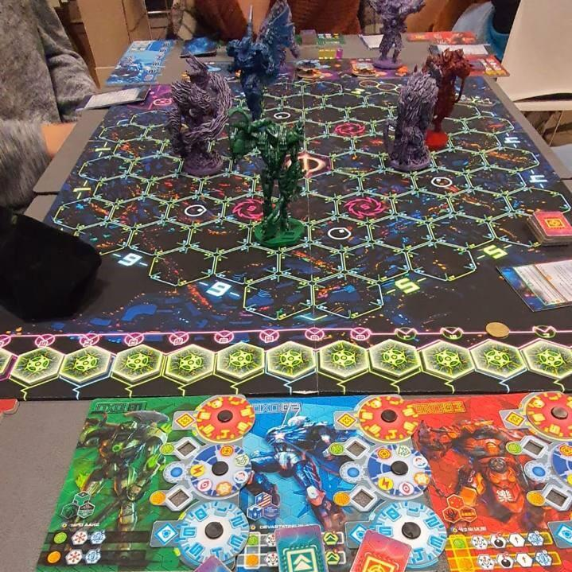
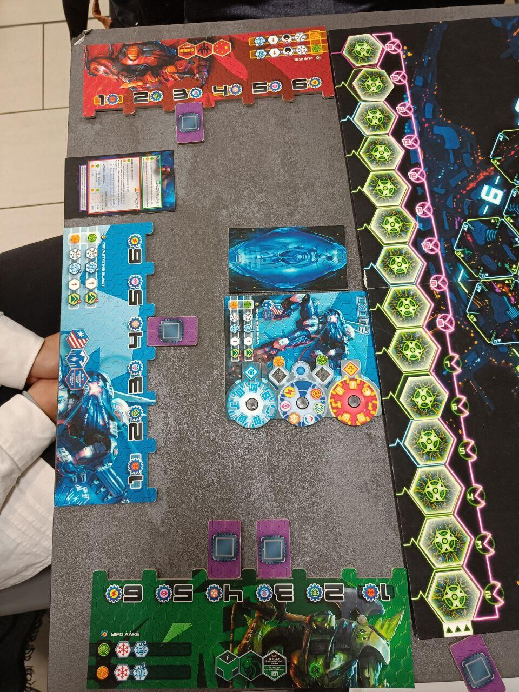
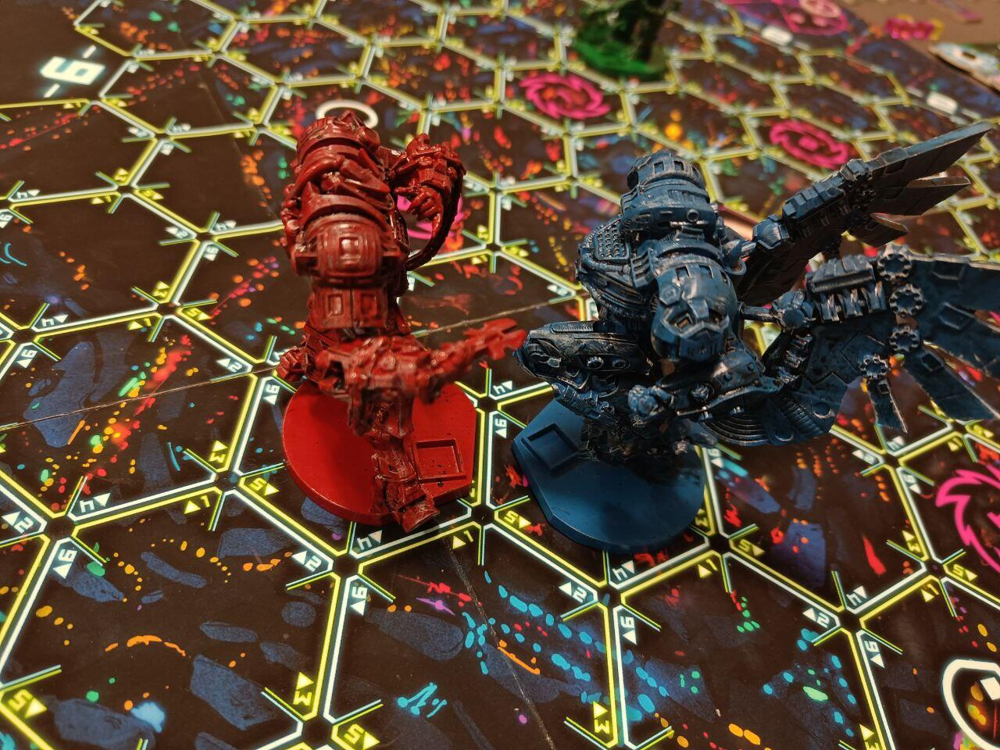

<Setting>

Tra mille anni, intorno al 3000 d.C., la guerra sarà combattuta nello
  spazio: nel vuoto cosmico, gli Ahotnik delle diverse nazioni, ovvero i
  giganteschi robot da guerra creati dagli uomini e la cui complessità richiede
  l’unione psichica delle menti di due piloti, si contenderanno la supremazia
  della Terra. In gioco vi è il dominio su tutto il nostro Pianeta Blu: chi
  sconfiggerà gli altri riuscirà ad impossessarsi anche del sapere tecnologico
  dell’avversario, e allora la potenza del proprio Ahotnik diverrà
  incontrastabile.
   
  Ma gli atavici conflitti umani, per i quali la dinamica non muta al cambiar
  del contesto, dovranno tenere conto anche di minacce esterne: sono infatti
  apparsi dei misteriosi portali sovra dimensionali, e demoni terribili stanno
  invadendo la nostra galassia. Queste entità minacciano l’esistenza della Terra
  stessa, e la necessità di sconfiggerli prima che ciò si concretizzi arriva a
  prevalere sul combattimento con i propri avversari.&nbsp;
   
  Sono quindi in gioco la gloria e la sopravvivenza di tutta l’umanità: attivate
  le vostre sinapsi e allenate la connessione mentale con il vostro compagno!
  Solo così, infatti, potrete guidare il vostro Ahotnik a
   
  prevalere in questo epico combattimento.

</Setting>

<Rules>

 Ahotnik è uno skirmish a coppie da 4 o da 6 giocatori (rispettivamente
  quindi 2 o 3 squadre. Gli autori hanno annunciato che il gioco finale dovrebbe
  però prevedere la possibilità di giocare fino a 6 squadre e che un giocatore
  possa giocare da solo), la cui ambientazione richiama il film Pacific Rim e la
  serie anime Evangelion .&nbsp;
   
  A ciascuna coppia sarà affidato il comando di un Ahotnik (detto anche OXO), e
  lo scopo sarà quello di riuscire a distruggere per primo un OXO avversario
  senza però essere sconfitto da un demone ed evitando che il
   
  livello di minaccia della Terra raggiunga il massimo.&nbsp;
   
  In ciascun turno, i due componenti di ogni coppia dovranno scegliere in
  segreto e senza poter comunicare tra loro due di tre azioni disponibili
  (Iniziativa, Movimento e Attacco), andando poi a selezionare quale Iniziativa
  svolgere oppure in quale direzione svolgere l’Attacco e il Movimento. In
  ordine, ciascun giocatore rivelerà la propria scelta: se la decisione di un
  giocatore sarà condivisa dal compagno (Sinapsi Riuscita), l’OXO svolgerà
  quell’azione; se i due avranno scelto la stessa azione, ma vi sarà una
  differenza su quale Iniziativa fare o sulla direzione per il Movimento e/o
  l’Attacco (Sinapsi Forzata), questa azione verrà svolta in maniera
  depotenziata
   
  e il suo risultato verrà determinato casualmente da un dado; se saranno scelte
  due azioni diverse (Sinapsi Mancata), nessuna delle due verrà svolta. In base
  al tipo di Sinapsi ottenuta dalla coppia, l’Ahotnik quindi
   
  si potenzierà, si muoverà o attaccherà i propri avversari e/o
  demoni.&nbsp;&nbsp;
   
  Dopo la Fase dei Demoni potranno essere evocate delle presenze demoniache, che
  assaliranno gli OXO, i quali saranno costretti a distruggerle prima di poter
  attaccare gli avversari, facendo inoltre attenzione al livello di minaccia
  della Terra. Una volta sconfitto un tipo (su quattro totali) di demone, si
  otterrà l’“immunità” da esso (DNA demoniaco) e si avrà quindi la possibilità
  di attaccare liberamente gli avversari.&nbsp;&nbsp;
   
  Il gioco finisce non appena un OXO sconfigge un altro OXO, divenendo quindi il
  vincitore, oppure con una sconfitta per tutti i giocatori, che avviene non
  appena un demone sconfigge un Ahotnik o il livello di minaccia
   
  della Terra raggiunge il livello massimo.

</Rules>

<Feedback>

L’idea alla base di Ahotnik, ovvero il sistema delle sinapsi, pone le
  basi per un gioco dalle grandi potenzialità: il movimento del proprio OXO,
  sebbene basato su un sistema di azioni molto semplice (iniziativa, movimento,
  attacco), fa totalmente leva sull’intesa con il proprio compagno di squadra, e
  viene quindi a generarsi un interessantissimo gioco di relazioni. Può così
  succedere di programmare l’attacco del proprio OXO verso un
   
  avversario, nella speranza di infliggere un terribile colpo, e vedere invece
  questo muoversi nella direzione opposta e sparare a vuoto solo per una
  differente scelta del co-pilota. Regala invece grandi soddisfazioni osservare
  l’Ahtonik di appartenenza combattere con forza ed efficacia grazie ad una
  perfetta intesa di squadra.&nbsp;
   
  I materiali e i componenti, sebbene ancora in forma prototipale, sono già
  buoni, e lasciano presagire il raggiungimento di una qualità eccellente al
  momento del lancio della campagna di crowdfunding: le miniature dei robot e
  dei demoni sono grandi (molto grandi!) e dettagliate, e la grafica delle
  plance è esteticamente piacevole, con uno stile dal sapore leggermente gotico
  seppur ambientato in un futuro fantascientifico. Vi è però qualche problema di
  leggibilità, sia per la simbologia adottata, sia per i colori vivaci e
  fosforescenti, che affaticano un po’ la vista e la distinzione delle varie
  componenti.&nbsp;
   
  Per quanto concerne invece la meccanica di gioco, nonostante l’idea di fondo
  davvero originale (cosa da sottolineare), questa sembra non essere ancora
  rifinita al meglio: alla lunga, durante la partita, il ritmo
   
  sembra perdersi e il flusso di gioco diventa un po’ ripetitivo. Inoltre, la
  risoluzione delle azioni (che prevede un
   
  rigido ordine di Iniziativa, Movimento e Attacco) rischia di rendere
  frustranti alcuni spezzoni del gioco: l’Attacco, deciso prima dell’Iniziativa
  e del Movimento degli avversari, viene risolto sempre alla fine, e diventa
  spesso
   
  inefficace proprio per lo sviluppo delle altre due azioni degli altri OXO
  avvenuto nel frattempo.&nbsp;&nbsp;
   
  Ci teniamo a ricordare però che la versione da noi provata è solo un prototipo
  e molte cose potrebbero cambiare: al momento abbiamo notato alcune criticità e
  diversi aspetti da migliorare, ma, come scritto precedentemente, riteniamo
  questo un gioco con le potenzialità per diventare un prodotto di successo. Il
  sistema delle sinapsi ci ha colpiti positivamente: di sicuro seguiremo lo
  sviluppo di questo gioco e vi esortiamo a fare altrettanto!

</Feedback>

