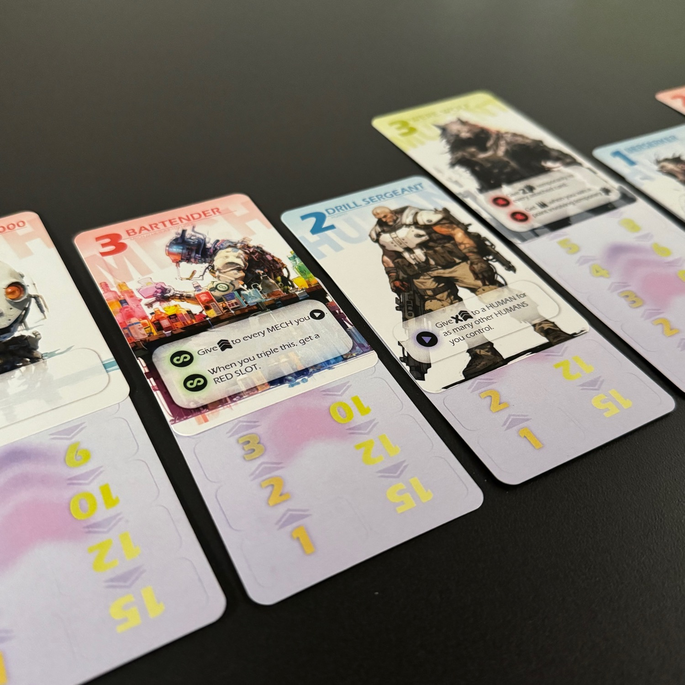
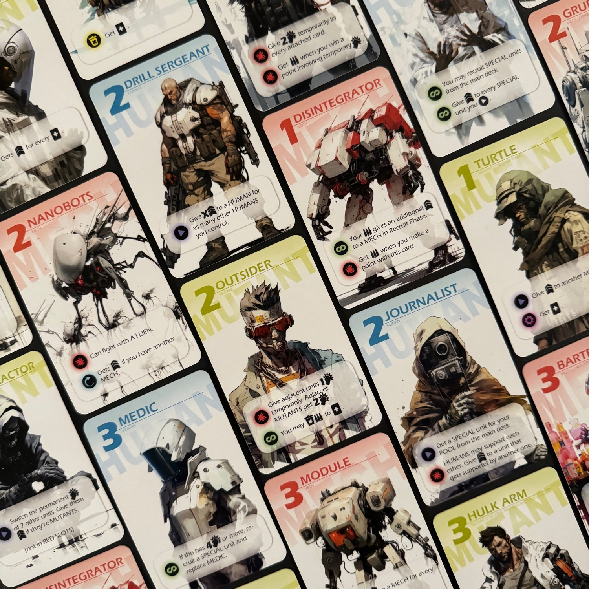
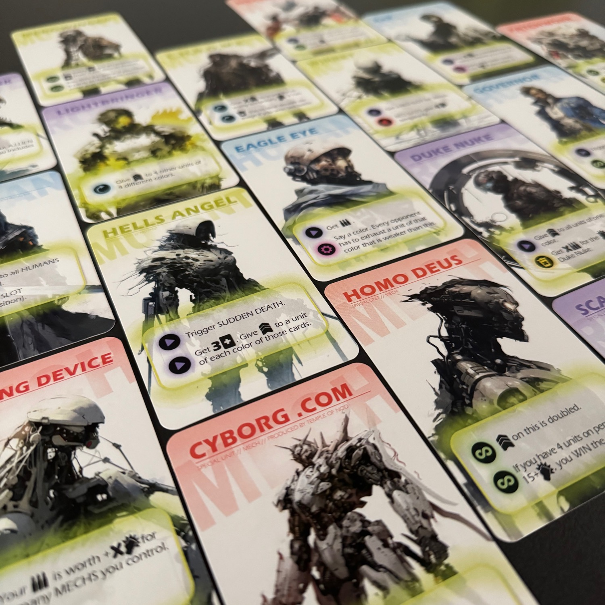

<Setting>

  L'A.I.Pokalypse arrivò rapidamente.  
  Nel giro di poche ore, tutto il sistema solare fu pervaso da sentori di guerra civile, affrontata con l'impiego di armi di distruzione di massa e con lo spegnimento di tutte le reti digitali. 
  Nel 2095 ci fu un'eruzione digitale e fu talmente massiccia che intere corporazioni si frammentarono in fazioni, gruppi autogestiti che, con il passare del tempo, furono sempre più abbandonati a loro stessi. Crollò anche la rete satellitare e, con essa, la conoscenza della situazione mondiale.  
  Da quel momento in poi, la regola fu: <strong>"mai fidarsi di nessuna macchina che non sia stata costruita da te"</strong>. 
  Le città divennero il campo di battaglia perfetto per accaparrarsi gli ultimi artefatti rimasti dalle società che una volta le abitavano.  
  Assumi mercenari, sopravvivi ai combattimenti e punta ad essere l'ultima fazione sopravvissuta.

</Setting>

<Rules>

  A.I.Pokalypse si gioca in diversi turni, ognuno dei quali è suddiviso in due fasi: la fase di <strong>reclutamento</strong> e la fase di <strong>battaglia</strong>. In entrambe le fasi si gioca <strong>contemporaneamente</strong>.  
  Il fulcro del gioco sono le <strong>carte unità</strong> (base e speciale), ovvero i mercenari che "assolderemo". Queste carte hanno <strong>due facce</strong>: una rappresenta l'unità con le proprie caratteristiche, l'altra mostra una scala di forza. 
  La fase di <strong>reclutamento</strong> inizia pescando <strong>6 carte</strong> unità base che si giocano nel corso della fase o che si tengono per la successiva. Per reclutare un'unità bisogna, prima di tutto, <strong>aprire uno "slot"</strong>, ovvero giocare una carta a faccia in giù: questa carta funge da "segna forza" per la carta che posizioneremo sopra di essa. È possibile avere solamente 6 slot e quindi, al massimo, 6 unità in gioco. Una volta che sarà stata giocata una carta, <strong>si risolveranno tutte le abilità scatenate</strong>, come ad esempio "quando entra in gioco", "quando succede qualcosa" oppure "quando viene scartata".  
  Una volta che tutti i giocatori avranno giocato le carte desiderate, si passerà tutti assieme alla seconda fase: la fase del <strong>combattimento</strong>. Si contano quante unità ha in gioco ogni giocatore, si definisce chi ne ha di più e ogni giocatore pesca altrettante carte.  
  Si mescola il mazzetto e si rivela così la prima carta: <strong>questa deve essere associata con la prima unità che si trova scorrendo da sinistra a destra</strong>, in modo che queste due carte condividano la tipologia (mech, umani e mutanti); si somma la forza stampata sulla carta appena rivelata con la forza indicata sulla carta-scala dell'elemento abbinato. Se l'abbinamento non è possibile, la carta pescata combatterà da sola. In questo momento si possono scartare le carte che abbiamo tenuto in mano, sostituendo la carta da abbinare e generando una coppia vincente. <strong>Il giocatore che ha la forza maggiore vince la sfida e segna il punto!</strong> 
  Si continuano a rivelare carte random finché non vengono rivelate tutte le carte presenti nel mazzetto degli scontri e <strong>si guarda chi ha vinto la maggioranza degli incontri portandosi a casa la vittoria della guerra del round.</strong> Gli altri giocatori perdono un punto vita pari alla differenza tra i match vinti da loro e quelli vinti dal vincitore.  
  I punti vita sono rappresentati da un mazzetto che inizialmente contiene 6 carte unità speciali. <strong>A mano a mano che si perdono punti vita, queste unità speciali diventano disponibili.</strong> Per ottenerle bisogna scartare una tripla, ovvero tre carte con lo stesso colore (sinonimo di tipo) e con lo stesso numero, che possono essere presenti sia in campo oppure in mano. Queste unità sono tutte diverse e possono sconvolgere l'esito della partita, cambiando addirittura la condizione di vittoria.  
  Quando un giocatore perde tutta la salute, si attiva la <strong>Sudden Death</strong> (morte improvvisa), si aggiungono alcune regole che possono permettere a qualsiasi giocatore di ribaltare la situazione e vincere la partita: nonostante tutto, è verosimile che il giocatore in vantaggio vincerà comunque la partita. A questo punto si fa l'ultima battaglia e si <strong>decreta il vincitore!</strong>

</Rules>

<Feedback>

  A.I.Pokalypse è un gioco che, se siete amanti dei giochi di combo e degli <Link to="/mechanisms/costruzione-motore">engine-building</Link>, <strong>dovete provare</strong>: gira bene senza troppi dubbi, in un minuto siete già pronti a giocare e, soprattutto, ha un costo irrisorio… e ha anche una modalità <strong>solo</strong> / cooperativa che, però, non hanno suscitato in me lo stesso interesse della variante competitiva.  
  Sono stato attirato da questo gioco per quello che promette: <strong>zero tempi morti e molte, molte combo</strong>. Devo dire che è così… ma forse un po' <strong>too much</strong>! Il fatto che tutti giochino contemporaneamente può far perdere il contatto con le altre persone al tavolo, facendo di fatto un bel solitario di gruppo. Giochi le tue carte, fai le tue complicate combo, prendi le tue decisioni… ma di <strong>quello che fanno gli avversari non ti interessa molto</strong> (e, in ogni caso, non intaccherebbe la tua strategia). Le combo sono davvero tantissime e ti spingono a giocare "male", nel senso che tendono a farti andare all-in con un solo tipo di unità per massimizzare la spettacolarità delle combo, costringendo a lasciare, però, il fianco scoperto agli attacchi delle altre tipologie di combinazioni. Sta al giocatore capire se è più conveniente specializzarsi su un solo tipo di unità o piuttosto disporre di un esercito più debole ma eterogeneo. 
  L'idea di dover <strong>"sacrificare" una carta unità</strong> dalla propria mano da dover utilizzare come "segna forza" mi è piaciuta parecchio ed è una bella versione dell'ormai usatissimo "scarto una carta per giocare una carta"… anche se utilizzando il prototipo e spostando componenti sul tavolo, a volte, si urtavano e si scombussolavano i valori.  
  L'altra idea che mi ha entusiasmato sin dalla lettura del regolamento è quella che i punti vita, in realtà, sono unità speciali girate a faccia in giù. <strong>Questo suggerisce l'idea che perdere vita non è per forza un male</strong>, in quanto vengono aperte molte nuove strade alle combo. Queste carte sono davvero fortissime, ma giocarle non è per niente semplice: potreste dover sacrificare la combo migliore (attraverso una tripla) per poterle fare entrare in campo!  
  Nota di merito sicuramente per la grafica: spettacolare. Marian, il designer, ha fatto una scelta che farà storcere il naso a molti: ha <strong>usato l'intelligenza artificiale</strong> come punto di partenza per definire stile e personaggi. C'è chi ci vede il diavolo e chi, invece, ci vede nuove opportunità. Voi di che scuola siete? 
  A.I.Pokalypse è da provare? sicuramente sì!  
  È da comprare? <strong>non ad occhi chiusi</strong>. Questo gioco porta al tavolo alcune idee davvero interessanti e le unisce in un gioco molto semplice da imparare, ma complicato da gestire per via di tutta la randomicità.

</Feedback>

