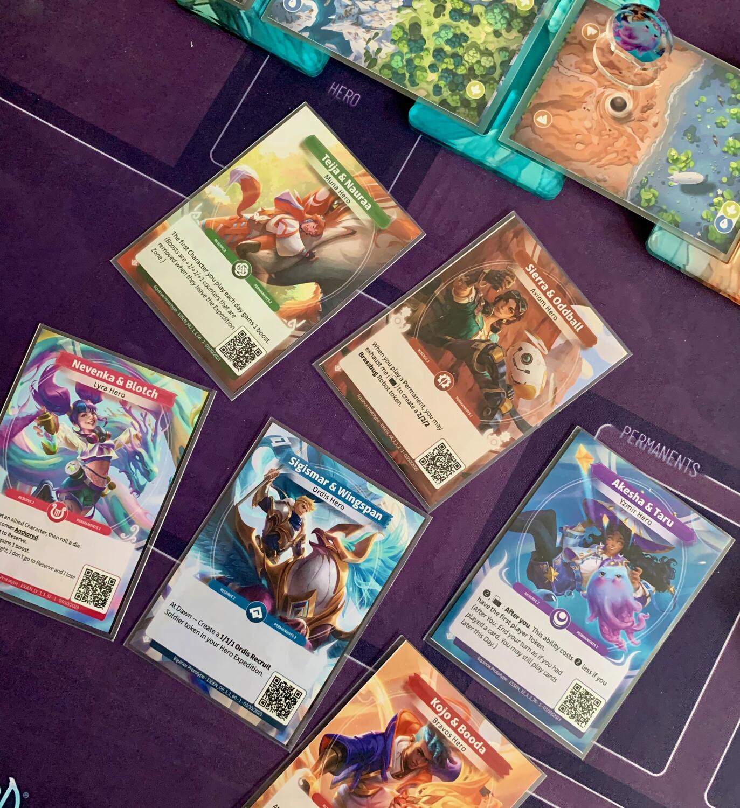
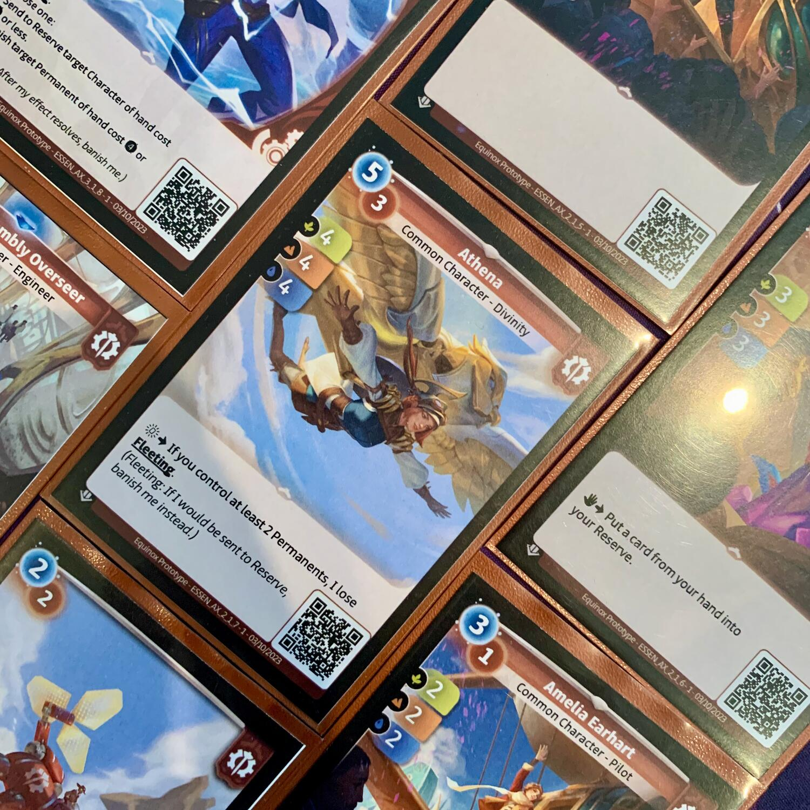
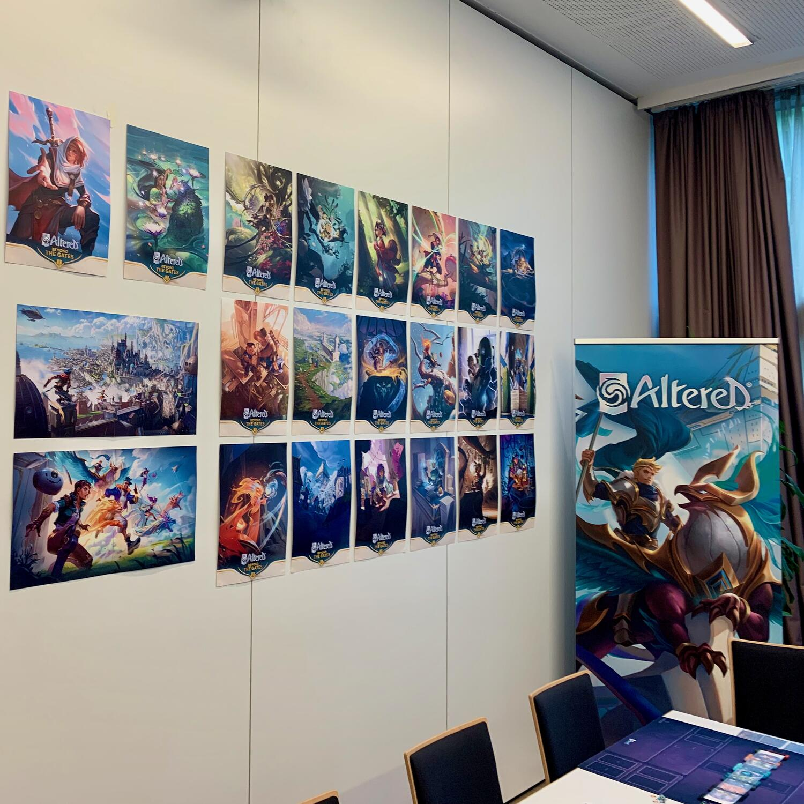

<Setting>

  Secoli fa,{" "}
  <strong>la nostra realtà si scontrò con il mondo immaginario</strong> durante
  un cataclisma noto come <strong>la Confluenza</strong>, un evento che
  rimodellò profondamente la Terra. In quel periodo abbiamo fatto la conoscenza
  di nuovi alleati immaginari, con i quali abbiamo pazientemente costruito una
  nuova civiltà. Ora, pacifici e prosperi, possiamo finalmente riscoprire il
  mondo alterato che ci circonda.
   
  <strong>Sei importanti fazioni</strong> hanno scelto i loro eroi e guideranno
  coraggiose spedizioni verso l'ignoto, dove <strong>il Tumulto</strong>,
  residuo della Confluenza, muta ancora ogni cosa lungo la sua scia.
   
  Potrete impersonare <strong>Teija dei Muna</strong>, la druida, che cercherà
  di ripristinare l'armonia della natura in tutta la sua forza;{" "}
  <strong>Sigismar degli Ordis</strong>, l'ideologo, difensore dell'ordine,
  dell'equità e della giustizia.
   O ancora, potrete incarnare <strong>Akesha degli Yzmir</strong>, la maga,
  pronta a studiare la magia e ad utilizzarla per difendere l'umanità dalle minacce
  che la mettono in pericolo; oppure <strong>Sierra degli Axiom</strong>, l'ingegnera,
  che se ne serve solo per poter progredire velocemente nelle scoperte scientifiche
  e non doversi più abbassare a farne uso.
   
  Oppure potrete personificare <strong>Nevenka dei Lyra</strong>, l'artista, che
  vuole godere al massimo di quello che il mondo ha da offrire, con il rischio di
  diventare un po' egoista; o infine <strong>Kojo dei Bravos</strong>, l'avventuriero,
  che preferisce spingere i propri limiti all'infinito ed esplorare sempre e sempre
  di più.
   
  Quale eroe vi rappresenta meglio? Io ho scelto gli <strong>Axiom</strong>.

</Setting>

<Rules>

  Ogni giocatore avrà un{" "}
  <strong>mazzo composto da una quarantina di carte monocolore, guidato da unevocatore</strong>. Questi ci rappresenta, con la sua carta e la sua pedina, mentre <strong>
    esploriamo la regione di Asgartha nella speranza di trovare il nostro
    companion
  </strong> e, soprattutto, mentre cerchiamo di farlo prima dell'avversario.
   
  Una partita ad Altered necessita non solo dei due mazzi, ma anche di <strong>un percorso</strong>
    (casuale e scoperto man mano) che va dal mondo reale al mondo dell'immaginario,
  passando per diversi biomi: quello <strong>acquatico</strong>, le <strong>
    foreste
  </strong> e il terreno <strong>montuoso</strong>.  
  <strong>Si inizia pescando una mano di sei carte, se ne scelgono tre e si giocano a
    faccia in giù</strong>: questo sarà il nostro "mana" iniziale.
    <strong>Il mana serve per giocare i personaggi</strong>,
    ovvero i nostri compagni di spedizione, che ci aiuteranno a controllare
  le varie tipologie di terreno e ad avanzare nella nostra ricerca. <strong>Quando
    li giocheremo, dovremo scegliere se posizionarli sul lato del mondo
    reale oppure su quello del mondo immaginario</strong>
  , rispettivamente per muovere il nostro evocatore verso il proprio companion o
  viceversa.
   
  Durante un round, i giocatori si alternano, giocando carta dopo carta, finché
  entrambi non hanno finito il mana o semplicemente perché non hanno intenzione
  di giocare altro. A quel punto si confrontano i punti forza delle 2 spedizioni
  (lato reale e lato immaginario) per vedere se qualche pedina può avanzare.{" "}
  <strong>
    Ad ogni carta, infatti, corrisponde un valore di forza per ognuno dei
    terreni prima elencati.
  </strong>{" "}
  Per ogni tipologia di terreno su cui è posizionata la pedina, si controlla se
  il valore della forza, data dalla somma delle varie carte personaggio e di
  eventuali bonus, è maggiore di quello dell'avversario. Se così fosse, la
  pedina avanzerà, altrimenti resterà ferma. Ad esempio, se entrambe le pedine
  sono su un terreno acqua + montagna, un giocatore ha 4 foreste,{" "}
  <strong>1 montagna</strong> e 0 acqua e l'altro ha 4 foreste, 0 montagna e{" "}
  <strong>2 acqua</strong>, il primo avanzerà perché controlla la montagna ma il
  secondo starà fermo perché pareggia nelle foreste, perde nelle montagne e il
  fatto di vincere in ambiente marino è inutile, in questo momento.  
  Finito il confronto tra le due esplorazioni, <strong>
    si possono conservare fino a 2 carte nella propria "riserva"
  </strong>: le altre andranno tutte scartate. La riserva è una "seconda mano" pubblica
  che può contenere fino a due carte, appunto, e che permette di giocarle a un costo
  diverso e con effetti diversi rispetto a quelli previsti qualora fossero giocate
  dalla mano. Una volta rigiocata, però, una carta non potrà più essere posta nella
  riserva.
   
  Si prosegue con i round, alternando il primo giocatore, fino a che una coppia di
  evocatore e companion non si trova riunita in un luogo qualsiasi e la partita termina.

</Rules>

<Feedback>

  Einstein diceva che "due cose al mondo sono infinite: l'universo e la
  stupidità umana, ma dell'universo non sono sicuro.". Si sbagliava, sono 3: non
  considerava <strong>la figaggine di questo gioco</strong>.  
  Quello che abbiamo davanti è <strong>un TCG finalmente innovativo</strong>: non
  ci sono carte che attaccano carte, o carte che ballano meglio di altre, o carte
  che si mettono in posizione di difesa… Qui <strong> abbiamo delle esplorazioni </strong>;
  <strong>abbiamo una gara da vincere</strong>; dobbiamo sia correre più
  velocemente degli altri, sia essere in grado di sgambettare e di farli rallentare…
  E questo l'abbiamo sia in una direzione che nell'altra: non è importante che le
  pedine si incontrino a metà, basta che si incontrino, e che lo facciano prima di
  quelle dell'avversario.  
  Se vi dico <Link to="/reviews/seasons/">Seasons</Link>? Il designer è proprio
  lui: Régis Bonnessée?
   
  La prima idea che mi è piaciuta di più è la scelta iniziale:{" "}
  <strong>date 6 carte, dobbiamo sacrificarne subito 3</strong>. È una scelta
  dolorosissima. Non sappiamo niente, se non quali carte abbiamo in mano; non
  sappiamo su che terreni competeremo; e soprattutto non sappiamo in che ordine
  compariranno. È una scelta al buio, è faticosa, è pesante, è bellissima.
   
  La seconda idea che mi è piaciuta di più è la riserva: a fine round, tutte le
  carte vengono scartate e solamente 2 (tra vecchie e nuove) possono essere
  riservate. Ormai avrete capito quanto <strong>mi piace il bluff</strong>, in
  qualsiasi salsa: questa è una forma elegantissima. Mostriamo cosa abbiamo in
  riserva, l'avversario sa che abbiamo il mana per giocare la carta in questione
  e sarà portato a fare tutti i calcoli del mondo per capire cosa potrebbe
  succedere… oppure potremo giocare qualcosa dalla mano… o ancora potremo
  indurlo a credere che vogliamo fare una certa cosa ma, alla fine, non la
  faremo, e lui avrà giocato inutilmente una carta in più che avrebbe potuto
  farlo avanzare il turno successivo.{" "}
  <strong>Nella riserva non vanno solamente i personaggi, ma anche le magie</strong>… che quindi possono essere lanciate fino a due volte!  
  Un altro dettaglio di cui non si può non parlare sono gli eroi e i relativi{" "}
  <strong>starting deck</strong>: ho avuto l'occasione di vederne 4 su 6
  all'opera (mi mancano il rosso e il rosa).{" "}
  <strong>L'asimmetria è tanta</strong>, ma girano tutti bene e, soprattutto,{" "}
  <strong>non sono banali</strong> come altri che ho provato ultimamente. Certo,
  alcuni sono più intuitivi di altri; alcuni sono più{" "}
  <strong>trickettosi</strong> di altri; ma il bello sta proprio lì.  
  L'ultima cosa che mi ha gasato da matti è stata <strong>la lore e la scelta dei personaggi</strong>: Altered parte dal concetto del mondo alterato, <strong>
    del nostro mondo alterato
  </strong>, e cosa più di tutto noi umani abbiamo alterato? La trasmissione orale
  delle storie. Infatti, nei vari mazzi, potremo trovare personaggi provenienti da
  favole, storie, leggende… ma finalmente non solamente europee o americane, ma anche{" "}
  <strong>dal Giappone e dalla Nigeria</strong>. Che bello è scoprire storie provenienti
  da tutto il mondo, reali o di finzione che siano, giocando?
   
  Altered è un gioco davvero molto molto bello… ma non è solo un gioco. Altered è
  un nuovo modo di giocare i TCG. Avete presente Magic: The Gathering? Il leader
  indiscusso dei TCG? Per la prima volta penso che potrebbe iniziare a sentire la
  pressione di un competitor.    
  <strong>
    E ora, parliamo di proprietà, di stato di condizione, di costi e soprattutto
    di tempistiche.
  </strong>
   
  Su ogni carta è presente un <strong>QR code</strong> che, una volta letto,
  aggiungerà quella carta alla nostra collezione digitale di carte. Se trovi per
  terra una carta e ne leggi il QR, probabilmente sarà già stata registrata da
  un'altra persona e quindi avrai due possibilità: tenerla o gettarla. Se la
  terrai avrai tutto il diritto di giocarla "for fun" ma non potrai portarla a
  tornei ufficiali, in quanto di fatto appartiene a un'altra persona.{" "}
  <strong>Se vuoi ottenere una carta di qualcun altro potrai andare sull'app web e
    comprarla direttamente</strong>, se qualcuno la vende, oppure fartela prestare. Per esempio, io vorrei tanto un’Athena
  ma non riesco a sbustarla: vado sullo store e vedo che la vendono in Giappone.
  La compro senza pensare che possa essere rovinata, senza pensare che possa essere
  in giapponese e soprattutto senza pensare che possa essere una fregatura. <strong>
    La carta diventerà mia immediatamente. Dopo di che, sempre attraverso il
    sito, potrò mandarla in stampa e riceverla a casa pagando solamente la
    spedizione e la carta.
  </strong> Era in giapponese? Nessun problema, me la faccio stampare in Italiano
  (sì, avete letto bene: sembra che ci sarà anche l'italiano!).  
  Il fatto interessante, insomma, è che la proprietà non riguarderà più un mezzo
  fisico, bensì una entry in un database.{" "}
  <strong>Questo potrebbe essere ovviamente un problema: hackerz</strong>. Ho
  avuto l'occasione di parlare anche con il <strong>CTO</strong> e mi ha
  assicurato che stanno facendo tanti <strong>penetration tests</strong> per
  essere sicuri di non vedere tutto distrutto o modificato in maniera non
  convenzionale.
   
  Come verrà venduto il gioco: inizialmente tramite <strong>Kickstarter</strong>,
  dal <strong>30 gennaio 2024</strong>, con consegna a luglio dello stesso anno.
  Sarà possibile comprare i <strong>6 starting deck</strong> (circa 15 euro l'uno)
  e <strong>box di bustine</strong> (circa 4 euro per 13 carte: 9 comuni + 3 rare
  / 9 comuni + 2 rare + 1 unica). Inoltre, ci saranno <strong>
    token in acrilico
  </strong> e <strong>playmat</strong>, come quelli che potete vedere nelle varie
  foto. Un'altra cosa che si può trovare nelle bustine sono i <strong>
    "foiler"
  </strong>… per far diventare foil la carta che preferite! Ci saranno i foiler comuni
  (per le carte comuni), quelli rari per le carte rare e quelli unici per le carte
  uniche! Le carte uniche, infine, sono carte… veramente uniche! Vengono generate
  random da un algoritmo che cercherà di mantenerle "normali", né rotte, né scarse.
   
  Insomma, <strong>
    Altered mette davvero tanta ciccia sul fuoco e ci vorrebbero giorni per
    parlarne!
  </strong> Se avete curiosità, se volete avanzare dei dubbi o, semplicemente, scambiare
  due chiacchiere sulle vostre impressioni, sapete dove trovarmi :)  
   
  <small>
    Ringrazio <strong>Banda</strong> del DBC (se non li conoscete, dovreste
    conoscerli) e <strong>Asmodee Italia</strong> per avermi coinvolto in questa
    presentazione avvenuta due giorni fa allo Spiel di Essen.
  </small>

</Feedback>

