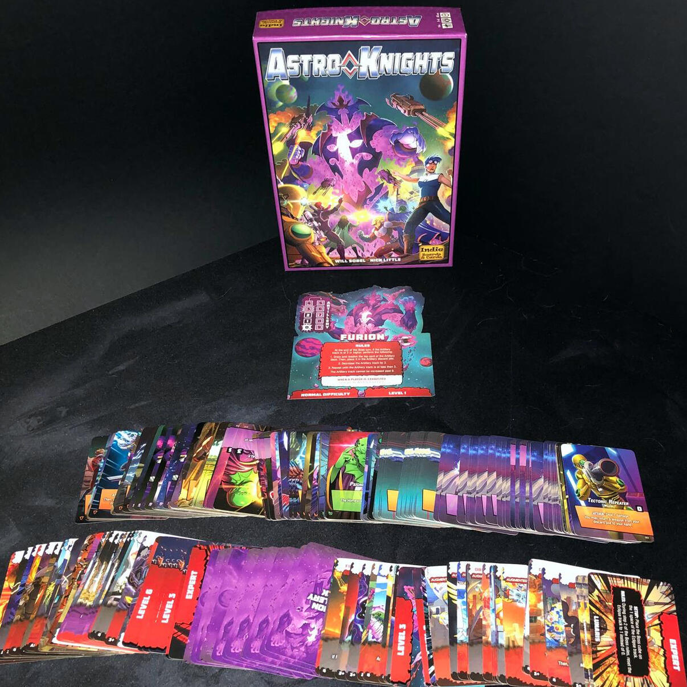
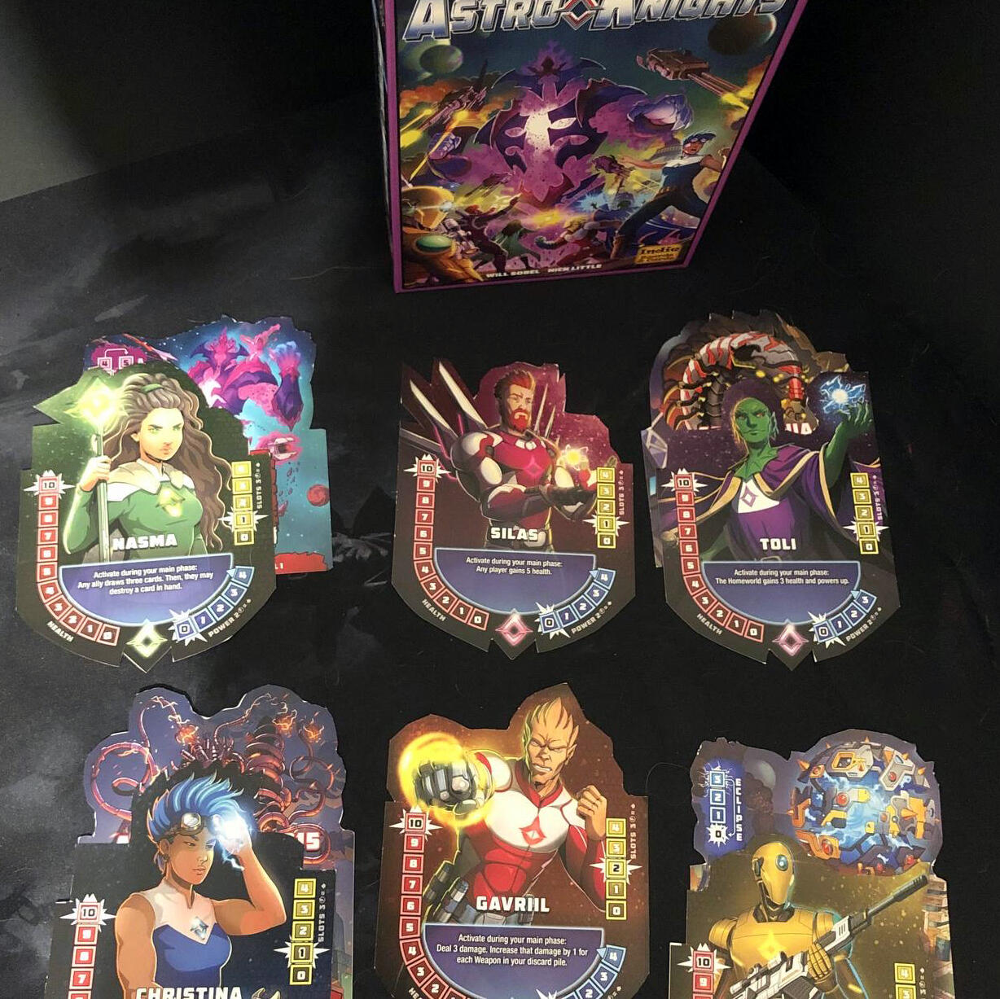

<Setting>

  L'ambientazione di Astro Knights è la cosa più simile ai Power Rangers nello
  spazio che abbia mai visto e questo tocco rétro, concede al gioco da tavolo
  quel retrogusto di trashata bellissima che non può mancare nella collezione di
  un buon intenditore di sci-fi e trash!

</Setting>

<Rules>

  Le regole di Astro Knights assomigliano a quelle del fratello maggiore{" "}
  <Link to="/reviews/aeon-s-end/">Aeon's end</Link> in quanto tutto il flusso di
  gioco sarà rivolto ad ottenere carte che producono Fuel, con cui comprare le
  carte Tech o Weapon, con cui a loro volta arrecare danni ai Boss prima che
  sconfiggano i Knights impersonati dai giocatori o distruggano il mondo che gli
  stessi stanno cercando di proteggere. Il tutto mentre i Boss diventeranno
  sempre più forti fino ad essere inarrestabili…

</Rules>

<Feedback>

  Astro Knights riesce a fare quello che la saga di{" "}
  <Link to="/reviews/aeon-s-end/">Aeon's end</Link> (sì è una saga con un sacco
  di espansioni) non è mai riuscita a fare: snellire l'esperienza di gioco.
  Infatti, il mercato da cui si ottengono le carte è composto da solo sei mazzi
  divisi per tipologia e costo: ciò dà sia più tatticità al gioco che più
  velocità in setup e de-setup. Inoltre, le nemesi che aumentano di livello nel
  corso della partita fanno sì che la partita diventi sempre più difficile in
  maniera organica, permettendo ai giocatori di prepararsi meglio alle
  difficoltà che si presenteranno…
   
  Ah, e oltre a tutto questo, se il gioco risultasse troppo facile, si potrà
  giocare a difficoltà avanzata o incubo… E saranno dolori, credetemi!

</Feedback>

