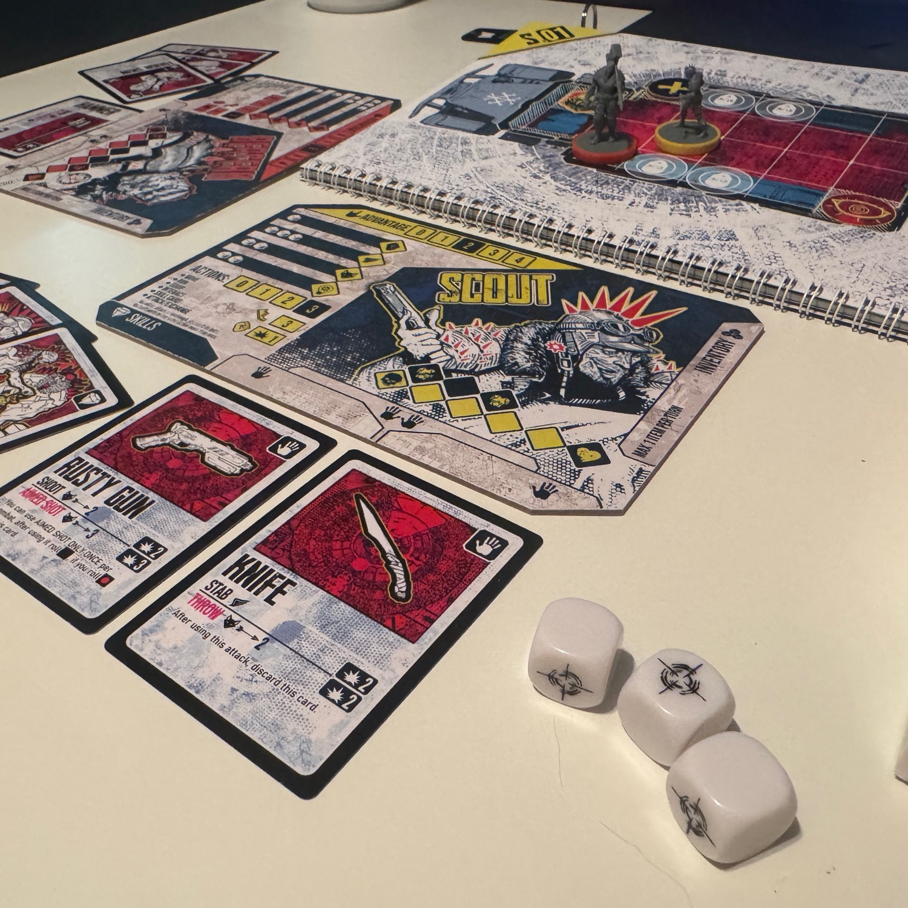
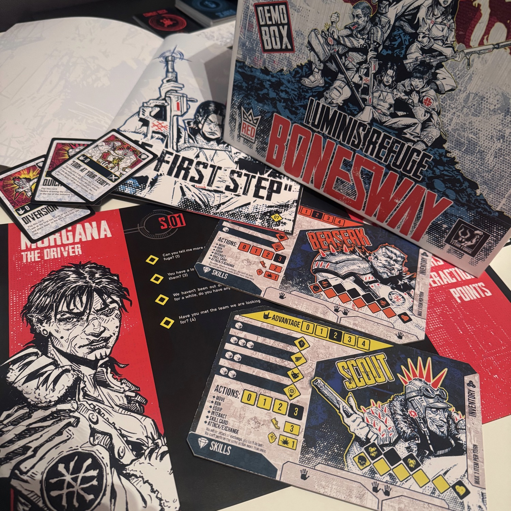
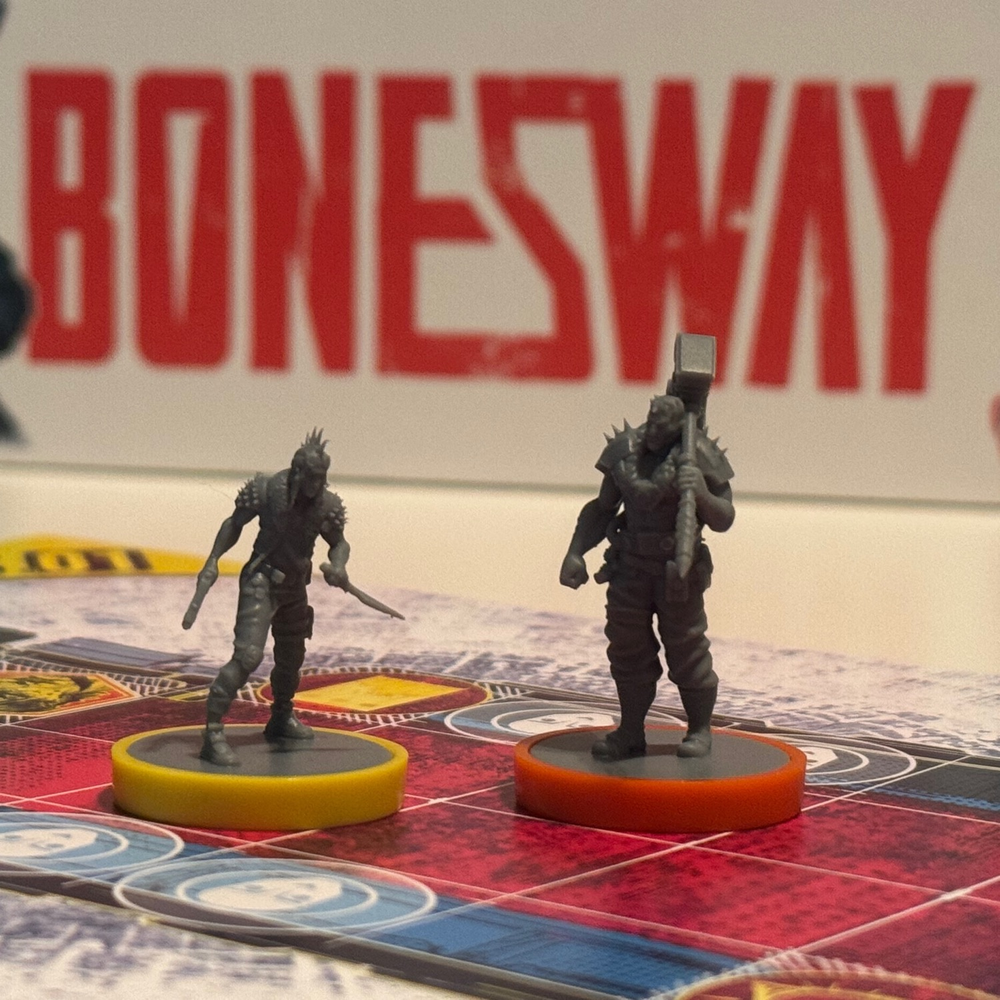

<Setting>

  Nel mondo crepuscolare di Last Hope, la luce non è un diritto, ma un ricordo. Le strade sono silenziose, spezzate da echi di un’umanità scomparsa. Nelle profondità di <strong>Luminis Refuge</strong>, tra ombre che sussurrano e macerie intrise di segreti, pochi sopravvissuti tentano l’impossibile: dare un senso al caos. Non ci sono eroi. Solo anime spezzate che provano a restare in piedi. 
  Ogni passo che farai in <strong>Bonesway</strong> sarà una scelta tra il rischio e la speranza, tra il silenzio e il coraggio. I tuoi compagni non sono solo personaggi, sono ciò che resta della tua fiducia. E ogni nemico non è solo carne, ma memoria corrotta di ciò che fu. 
  Hai una missione. Ma forse non basta. E in un mondo dove anche il respiro è un atto di sfida, un giorno può essere tutto ciò che hai.

</Setting>

<Rules>

  In Bonesway, guiderai uno o più personaggi in un mondo in rovina, affrontando scenari pieni di pericoli, enigmi e scelte morali. <strong>Ogni partita è un capitolo di una campagna più ampia</strong>, dove le decisioni prese lasciano tracce permanenti. 
  Il turno di gioco è semplice ma teso: si pesca un evento narrativo o casuale (se necessario), si eseguono <strong>fino a tre azioni</strong>, poi si passa il turno. Le azioni disponibili includono movimento, interazione con l’ambiente o con NPC, combattimento, utilizzo di oggetti o abilità — ognuna con un peso e un significato specifico. 
  Il cuore del sistema sono i tiri di attributo, effettuati lanciando dadi bianchi (successi) e, in certi casi, dadi neri (penalità). Il risultato determina l’esito di esplorazioni, dialoghi, e persino della tua sopravvivenza. I <strong>combattimenti sono tattici</strong>, con un’iniziativa variabile e i nemici mossi da un mazzo di carte che non fa sconti. <strong>Le armi possono rompersi, le condizioni indebolire, e le cure scarseggiano.</strong> 
  <strong>Se un personaggio viene sconfitto</strong>, non è la fine: può tornare in gioco, ma a caro prezzo. Se invece tutti cadono, bisogna ricominciare da capo. 
  Ogni scenario è un pezzo di un puzzle più grande. I Clue Cards che raccogli sbloccano nuove possibilità, i dialoghi con gli NPC influenzano il mondo, e ogni scelta — anche quella sbagliata — è parte della storia.

</Rules>

<Feedback>

  Ho provato Boneway: Luminis Refuge a Modena <strong>Play 2024</strong> ed è stata una di quelle sorprese che non ti aspetti. Non ero lì per cercare un nuovo narrativo, eppure dopo pochi minuti ero completamente immerso. Ho chiesto agli autori se potevo ri-provarlo a casa e, dopo un anno, sono felice di averlo fatto. 
  La sensazione che ho avuto fin da subito è quella di trovarmi dentro a un <strong>punta e clicca vecchia scuola</strong>, alla Monkey Island, ma in chiave <strong>dark sci-fi</strong>: esplori ambienti, raccogli oggetti, interagisci con NPC, sblocchi dialoghi, risolvi enigmi e tutto con una narrazione fitta, intrigante e piena di mistero. Il gameplay è snello e non ti ostacola mai: già dalla prima lettura del regolamento (ben scritto e chiarissimo) si riesce a giocare senza intoppi. 
  <strong>La grafica merita una menzione speciale</strong>: è davvero spettacolare, tra ambientazioni disegnate a mano, icone leggibili, carte curate e un’estetica che riesce ad essere originale e riconoscibile fin da subito. Anche la scelta di dividere i manuali in sezioni (regole, NPC, eventi, mappe) si è rivelata azzeccata: comodissimi da consultare, senza mai dover fare avanti e indietro mille volte. 
  Per ora ho giocato con i due personaggi demo, <strong>Scout e Berserk</strong>, ma nella versione completa saranno disponibili anche <strong>Sniper e Trooper</strong> — e non vedo l’ora di provarli. <strong>Ogni boss fight</strong> sarà unica, con nemici che avranno <strong>meccaniche specifiche e "gimmick" diversi</strong>, cosa che promette una varietà notevole. 
  E la storia? Bella. Davvero bella. Avvincente, ben scritta, con dialoghi interessanti e misteri che spingono a giocare “ancora solo un turno”. Mi è dispiaciuto dover smettere. 
  Insomma: è uno di quei giochi che <strong>si spiegano in 10 minuti</strong>, ma ti restano addosso per molto di più. 
  Bonewsay non è un semplice gioco d’avventura. È sopravvivere raccontando. E raccontare per sopravvivere.

</Feedback>

