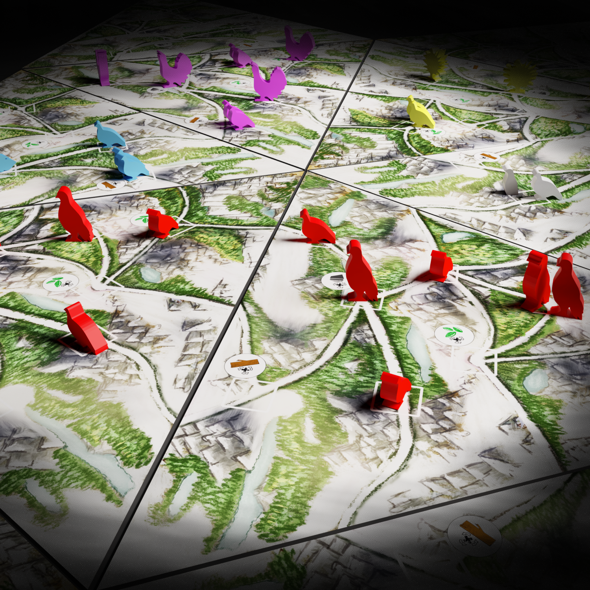

<Setting>

  Nel mondo di <strong>Clash of Galliformes</strong>, l'evoluzione ha preso una
  piega diversa per gli uccelli facendo sì che diventassero enormi bestie.
   
  Le tribù, in questa Scandinavia alternativa, hanno preso la palla al balzo e
  sono riuscite ad addomesticare questi uccelli giganti e a far sì che si
  integrassero “perfettamente” con il loro stile di vita, usandoli come
  cavalcature o vere e proprie macchine da guerra.

</Setting>

<Rules>

  Clash of Galliformes si articola su più round, massimo 50 per la precisione,
  in cui i turni dei giocatori si susseguiranno in tre fasi fino alla fine della
  partita, ovvero al raggiungimento del round limite o dopo aver soddisfatto
  delle particolari condizioni.{" "}
  <strong>Le fasi che dovranno compiere i giocatori sono</strong>:
  <ul>
    <li>
      <strong>Movimento</strong> : in questa fase i giocatori muoveranno le loro
      “armate” di pennuti sulla mappa, causando eventuali scontri, raccogliendo
      tecnologie o preziosi frammenti che serviranno a costruire un puzzle.
      Muoversi permetterà inoltre di poter costruire avamposti, importanti per
      aumentare la produzione di risorse
    </li>
    <li>
      <strong> Produzione e scambio </strong> : in questa fase gli avamposti
      produrranno le risorse necessarie per il sostentamento della tribù
    </li>
    <li>
      <strong>Sviluppo ed espansione </strong>: in quest'ultima fase, fulcro del
      gioco, i giocatori potranno convertire le risorse in uccelli, avamposti o
      potenziamenti per la tribù, in modo da avere un vantaggio sugli avversari.
      Inoltre, in questa fase sarà possibile usare i preziosi frammenti per
      ottenere il puzzle che farà finire la partita in anticipo o vari bonus
    </li>
  </ul>
  Il combattimento <strong>è molto snello</strong>. Ogni unità di gioco, uccelli,
  uccelli da battaglia, uccelli selvaggi, nido o avamposto ha varie caratteristiche
  offensive e difensive più o meno potenziabili, che andranno confrontate utilizzando
  un sistema di dadi simile a <Link to="/reviews/root/">Root</Link>, con bonus di
  attacco o difesa e un sistema di carte bonus usabili una volta a partita. Sostanzialmente
  il combattimento di Clash of Galliformes è letale e pericoloso, ma anche l'unico
  modo per interagire con gli avversari!
   
  Quando la partita finirà i giocatori si metteranno a contare i punti vittoria,
  riflesso della performance della tribù impersonata durante la partita, ricevendo
  un quantitativo di punti notevole per il completamento del puzzle, ma avrete intuito
  che non solo così si può vincere una partita di Clash of Galliformes…

</Rules>

<Feedback>

  Clash of Galliformes è quello che personalmente mi piace definire un{" "}
  <em>gioco Camaleonte</em>. Questo perché, a seconda dei giocatori presenti al
  tavolo, può essere giocato in maniera più o meno aggressiva o più o meno
  controllata. Eppure, come tutti i giochi con alle spalle questa filosofia,
  proprio a seconda del gruppo di gioco il piacere dato dall'esperienza non è
  mai inquadrabile. Alcune partite potranno risultare in uno stallo infinito
  perché i giocatori più aggressivi non vogliono attaccarsi a vicenda, mentre
  per i giocatori più controllati tutta la strategia può andare in fumo per un
  lancio di dadi in un combattimento avvenuto senza motivo; altre partite
  potrebbero rivelarsi dei capolavori di esperienza di gioco.
   
  Insomma, è questo che bisogna aspettarsi da Clash of Galliformes,{" "}
  <strong>
    un titolo leggermente asimmetrico che si è evoluto per essere in grado di
    soddisfare i palati di tutti i giocatori
  </strong>
  , riuscendoci, per la maggior parte delle volte, grazie al suo sistema fluido e
  alle sue meccaniche non troppo pesanti, ma sapientemente amalgamate: un gioco che{" "}
  <strong>merita sicuramente un posto in collezione</strong>!

</Feedback>

