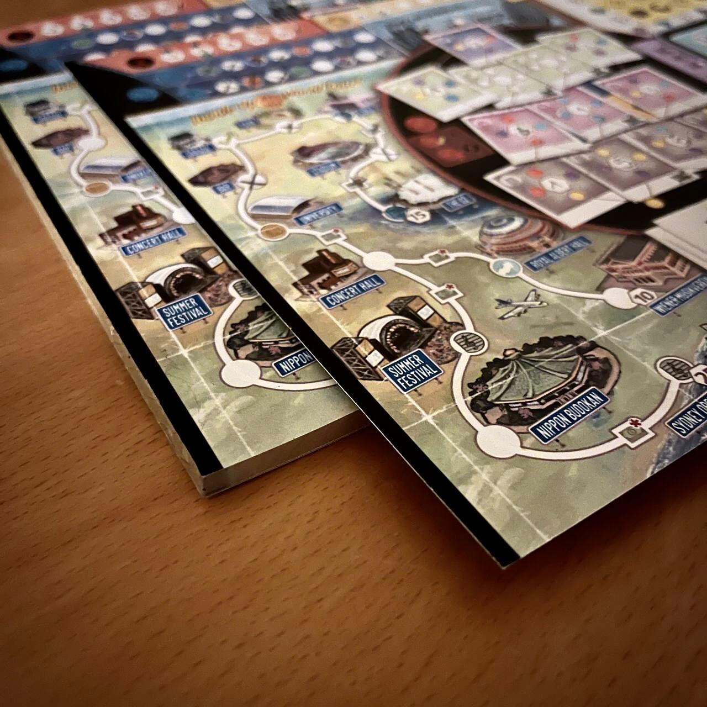
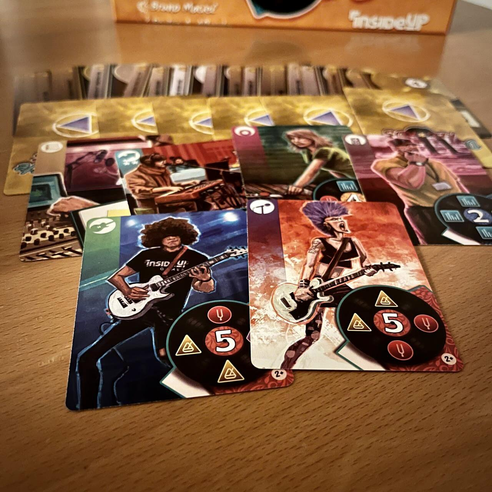
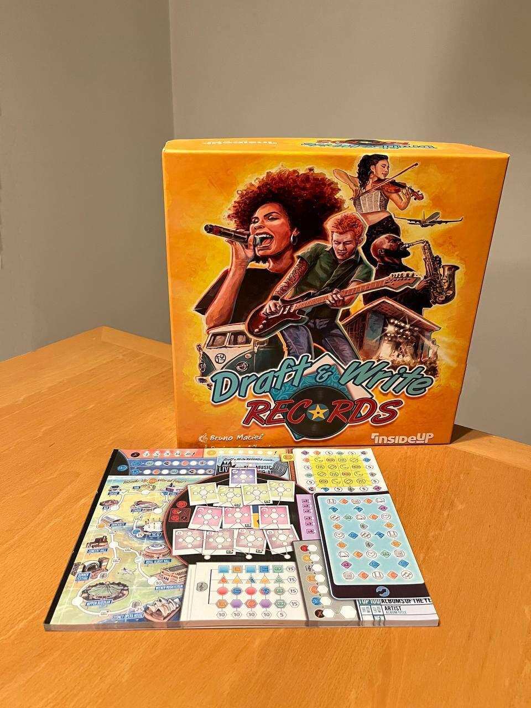

<Setting>

  Avete mai sognato di gestire una rock band e di farla crescere fino a farla
  arrivare alle stelle?!  
  Draft & Write Records è il gioco che fa per voi allora: pianificate una tournée,
  capite qual è la configurazione migliore per la vostra band, tenete sempre sott’occhio
  l’agenda e studiate come rimanere a galla con le spese…  
  <strong> Cosa state aspettando </strong>?!

</Setting>

<Rules>

  Il gioco si suddivide in round che per la band rappresentano settimane. In
  ogni giorno della settimana, tranne il venerdì, in cui ovviamente ci si
  prepara al weekend, i giocatori dovranno scegliere le carte con cui vorranno
  effettuare un’azione tramite un <Link to="/mechanisms/drafting"> Draft </Link>
  . Le carte tra cui scegliere permetteranno di influenzare uno dei tracciati presenti
  sulla plancia dei giocatori e saperli concatenare al massimo creando fantasmagoriche
  combo sarà necessario per vincere la partita.  
  Le carte/sezioni della plancia riguarderanno
  <ul>
    <li>
      <strong>Band e le armonie</strong>:
    la band dovrà essere composta con le carte che ne rappresentano i componenti,
    prestando attenzione ai punti vittoria di ognuno di essi e alle “armonie" che
    questi portano ai loro colleghi. Più componenti hanno armonie simili, più effetti
    in gioco di vario tipo verranno sbloccati.
    </li>
    <li>
      <strong>L’Agenda</strong>:
    una griglia 4x4 formata da simboli. Le carte potranno contenerne alcuni che verranno
    cancellati. Ogni riga e colonna completata fornirà…
    </li>
    <strong>ALTRI BONUS!!!</strong>
    <li>
      <strong>Il Tour</strong>:
    Solo grazie ai bonus ottenuti si potrà pianificare il tour della propria
    band. Più lontano si andrà meglio sarà!
    </li>
    <li>
      <strong>Gli Album</strong>:
      Quando le band incideranno un pezzo grazie a dei bonus… otterranno <strong>ALTRI BONUS!!!</strong>
    </li>
  </ul>
  Durante il weekend i giocatori dovranno confrontarsi su chi ha raggiunto gli
  obiettivi del round/settimana in corso.  
  I round si susseguiranno fino a che un giocatore non avrà completato la sua band
  per intero, completato abbastanza obiettivi, o finché un giocatore avrà malauguratamente
  fallito troppe azioni.  E poi… <strong>TEMPO DI CALCOLARE I PUNTI!!!</strong>

</Rules>

<Feedback>

  Draft & Write Records è un gioco sicuramente interessante per gli amanti dei
  Roll & Write…o, in questo caso, dei Flip & Write. Più di una volta durante una
  partita vi ritroverete a dover fare i conti con le infinite possibilità di
  combinazioni per massimizzare il potenziale di combo allo scopo di fare{" "}
  <strong>esplodere</strong> il vostro punteggio.  
  Come tutti i giochi di questa categoria, questa continua ricerca alla combo migliore
  può piacere o non piacere, ma Draft & Write Records, anche grazie a un’ambientazione
  che per il <strong> “potere del Rock" </strong> è sentita (per quanto sulla carta
  non sembrerebbe), riesce a convincere anche i giocatori non tanto avvezzi al genere:
  un genere che, per inciso, rimane molto particolare e forse, per quanto questo
  titolo non si possa considerare troppo complesso, non è troppo adatto ai neofiti.

</Feedback>

