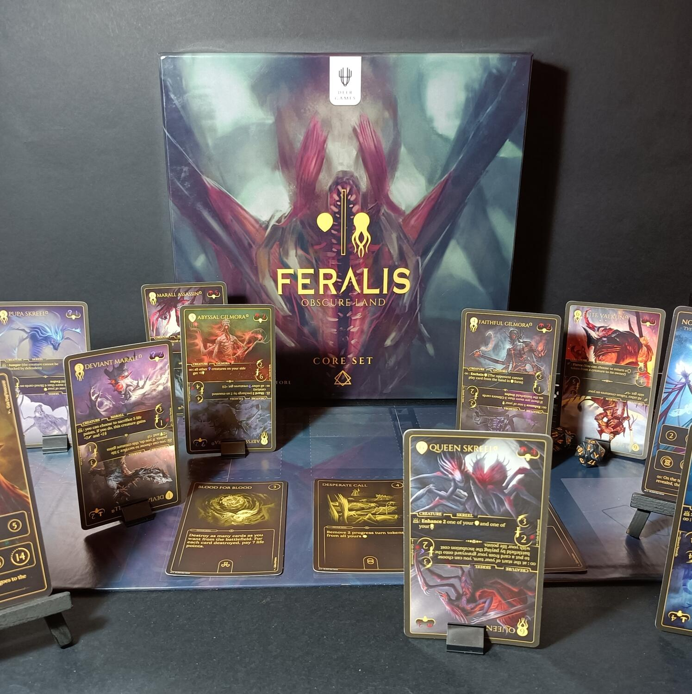
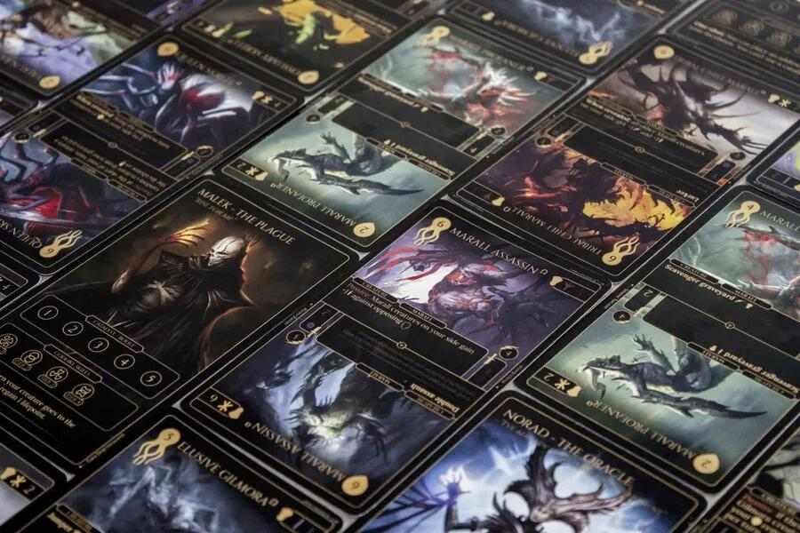

<Setting>

  Feralis è un mondo oscuro e brutale dove creature di ogni genere e razza
  vivono in conflitto tra di loro. Vestirai i panni di un <strong>Aesyr</strong>
  , un dio senza tempo di questa dimensione, pronto a scontrarsi con altri suoi
  pari per chissà quale motivo: gloria, potere o semplicemente per pura noia.
  Potenti eserciti saranno evocati, e solo tu potrai comandare le potenti
  creature che popolano questo regno. Ce la farai o perirai nel provarci?

</Setting>

<Rules>

  Feralis è un gioco di carte per 2 giocatori, in cui ogni giocatore prenderà il
  comando di una delle potenti razze che popolano questo regno e vestirà i panni
  di uno dei loro <strong>Aesyr</strong>. 
  Ad inizio partita, ogni giocatore dovrà scegliere quindi una divinità, con gli
  eventuali segnalini Catalizzatori e le relative abilità Divine. Come in un classico
  gioco di carte 1vs1, ogni giocatore dovrà evocare creature turno dopo turno e usare
  abilità per portare a zero punti vita l'avversario. Ma entriamo nel dettaglio e
  analizziamo le particolarità di questo fantastico gioco.
    Innanzitutto, in Feralis le creature non saranno evocate direttamente,
  bensì andranno prima <strong>incubate</strong>. Il tempo è una risorsa davvero
  importante: sia le abilità che le creature potranno essere giocate solo dopo
  un tot di turni. È qui che verranno in soccorso i{" "}
  <strong>Catalizzatori</strong>, potenti artefatti che permettono di modificare
  il tempo. Ogni creatura in Feralis presenta un lato <strong>Richiamo</strong>{" "}
  e uno <strong>Risveglio</strong>. Ogni lato avrà le sue abilità, i suoi punti
  attacco e la sua velocità, rendendo ogni creatura davvero unica. Quando
  decidiamo di mettere una creatura nell'incubatrice potremo scegliere da che
  lato evocarla, tenendo presente però che se una creatura muore mentre è girata
  sul lato Richiamo, potrà ritornare nell'incubatrice girata dal lato Risveglio;
  non succede il contrario, ovvero se la creatura viene distrutta in modalità
  Risveglio, il giocatore è costretto a scartarla. Le creature in Feralis
  possono avere 3 diverse Costituzioni: <strong>Fisico</strong>,{" "}
  <strong>Corrotto</strong> o <strong>Ombra</strong>, che determineranno
  vantaggi o svantaggi durante lo scontro con altre creature. I giocatori,
  durante il loro turno, potranno usare le abilità Divine attive, attivare
  l'abilità del proprio Aesyr, usare un Catalizzatore o far attaccare le proprie
  creature.
    Una creatura può attaccare direttamente l'Aesyr avversario se non sono presenti
  creature avversarie con il segnalino <strong>Difensore</strong> (posizionati al
  momento dell'evocazione: ce ne sono solo tre e vengono scartati una volta che la
  creatura è sconfitta). Invece, se una creatura ne attacca un'altra, infliggerà
  danno per prima quella più <strong>rapida</strong>, al netto di tutti i modificatori.
  Il gioco termina se uno dei due Aeyrs arriva a zero punti vita.

</Rules>

<Feedback>

  Premetto che ho potuto giocare solo al prototipo, quindi eventuali
  bilanciamenti di carte e materiali potranno cambiare nel corso della campagna
  Kickstarter, oltre ovviamente all'aggiunta di nuove carte, razze e Stretch
  goals.
   
  “Feralis: Obscure land” è davvero una chicca. Un gioco di carte ben
  strutturato e bilanciato. Per gli amanti del deck building o per vecchi
  giocatori di Magic che cercano qualcosa di nuovo, penso che questo titolo sia
  un'ottima alternativa. La profondità strategica è davvero alta, ponendo i
  giocatori di fronte a numerose scelte in ogni momento della partita. La
  pianificazione delle combo e delle evocazioni delle creature sarà il fulcro
  principale delle vostre strategie.
    La possibilità di costruire il proprio mazzo di carte porta la rigiocabilità
  e la longevità di questo titolo alle stelle. Ogni creatura presenta peculiarità
  davvero uniche, non solo grazie alle diverse tipologie di Costituzione, ma anche
  alla struttura a due lati di ogni carta. D'altra parte, questo stesso aspetto rende
  il titolo non proprio adatto a tutti. La paralisi d'analisi dovuta alle innumerevoli
  possibilità e alla complessità delle varie strategie da poter costruire alzano
  l'asticella della difficoltà non di poco. Dover gestire diverse carte sul campo
  di battaglia, i tempi di incubazione e di attivazione delle varie abilità Divine
  e le numerose abilità che ogni creatura possiede, senza contare le tre diverse
  Costituzioni e i parametri di velocità e attacco di ognuna di esse, in alcuni momenti
  vi faranno fumare le orecchie.
   I componenti di Feralis sono da togliere il fiato. Mi sono innamorato di
  questo gioco non solo per il gameplay ma anche per il design e l'art delle
  carte. Ogni carta è un quadro incorniciato, dettagliato e davvero unico, quasi
  da poster. Non posso commentare gli altri componenti poiché dispongo solo del
  prototipo, ma ci metto la mano sul fuoco che i ragazzi della Deer games studio
  faranno un buon lavoro anche su questo fronte. Che dire, se amate i giochi di
  carte uno contro uno, la strategia e i titoli deck building, beh non fatevi
  assolutamente scappare questo titolo, perché è davvero fantastico.

</Feedback>

