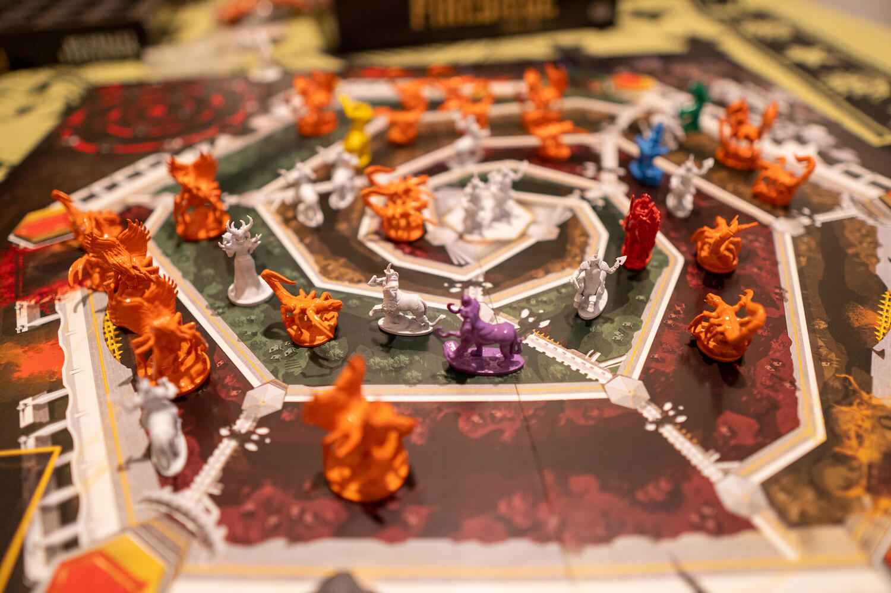
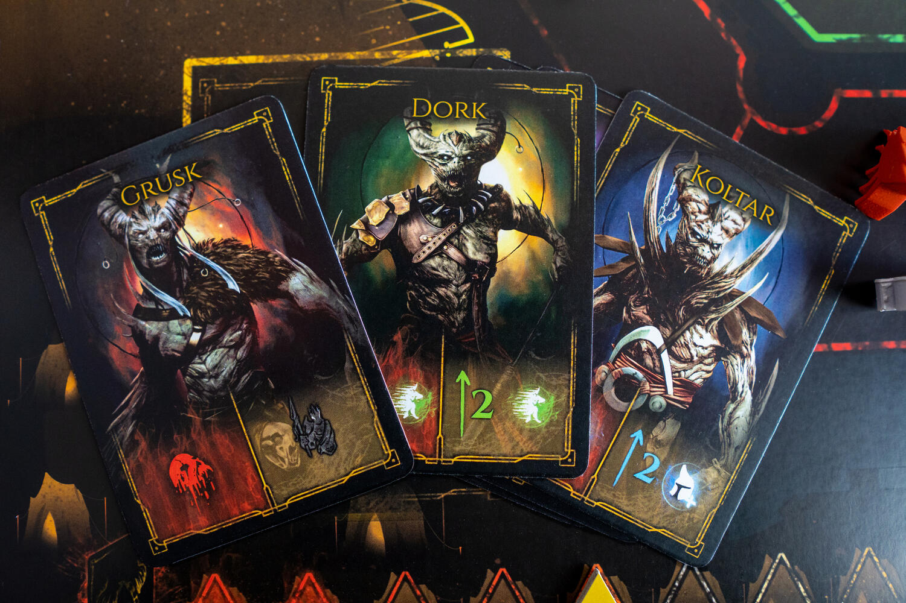
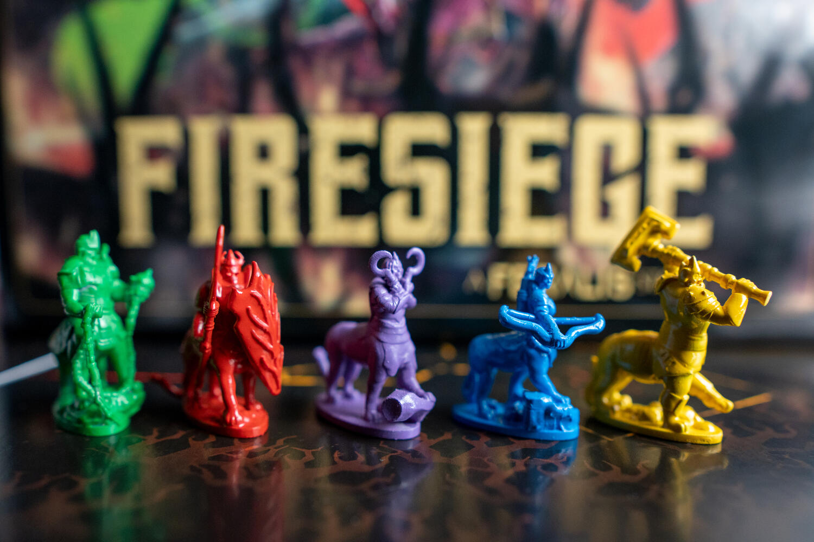

<Setting>

  Sull’isola di Elimor, nel <strong>mondo di Feralis, la città di Medda è stata posta sotto assedio</strong>.
    L’ambizioso Zagal vuole infatti impossessarsi della città e dei segreti che questa
  custodisce. Le <strong>orde di Skreel</strong> hanno già fatto breccia attraverso
  le mura, e corrono veloci verso la cittadella. I “Valkun”, i guerrieri della città,
  sono disposti a dare la vita pur di difendere la propria casa, guidati da cinque
  eroi dotati di straordinarie capacità.
   
  La lotta è disperata ma non tutto è perduto: se vi è ancora un barlume di speranza,
  questo è posto nelle vostre mani! Diventate uno degli eroi, scacciate Zagal e le
  sue terribili armate, riprendete il controllo di Medda in questa disperata <strong>battaglia all’ultimo sangue</strong>.

</Setting>

<Rules>

  Firesiege è un <strong>gioco cooperativo</strong> da 1 a 5 giocatori, nel
  quale sarete chiamati ad impedire che e truppe avversarie arrivino al centro
  della città.
   
  La mappa si struttura come una fortezza con{" "}
  <strong>tre percorsi diversi</strong>, che dalle mura esterne conducono,
  seguendo una spirale, verso la <strong>cittadella interna</strong>. All’inizio
  di ogni percorso è posto un nido, dal quale avranno origine le truppe
  avversarie, e lungo uno di questi tracciati, circa a metà, posizionerete il
  vostro eroe. A ciascun giocatore, inoltre, sarà fornita una
  <strong> scheda personaggio</strong>, sul cui fronte verrà indicato lo <strong>
    status normale
  </strong> dell’eroe con i punti vita e i punti attacco, mentre sul retro ci sarà
  lo <strong>status “risvegliato”</strong> con punti vita, punti attacco e soprattutto
  un’abilità speciale attiva e una passiva.
   
  Lo scopo del gioco sarà quello di posizionare tutti i <strong>
    sei stendardi
  </strong> sulla cima delle mura, completando i tre diversi obiettivi sorteggiati
  all’inizio; ciascun obiettivo fornisce un numero di stendardi variabile.
   A inizio partita ogni giocatore dovrà pescare dal sacchetto{" "}
  <strong>tre tessere comando</strong> e posizionarle verticalmente nella
  fessura della propria plancia,{" "}
  <strong>in maniera tale che lui ne possa vedere un lato e gli altri giocatori
    l’altro
  </strong>. Durante ogni turno, consultandosi con i propri compagni, dovrà quindi scegliere
  una tessera da giocare, <strong>
    eseguendo prima le azioni sopra riportate a lui visibili e poi quelle poste
    sull’altro lato, di cui era ignaro
  </strong>. Bisognerà infine pescare una tessera dal proprio sacchetto, avendo cura
  di vedere sempre solo un lato di questa, riportando quindi a tre il numero di tile
  sulla plancia. La comunicazione tra giocatori sarà libera, ad eccezione del fatto
  che a ciascuno <strong>non sarà mai possibile esplicitare le azioni presenti sul lato a sé visibile
    delle tessere</strong>
  .
   
  Le azioni dei difensori potranno portare a schierare truppe (i “Valkun”), ad
  avanzare sulla mappa, ad attaccare gli avversari, ad accumulare magia o
  potenziamenti e, infine, ad usare le abilità speciali degli eroi.
   
  Tra le azioni degli invasori vi sono, invece, la creazione di nuovi Skreel,
  l’avanzamento di questi lungo il tracciato e, infine, la generazione e
  l’attivazione dei Warlord, temibili avversari con poteri specifici molto
  forti.
   
  Ma attenzione! Il lato invasore delle tessere potrebbe anche far avanzare un
  contatore lungo la “Horde Track”, e, se questo raggiungerà la fine, la partita
  terminerà con una sconfitta. Quest’ultima potrà arrivare anche se un eroe
  muore, oppure se un’unità nemica raggiunge il centro della città.{" "}
  <strong>La vittoria</strong>, come scritto precedentemente,{" "}
  <strong>si otterrà posizionando tutti i sei stendardi</strong> (ottenibili con
  i tre obiettivi) sulle mura esterne.

</Rules>

<Feedback>

  Firesiege ci ha davvero sorpreso, in quanto la meccanica di gioco induce a
  doversi fidare ciecamente dei propri compagni d’arme, come in una vera
  battaglia all’ultimo sangue. La dinamica della scelta delle tile rende la
  collaborazione non facoltativa ma necessaria e crea tensione tra tutti i
  giocatori, perché nessuno saprà mai cosa si nasconde dall’altra parte delle
  tessera, ma saprà anche che uno degli effetti potrebbe contribuire in maniera
  decisiva alla vittoria o alla sconfitta del gruppo. In sostanza vi chiederete, <strong>“avrò fatto bene a fidarmi del mio compagno e a scegliere quella tessera?”</strong>
   
  Tutto ciò rende la <strong>battaglia dinamica e sfidante</strong>, perché ad ogni
  azione corrisponde una reazione, ed è davvero difficile guadagnare vantaggio sugli
  avversari: spesso si ha davvero la sensazione di trovarsi sotto assedio, con orde
  di Skreel che sciamano continuamente dai tre nidi posti sulle mura. Da un sistema
  tutto sommato semplice viene generata <strong>un’ottima profondità di gioco</strong>; i diversi obiettivi porteranno a pianificare le proprie mosse, obbligando
  a mantenersi sempre pronti a continui cambi di fronte.
   
  Per quanto riguarda la variabilità di gioco, ad inizio partita vengono scelti tre
  obiettivi fra i dieci disponibili presenti nella scatola base, che potranno portare
  anche variazioni di setup: considerando, inoltre, cinque diversi eroi la rigiocabilità
  è buona.
   È inoltre presente una{" "}
  <strong>campagna con sette scenari differenti</strong> che permettono di
  scoprire la storia dell’assedio di Medda.
   
  L’<strong>artwork</strong>, come in{" "}
  <Link to="/reviews/feralis/">Feralis</Link>,{" "}
  <strong>è davvero eccezionale</strong>: tutte le illustrazioni sono di alta
  qualità e molto evocative, e permettono al giocatore di immergersi nel mondo
  brutale e orrorifico immaginato dagli autori.
   
  Non bisogna, inoltre, dimenticare il grande sforzo che la{" "}
  <strong>Deer Games Studio</strong> sta facendo per ampliare{" "}
  <strong>l’universo di Feralis</strong>, di cui potete trovare molte altre
  informazioni e illustrazioni sul{" "}<a href="https://deergamesstudio.com/feralis-lore/" target="_blank">loro sito</a>: di fatto stanno creando un mondo intero e <strong>Firesiege vi si innesta perfettamente</strong>.
   
  In conclusione, Firesiege conferma quanto fatto con Feralis, aggiungendo un elemento
  di <strong>originalità</strong> con la scelta parzialmente alla cieca della tessera
  comando. La campagna di Crowdfunding partirà verso metà novembre e noi la seguiremo
  certamente, perché è un gioco che merita decisamente attenzione.

</Feedback>

