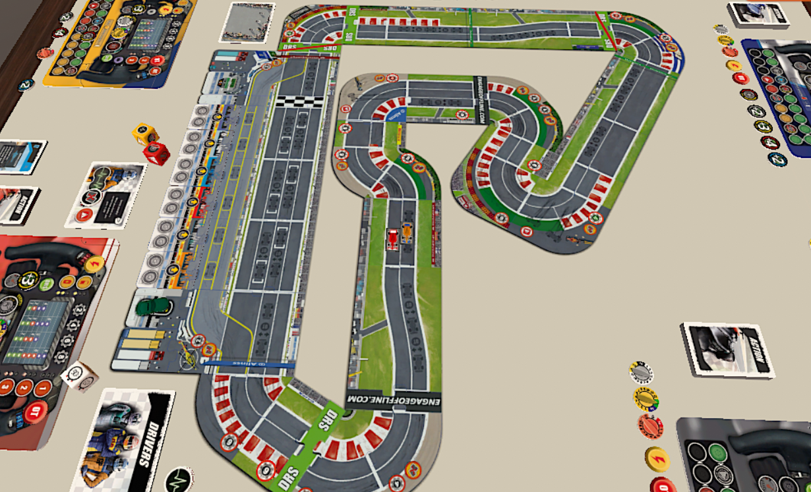
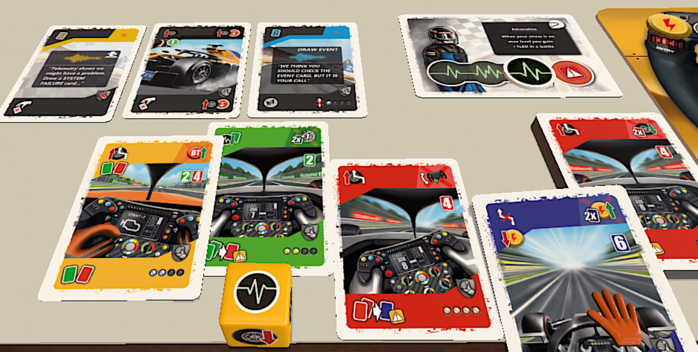
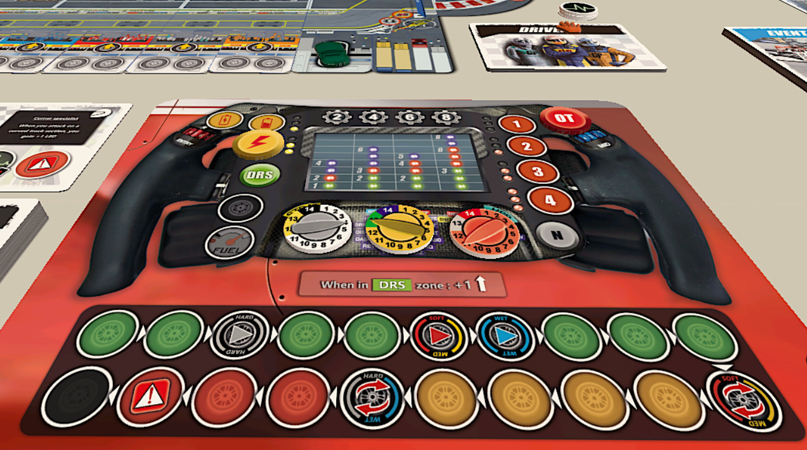

<Setting>

  “Ora possono superare la Safety Car! Via! <strong>Si decide il mondiale a questo ultimo giro!</strong> Tutti in piedi!
  Mai visto un mondiale finire così! Con i due contendenti alla pari! Cerca, <strong>Verstappen</strong>, di stare
  incollato ad <strong>Hamilton</strong>, per avere la sua chance! Ce l’avrà! È vicino! Alla cinque va già dentro
  Verstappen! Dentro Verstappen, prende la posizione! Max Verstappen <strong>ribalta la situazione</strong>! Prende
  tutta la scia Lewis Hamilton! Ci prova! Va all’esterno Hamilton! È un finale che non dimenticheremo mai! Va
  all’esterno Lewis Hamilton, quasi si toccano! Un boato, è un inferno ad <strong>Abu Dhabi</strong>! Ultime curve! La
  12, la 13, la 14! È incredibile questo mondiale! Cosa ci ha regalato! <strong>Max Verstappen vince!</strong> Ed è{" "}
  <strong>campione del mondo</strong>! Incredibile!” (dalla Cronaca del Mondiale 2021, Carlo Vanzini)

</Setting>

<Rules>

  Lo scopo del gioco è quello di <strong>tagliare il traguardo per primi dopo il 24esimo round</strong>. 
  Assemblato il circuito-puzzle, estratto casualmente l’ordine dei garage, impostati i mazzi di carte e predisposti i token
  e i dadi, si può iniziare. Nella <strong>versione Avanzata</strong> occorrerà anche stabilire le condizioni meteo.
   
  Ogni giocatore disporrà di un’<strong>auto</strong>, che si muoverà lungo il circuito; di una <strong>Carta Pilota</strong> con un <strong>Token Stress</strong> e un’abilità, attivabile normalmente una volta al turno; di una <strong>Carta Team Radio</strong>; del proprio mazzo di <strong>Carte Azione</strong>; di una <strong>Plancia Personale</strong> (con una caratteristica
  unica), nella quale sono rappresentati l’<strong>indicatore OT</strong>, la <strong>batteria ERS</strong>, il percorso
  dei <strong>Pneumatici</strong> e il quadrante del volante con tre <strong>token Parametri</strong> (Bianco, Giallo e Rosso,
  che possono essere sfruttati per migliorare le prestazioni dell’auto o per riparare eventuali guasti).
   
  Prima di iniziare, i giocatori dovranno selezionare il tipo di Pneumatici con cui muoveranno la loro vettura. Inoltre,
  verrà stabilito il <strong>Punteggio di Qualificazione</strong> che determinerà l’ordine di turno iniziale (nei turni successivi
  sarà la posizione delle vetture lungo il tracciato a determinarlo).
   
  I giocatori partono in seconda; nel primo round di gioco non avverranno battaglie (anche se si potrà ugualmente sorpassare
  un avversario) e le zone DRS non saranno attive.
   
  All’inizio di ogni turno, la <strong>Bandiera a Scacchi</strong> si sposta di un passo nel Pannello di Controllo della
  Corsa; poi si rimuovono, se opportuno, eventuali token Bandiera Gialla e Verde.
   
  Nella fase successiva, i giocatori pescano simultaneamente dal proprio mazzo 4 Carte Azione; poi, una volta al turno, possono
  rimpiazzare un numero di carte appena pescate pari al <strong>valore LED</strong> sul tracciato ERS (tranne nel primo round
  di gioco).
   
  Segue la fase in cui si compiono una serie di <strong>Azioni</strong>, alcune obbligatorie, altre opzionali.
    <strong>L’unica sempre obbligatoria è il Movimento</strong>. Pertanto, ogni giocatore, al suo turno, giocherà una o due <strong>Carte Movimento</strong>. Il colore indica
  quanto si sta forzando l’auto (nell’ordine, <strong>Verde</strong> = movimento conservativo; <strong>Rosso</strong> = movimento
  possente; <strong>Blu</strong> = movimento incrementato; le <strong>Carte Gialle</strong> sono Opzionali e possono essere
  usate all’occorrenza come Rosse o Verdi). Giocando due carte dello stesso colore si otterrà l’equivalente di una Carta
  di movimento superiore, ma dopo averle giocate dovrà tirare il <strong>Dado Giallo</strong>. I Punti Movimento dipendono
  dal Colore della Carta e dalla marcia attuale, sommato al <strong>Bonus dei Pneumatici</strong>. Il movimento non può mai
  essere diagonale ma deve sempre essere laterale, se si vuole cambiare corsia. Si può estendere il Movimento con una <strong>Carta Pneumatici Usurati</strong> se si è in curva o con punti ERS se si è su un tracciato rettilineo. Una sola auto può fermarsi su ciascuna “sezione”
  del tracciato, tranne che sugli spazi in <strong>Scia</strong>: allora le auto possono fermarsi in una stessa sezione,
  ma ciascuna si collocherà sulla prima ombra libera dietro l’auto che si trova più avanti. Alcune curve imporranno ai giocatori
  il lancio di un <strong>Dado Rosso</strong> per verificare se perdono o meno il controllo dell’auto.
   
  Il mazzo del giocatore è poi composto da altre carte, come i “Pneumatici Usurati” o il “Guasto del Sistema”, che normalmente
  occupano spazio in mano e comportano danni alla vettura che si possono riparare solo con un Pit Stop o una Riparazione
  Rapida. Fare un <strong>Pit Stop</strong> accedendo all’apposita rampa consente di ricaricare l’ERS token, sostituire i
  Pneumatici, azzerare lo stress, riparare i danni alla vettura, scartare carte azione e pescarne altre, cambiare gratuitamente
  la carta team radio.
   
  Normalmente, ovvero se non si è in Scia e ci si trova sulla stessa corsia di un avversario o su una adiacente, un giocatore
  deve fermarsi una sezione dietro alla vettura che li precede. Eventuali punti movimento in eccesso finiscono sull’indicatore
  OT e ulteriori eccedenze sono perdute. I punti OT sono temporanei e possono essere sfruttati se si sceglie di andare all’attacco
  di una vettura avversaria, avviando una battaglia, altrimenti vanno persi.
   È possibile superare un avversario senza avviare una battaglia se c’è almeno una corsia che separa i due rivali.
  Ma quando due giocatori terminano il loro movimento o una battaglia sulla stessa sezione del tracciato, inizierà un{" "}
  <strong>Testa a Testa</strong>, che potrà proseguire nei round successivi. Durante una <strong>battaglia</strong>{" "}
  entrambi i giocatori selezionano segretamente le Carte da investire (il loro valore di attacco o di difesa è indicato
  dai relativi LED) e spendono punti ERS. Il giocatore con il punteggio di attacco più elevato dato dalla loro
  combinazione vince la battaglia e usa i punti OT attualmente disponibili per staccare l’avversario di altrettante
  caselle. Durante questa manovra di sorpasso, il vincitore può superare anche altre vetture (che non si difendono).
  Tutte le carte usate in battaglia vengono scartate. Se la battaglia non è vinta dall’attaccante, le posizioni delle
  due vetture non cambiano.
   
  Dopo che la bandiera a scacchi ha raggiunto la 24esima casella dell’apposito tracciato, il primo giocatore che taglia
  il traguardo in qualunque round successivo vince la partita.

</Rules>

<Feedback>

  Una delle cose che non avevo amato di <Link to="/reviews/heat-pedal-to-the-metal/">Heat</Link> è l’estrema{" "}
  <strong>semplificazione</strong> del processo di guida di una vettura. Certo, il gusto un po’ retrò per un mondo
  lontano ed evocativo di corse automobilistiche c’è, ma per gli amanti delle corse di F1 che volessero ritrovare nel
  gioco da tavolo un’esperienza più attuale e verosimile, Formula GP è forse il titolo più promettente, avendo già
  presenti esempi come <em>Race! Formula 90</em> (che presenta aspetti di totale casualità) o <em>Rallyman GT</em> (che
  per molti versi è decisamente più semplice).
   
  L’impressione che ho avuto provando questo titolo su TTS nell’ottobre 2023 è che gli altri giochi da tavolo in
  circolazione sullo stesso tema riprendano l’atmosfera del mondo della F1 e se ne approprino inventando meccaniche
  semplici e accessibili: in questo contesto, Formula GP è{" "}
  <strong>la più vicina e verosimile trasposizione su tavolo</strong> di quel mondo, visto dalla{" "}
  <strong>prospettiva del pilota</strong>. La gestione dello stress, la possibilità di finire fuori strada, perdendo il
  controllo dell’auto, e di dover gestire una situazione del genere, il testa a testa, la scia (!!!), i danni materiali
  alla vettura, la safety car, gli indicatori di marcia, il Pit Stop, le penalità, le bandiere gialle che indicano la
  necessità di rallentare, la modalità campionato…{" "}
  <strong>Tutto in questo gioco è curato nei minimi particolari</strong> per restituirvi un’esperienza fatta di scelte
  difficili e astuzia, <strong>estremamente verosimile</strong>, e vi farà respirare l’aria di una vera corsa di Formula
  1, riportandovi a quelle domeniche pomeriggio in cui immancabilmente lo zio di turno vi trascinava a sedervi accanto a
  lui a tifare per Schumacher o Villeneuve. Non solo:{" "}
  <strong>Formula GP imposta un nuovo modo di approcciarsi ai giochi di corsa</strong>, proponendosi come
    <strong>un sistema-modello che certamente non potrà più essere ignorato</strong>! 
  La Sprint Race, in quanto versione semplificata delle regole, è ideale per cominciare ad approcciarsi al gioco, ma bisogna
  dire che Formula GP <strong>dà il meglio di sé quando si concede al titolo di realizzarsi in tutte le sue articolate possibilità.</strong>
    Infine, per gli amanti dei solitari esiste anche un’apposita versione, in cui il giocatore sarà assistito da
  vari BOT (più o meno sfidanti), che possono in ogni caso essere adoperati in partite multigiocatore.
   
  Noi di Dudexpress abbiamo deciso di supportare questo progetto. E voi?

</Feedback>

