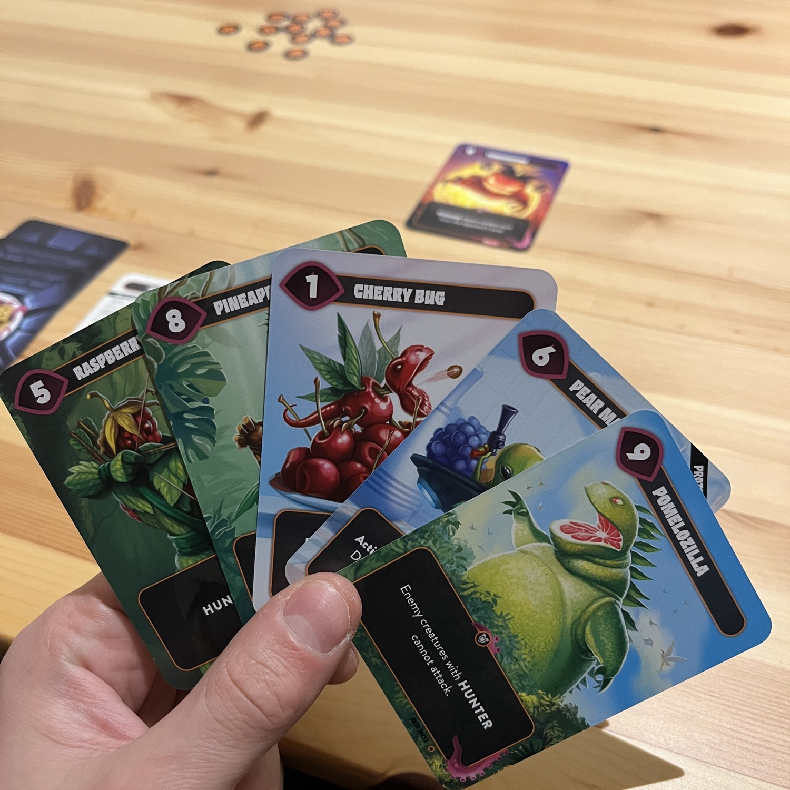
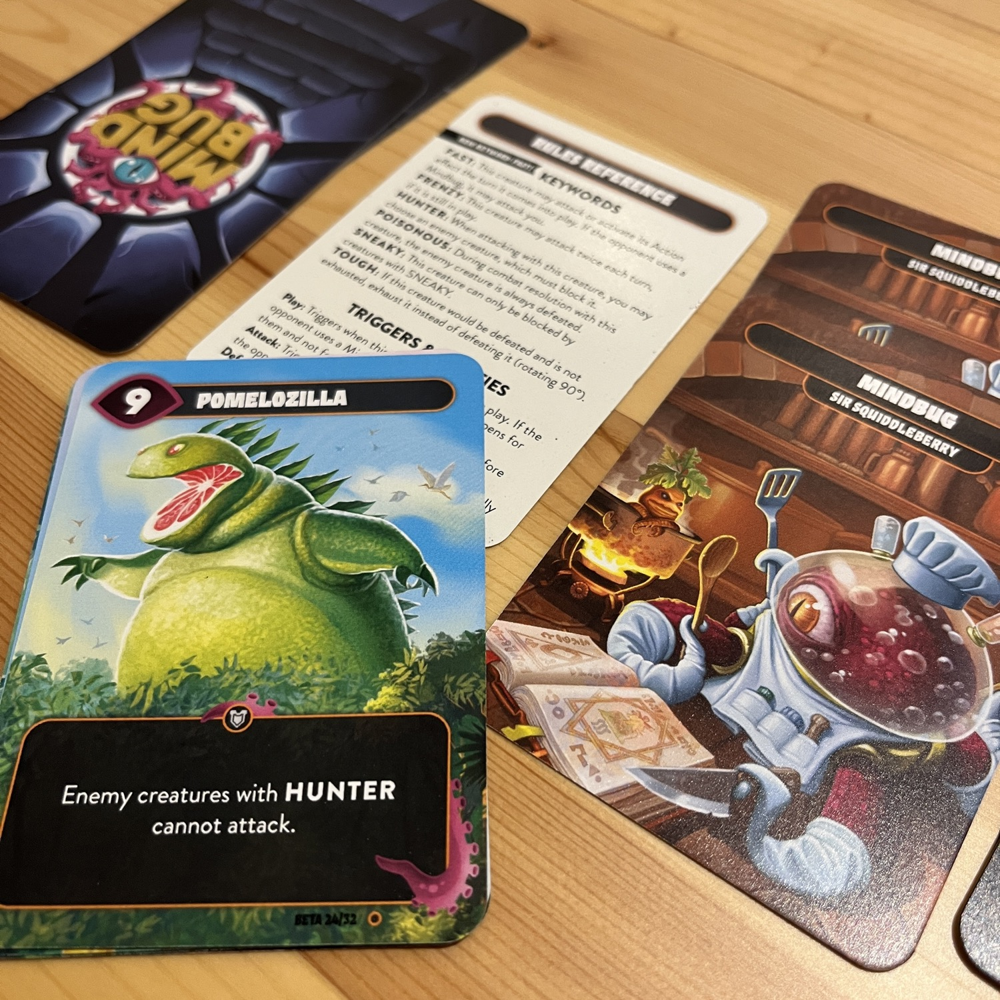

<OriginalReviewLink slug="mindbug" />

<Panoramic>

Pensavate che andare nello spazio fosse il limite? Pensavate che <Link to="/previews/mindbug-beyond-evolution/">Beyond</Link> fosse l’ultima espansione di Mindbug?! <strong>E invece no!</strong>  
Con Battlefruit abbiamo un’ambientazione a tema frutta alquanto geniale che introduce nuove modalità di gioco al sistema mindbug (2v2) e due nuove <em>keywords</em>: 
<ul>
    <li><strong>Fast</strong>: la creatura attaccherà immediatamente una volta giocata</li>
    <li><strong>Harvest</strong>: sfruttando i nuovi segnalini, gli <em>octaniti</em> attiveranno un effetto dopo alcuni turni, creando sostanzialmente un effetto ritardato in grado di stravolgere la partita!</li>
</ul>

</Panoramic>

<Feedback>

Mindbug Battlefruit è ancora un <em>more of the same</em>. Tutte le espansioni di Mindbug lo saranno, quindi aspettarsi altro non è realistico. Alla fine sono set a sé stanti in grado di fornire ai giocatori, dai più navigati ai più inesperti, un’esperienza appagante e assolutamente divertente. Poi, come un bananpus negli abissi, questo Mindbug diventa più profondo, espansione dopo espansione. Nuove divertenti meccaniche, nuove interazioni, nuovi modi di gestire la partita lo rendono un sistema sempre più maturo. Più complicato forse, ma non meno divertente. Le nuove <em>keywords</em> aggiungono uno strato strategico più a lungo termine al gioco e il fatto di avere effetti qualche turno nel futuro complica drammaticamente la risposta alla domanda:  <strong> Mindbug o non Mindbug? </strong>  Un gioco in cui una partita tira l’altra e che vi farà sbellicare dalle risate. Come fa a non essere divertente giocare i crudelissimi Pesky Peas?!   
Detto questo perchè dovreste voi effettuare il pledge di questa espansione? Innanzitutto perchè Mindbug è tutto modulare. Avete tutte le espansioni? Potete mischiarle assieme per partite estremamente folli! Volete giocare solo ad un set singolo? A maggior ragione potete sfruttare il sapiente bilanciamento di “folli" combo in cui potrete sfruttare la conoscenza di un mazzo di carte più piccolo per prevedere cosa potrebbe scatenarvi addosso il vostro avversario e, beh, <em>mindbuggarlo</em> cum grano salis!

</Feedback>

