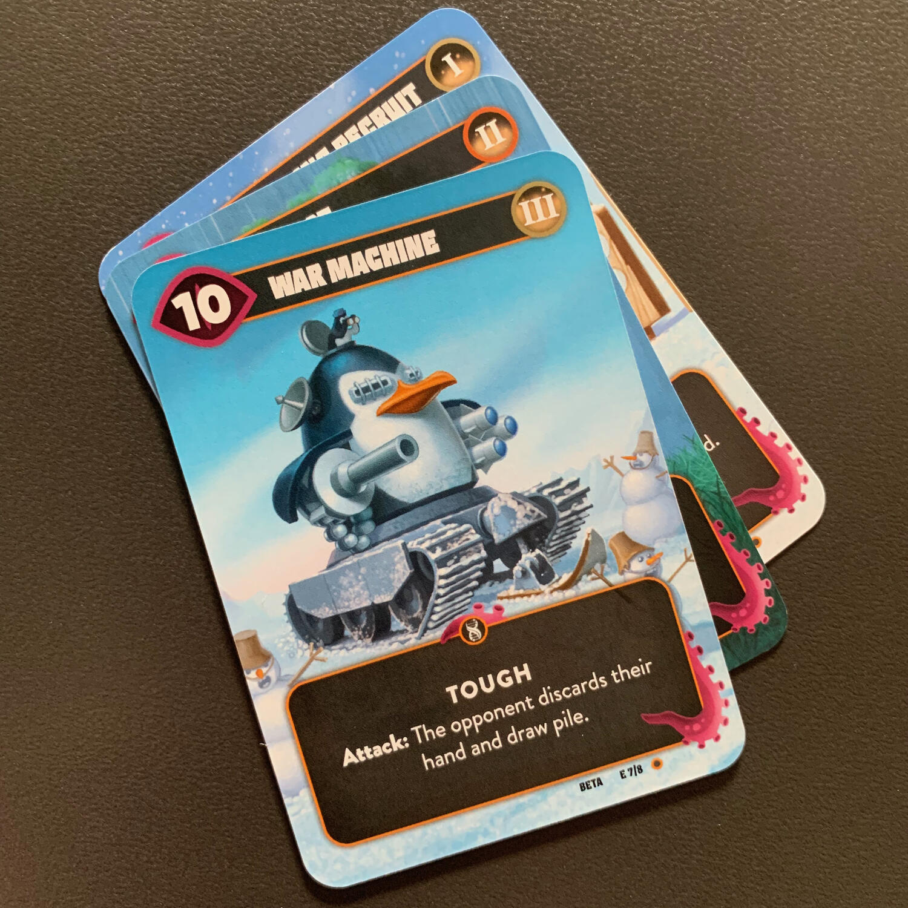
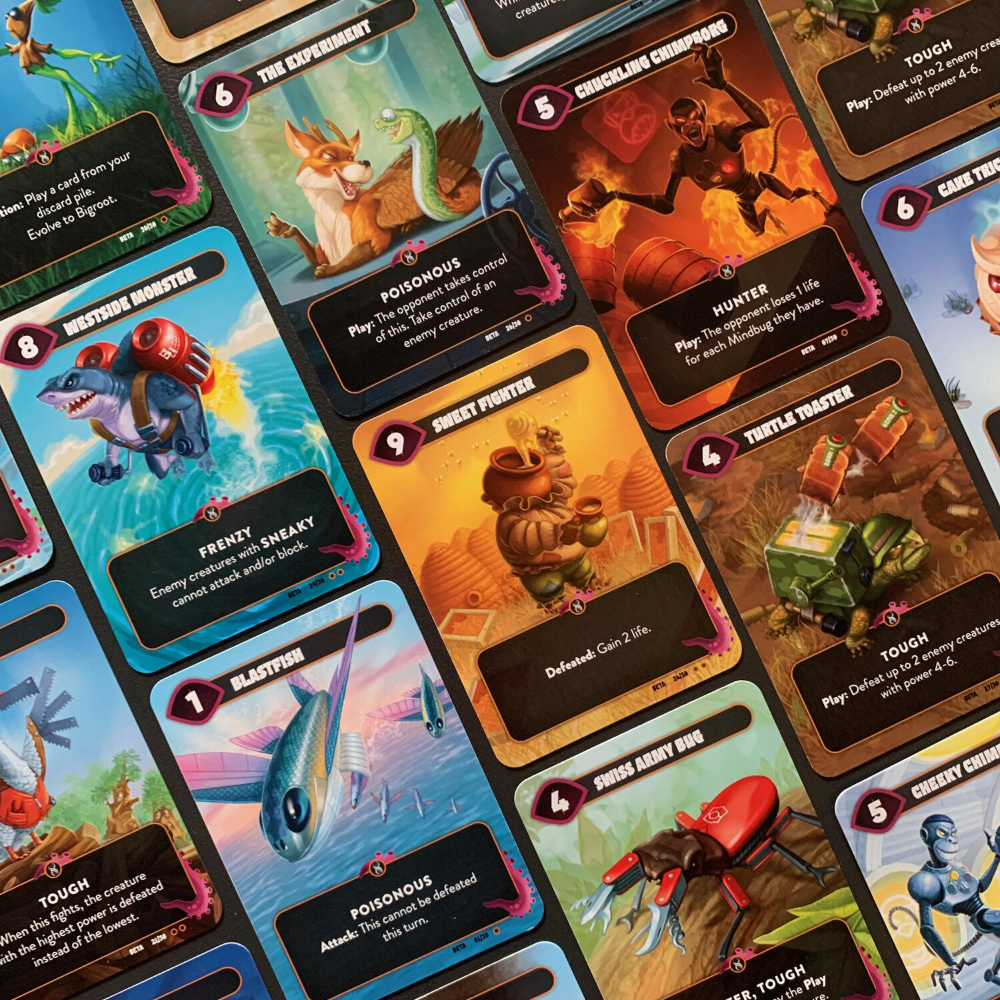

<OriginalReviewLink slug="mindbug" />

<Panoramic>
  Mindbug è quel gioco (anche se ormai dovrei dire “sistema”), che non ti
  aspetti. Ovviamente essere partorito dalla mente che ha sfornato Magic non è
  per forza una garanzia… ma decisamente aiuta!  
  In questa sua nuova versione veniamo esposti ad un nuovo attacco dei Mindbug. Il
  gioco è sempre uguale, quel cocaine-Magic a cui siamo già stati abituati. Anzi,
  i più maliziosi vedrebbero in Mind Bug Beyond: Evolution la "classica" espansione{" "}
  <em>More of the same </em>, finché non iniziano a guardare le nuove carte, le parole
  chiave introdotte e si accorgono che ora ci sono carte che si evolvono, carte che
  si attivano e carte che interagiscono con gli scarti! Nuova linfa vitale ad un
  gioco il cui unico obiettivo fino ad ora era solo quello di farvi divertire!
</Panoramic>

<Feedback>

  Lo ammetto, all'inizio ero un po’ scettico per questa espansione, in quanto di
  solito il <em>More of the same</em> mi lascia molto perplesso. Poi ho fatto
  otto partite in una serata e mi sono accorto che ora Mindbug è un gioco ancora
  più interattivo, che ci sono effetti che si concatenano meglio, che vogliono
  costringere il giocatore avversario a sprecare i suoi preziosissimi Mindbug e
  ad interagire con l'area di gioco in maniera differente.{" "}
  <em>More of the same</em>, sì, ma quello di cui avevamo disperatamente
  bisogno!

</Feedback>

