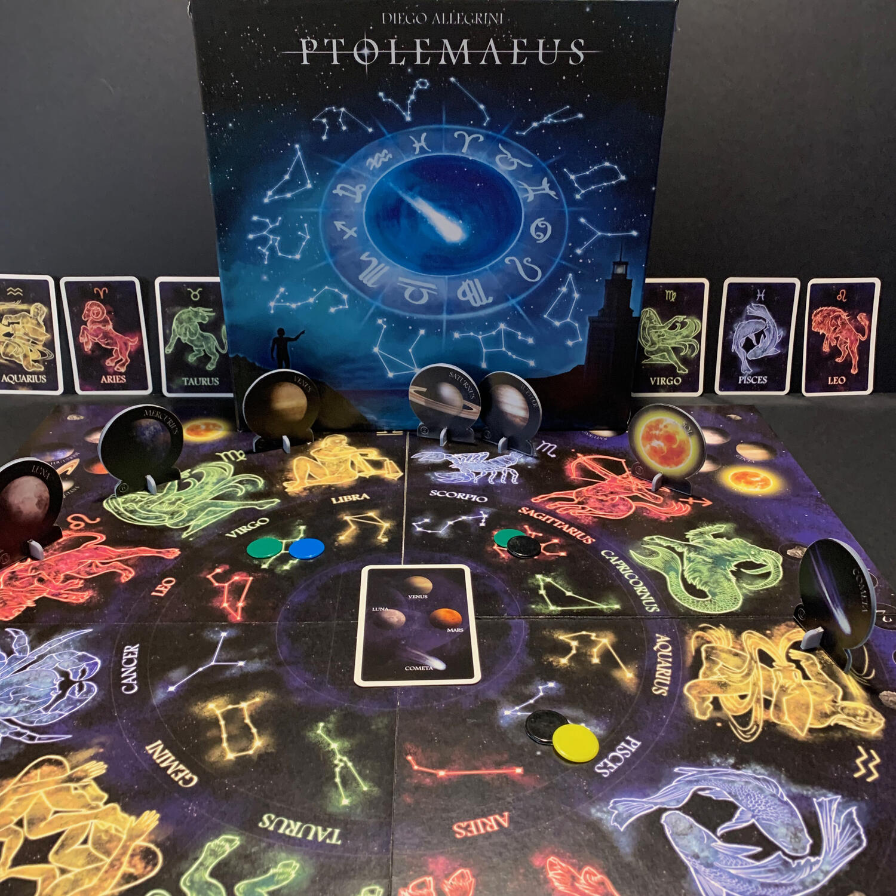
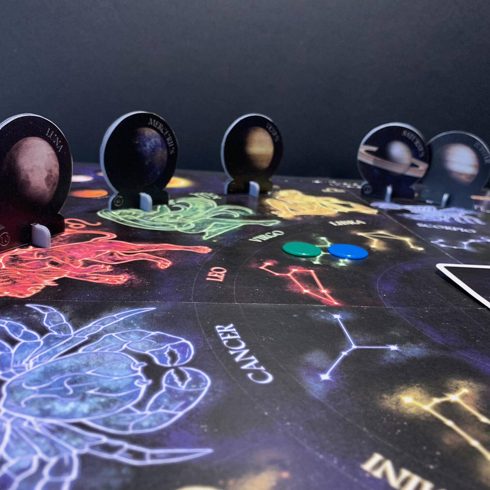

<Setting>

  Alessandria d'Egitto, anno 150 d.C., Claudius Ptolomaeus, il più grande
  astronomo del tempo, sta completando l'Almagesto, un trattato che lo
  consegnerà alla storia. In questa importante opera astronomica, Tolomeo
  descrive il moto del Sole e della Luna intorno alla Terra, insieme a quello
  dei cinque pianeti allora conosciuti: Mercurio, Venere, Marte, Giove e
  Saturno.
   
  Secondo il modello tolemaico, era possibile prevedere con notevole precisione
  i moti dei sette corpi celesti, fornendo una guida fondamentale sia per i
  navigatori dell'epoca che per quelli dei secoli successivi.
   
  In questo contesto, i giocatori dovranno calarsi nei panni di ambiziosi
  astronomi e dimostrare di sapere calcolare il moto di questi corpi celesti
  che, ruotando attorno alla Terra, transiteranno con diversa velocità lungo le
  dodici costellazioni dello zodiaco.
   
  Solo chi sarà più abile nell'osservazione del cielo e delle configurazioni dei
  pianeti potrà fregiarsi del titolo di primo discepolo di Tolomeo e contribuire
  alla stesura finale dell'Almagesto.

</Setting>

<Rules>

  Dopo aver scelto una data, ad esempio il tuo compleanno, ed aver configurato
  il tabellone con i pianeti e l'asteroide nelle costellazioni corrette (come
  indicato dal manuale), il gioco ha inizio.
   
  Per diventare il discepolo preferito di Tolomeo bisognerà collezionare più
  punti vittoria degli avversari, per ottenerli bisognerà studiare i pianeti,
  per studiarli bisognerà osservare le costellazioni.
   
  Si pescano due carte costellazione e una carta obiettivo segreto.
   
  La partita si svolge in un numero variabile di round, ciascuno composto da 3
  turni di gioco, nei quali bisogna pescare 2 carte costellazione e osservare il
  cielo: le carte si possono pescare da quelle visibili o dalla cima del mazzo.
   
  La fase di osservazione è il vero e proprio gioco: si può osservare una
  costellazione oppure una configurazione.
   
  Quando un pianeta entra in una costellazione, è possibile osservarla,
  scartando la carta corrispondente e posizionando un proprio segnalino su quel
  segno. In alternativa si possono scartare due carte dello stesso colore del
  segno in questione oppure tre carte qualsiasi ma di colore uguale.
   
  Per studiare una configurazione, invece, si andranno a prendere in
  considerazione pianeti posti su costellazioni diverse, a patto che siano
  disposte secondo alcuni criteri:
  <ul>
    <li>Congiunzione: due pianeti presenti nella stessa costellazione</li>
    <li>
      Opposizione: due pianeti posizionati su due costellazioni diametralmente
      opposte
    </li>
    <li>
      Trigono: tre pianeti posti su tre segni zodiacali dello stesso tipo
      (acqua, fuoco, terra, aria)
    </li>
    <li>
      Quadrato: due o più pianeti posti su costellazioni connesse attraverso
      angoli di 90 gradi.
    </li>
  </ul>
  Appena una costellazione è stata osservata tre volte, uno dei pianeti su di
  essa viene considerato studiato.
   
  Conclusi i tre turni del round, si muovono i pianeti come descritto da una
  carta precedentemente posta in mezzo al tabellone. Oltre ai pianeti, si
  muoverà anche la cometa che distruggerà tutti i segnalini osservazione posti
  nella costellazione in cui questa si fermerà.
   
  Il gioco termina non appena un giocatore raggiungerà i 12 punti vittoria, che
  vengono calcolati a seconda di quanti pianeti sono stati studiati e
  dall'obiettivo segreto, oppure quando la cometa torna nella costellazione
  iniziale.

</Rules>

<Feedback>

  Ptolomaeus è un bell'astratto incastonato in una cornice astrologica:
  l'ambientazione si sente e la grafica della plancia incuriosisce molto le
  persone attorno al tavolo, con i suoi colori sgargianti e una simbologia nota
  a tutti.
   
  Dopo alcuni turni un po' confusionari, si riesce a godersi il gioco per tutta
  la sua semplicità e immediatezza: nonostante siano davvero poche, le regole
  riescono a dare una bella profondità, stuzzicante anche per gamer esperti, che
  giocheranno una partita totalmente diversa da un giocatore alle prime armi,
  facendo scelte più a lungo termine e cercando di ostacolare, per quanto
  possibile, gli altri giocatori.
   
  Alcuni elementi di alea aiuteranno a bilanciare questa differenza di
  preparazione e abbasseranno il peso della partita, come la pesca delle carte
  costellazione e delle carte bonus, ottenibili nel momento in cui un pianeta
  verrà studiato (benefit che aiuteranno nel resto della partita).
   
  Giocare di strategia potrebbe risultare complicato in quanto, oltre all'alea,
  sarà rivelata solamente una carta "muovi pianeta" a turno, facendo scoprire
  man mano come i pianeti si muoveranno... portando simpatiche comete a
  distruggere tutta la vostra pianificazione.
   
  Sicuramente non mancano i punti negativi, primo tra tutti la sensazione di
  occhi che si incrociano quando bisogna seguire linee immaginarie per decretare
  se ci sono costellazioni poste in una qualche configurazione utile alla nostra
  strategia: ma non c'è da preoccuparsi: i nostri informatori ci dicono che su
  questo elemento si sta lavorando per migliorare il prodotto in fase di
  campagna.
   
  Per il resto, il gioco gira molto bene e porta, con il passare del tempo, alla
  sensazione di accelerazione e di velocità: inevitabilmente, turno dopo turno,
  resteranno sulla plancia dei dischetti studio che verranno usati negli studi
  successivi.
   
  Concludendo, le persone con cui ho provato il gioco si sono alzate
  soddisfatte, sorridenti e con qualche aneddoto su qualche cometa fastidiosa
  capace di cambiare le sorti della vittoria.

</Feedback>

