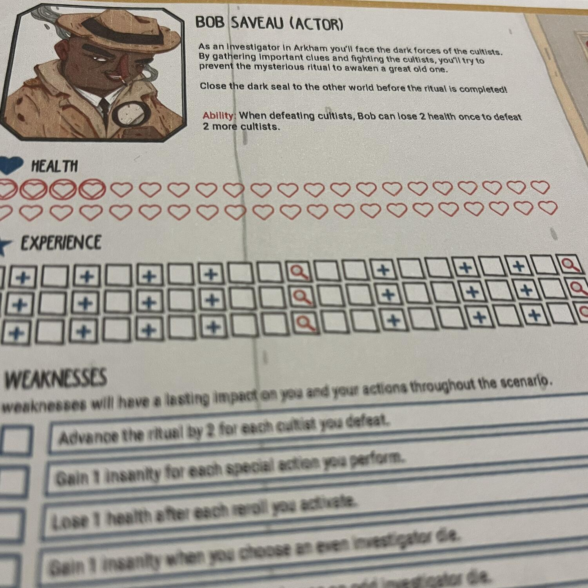
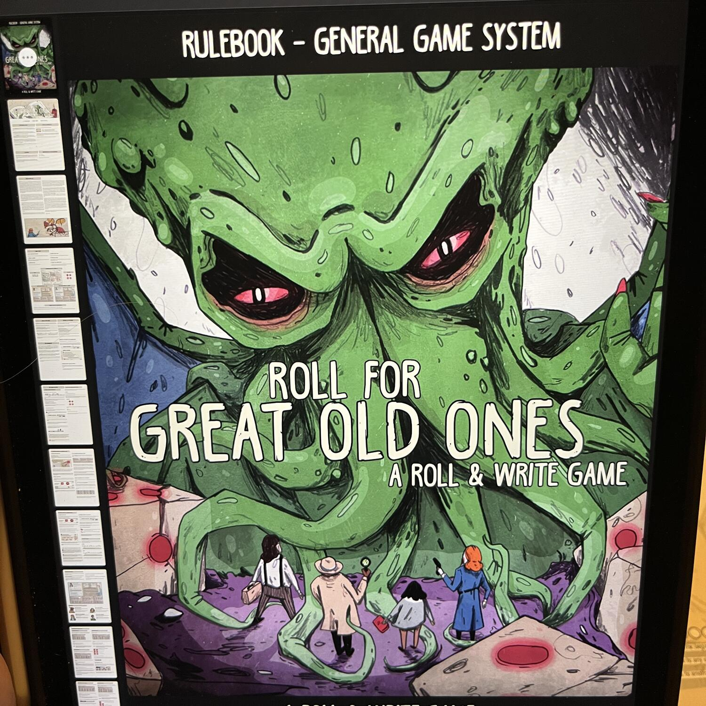

<Setting>

  Mi sono sempre chiesto che senso abbia fare da Investigatore in un mondo
  Lovecraftiano.  
  Nel momento in cui senti la parola Cultista il lavoro è direttamente da rifiutare!
  No? Eppure senza questi coraggiosi investigatori non ci sarebbero storie da raccontare
  per giochi come questo Roll for Great Old Ones: A Roll & Write Game!

</Setting>

<Rules>

  Scelti gli investigatori da 1 a 4 e uno scenario, il gioco procede in round
  fino a quando non si incontrano le condizioni di vittoria o sconfitta. Si
  vince se si è riusciti a fermare l’evocazione del grande antico, mentre si
  perde quando i cultisti sono riusciti a portare questi potenti esseri nel
  nostro piano.  I giocatori avranno a disposizione un dado a turno, il cui
  valore andrà scritto per ben due volte in due diverse sezioni della propria
  plancia. Ogni sezione è divisa in sottosezioni che, una volta completate,
  permetteranno al giocatore di attivare l’azione della sezione e innescare{" "}
  <strong>fantasmagoriche combo!</strong> Ma attenti, perché ritentare il lancio
  dei dadi farà progressivamente sprofondare i giocatori nella follia!

</Rules>

<Feedback>

  Roll for Great Old Ones: A Roll & Write Game è un gioco che riesce a sfruttare
  decisamente bene la meccanica del{" "}
  <Link to="/mechanisms/roll-and-write/"> Roll & Write </Link>. Certo, non è il
  gioco che vi farà cambiare idea sul genere, ma che finalmente porta sui nostri
  tavoli un po’ di orrore cosmico in maniera diversa dal solito. Al lancio del
  dado, ogni scelta del giocatore sarà riportata a matita sulla plancia di
  gioco, un monito che risulta in linea con un’ambientazione lovecraftiana,
  portando a riflettere sulla futilità delle proprie scelte.  
  Insomma, un gioco che saprà incantare i veri appassionati e stuzzicare gli avventori.

</Feedback>

