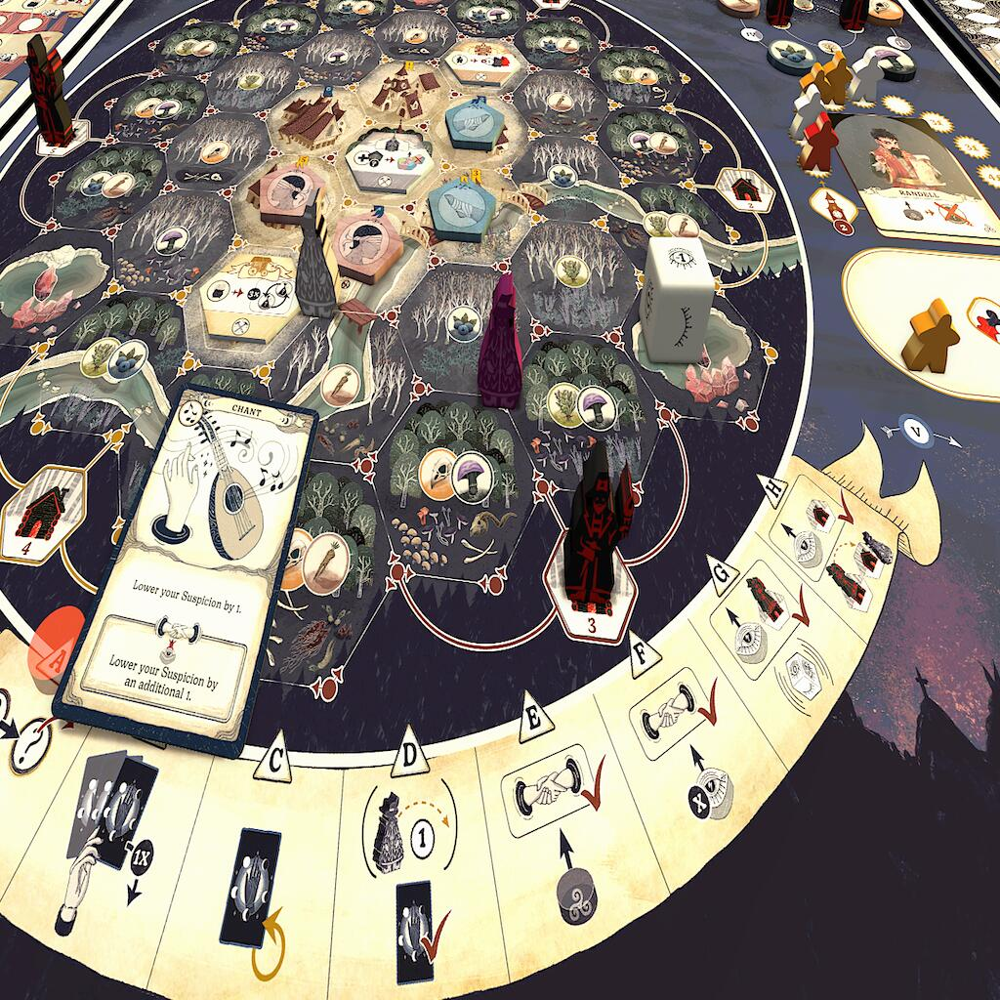
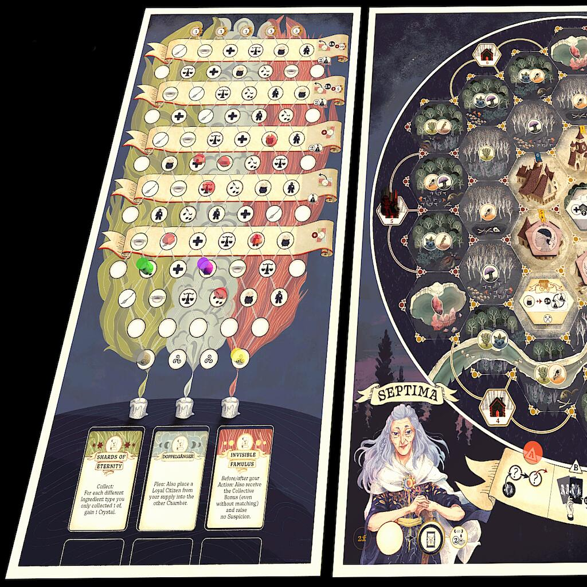

<Setting>

  Vi ritroverete alla guida di una congrega di streghe, che si muoverà nei dintorni di un borgo medievale ed avrà lo
  scopo di curare i cittadini ammalati all’interno della città. Per farlo si dovranno usare varie pozioni, le quali
  richiederanno ingredienti che andranno raccolti nella parte più esterna della mappa di gioco. Ma attenti ai cacciatori
  che pattugliano la zona ed evitate che le vostre streghe finiscano sotto processo!

</Setting>

<Rules>

  La congrega di ogni giocatore sarà composta inizialmente da due streghe, ma durante il gioco potrà crescere fino ad un
  massimo di quattro o diminuire fino a zero.  
  Lo scopo del gioco è quello di fare più punti degli avversari, salvando gli ammalati all’interno della città, eseguendo
  azioni cooperative, salvando le streghe dai processi o completando obiettivi segreti. Il modo più diretto per fare punti
  è salvare i cittadini da 3 possibili malattie, che vanno curate con altrettante pozioni. Ogni pozione richiede però degli
  ingredienti specifici che andranno raccolti nella mappa.  
  Muoversi, raccogliere ingredienti, preparare pozioni e curare gli ammalati sono azioni, ciascuna rappresentata da una
  carta nella mano del giocatore. Durante il turno ognuno può decidere segretamente quale azione compiere posizionando
  la relativa carta coperta sul tavolo. Una volta che tutti i giocatori avranno scelto, tutte le carte verranno rivelate
  e si risolveranno le azioni scelte. Se due o più giocatori hanno giocato la stessa carta, questa avrà per entrambi
  anche un effetto secondario che la renderà molto più remunerativa ma farà anche salire l’indice di sospetto dei
  cacciatori di streghe. Decidere quale carta giocare è una scelta che non va presa alla leggera: una volta giocata,
  infatti, resta scartata finché non finisce un intero round di gioco. Fare azioni cooperative è utile anche per
  avanzare su un tracciato parallelo al tabellone, il tracciato rituale, che permetterà di ottenere nuovi poteri per la
  congrega, risorse e punti vittoria.  
  Dopo aver risolto le azioni, è il turno dei cacciatori, che avranno più o meno possibilità di catturare una strega in base
  alle scelte compiute dai giocatori. Quindi il round finisce e ne inizia uno nuovo.  
  Il gioco è composto da 4 round, rappresentanti le stagioni, ciascuno da risolvere in 5 turni, rappresentati dalle fasi
  lunari. Sia le stagioni che la fase lunare corrente hanno un’influenza sul gioco: ad esempio, durante alcune stagioni
  entreranno in gioco più cacciatori, rendendo la partita più difficile; in determinate fasi lunari, invece, alcuni
  ingredienti sono più facili da reperire.  
  Terminate tutte le fasi lunari, ci si avvia verso la fine del round: molte delle operazioni di fine round sono di refresh,
  ma è sempre in questa fase che avvengono i processi alle streghe catturate: fino a due, in particolare, una presa dalla
  pile delle streghe non ancora entrate in gioco e l’altra presa dalle streghe catturate dai cacciatori. Salvare le streghe
  è molto remunerativo, sia per ottenere punti sia per aggiungere nuove streghe alla nostra congrega. Durante la partita
  avremo vari modi di agire sui cittadini per influenzare l’andamento di un processo.  
  Conclusi i processi, inizia un nuovo round: al termine del quarto round avviene il conteggio dei punti totalizzati.

</Rules>

<Feedback>

  I giochi prodotti da Mindclash Games sono sempre difficili da spiegare, in genere abbastanza complessi, e pongono
  moltissima attenzione sull’ambientazione, plasmando regole e meccaniche su di essa, piuttosto che fare il contrario.{" "}
  <em>Septima</em> su questo non fa eccezione: tutte le meccaniche sembrano integrate nel contesto e vi daranno
  effettivamente la sensazione di guidare una piccola congrega. Ciò che lo distingue dagli altri giochi della stessa
  casa è invece la complessità: qui Mindclash ha cercato di proporre un’esperienza più leggera e semplice, offrendo una
  modalità di gioco “base” che rimuove alcune parti di gioco in favore di un flusso più snello (consigliabile
  esclusivamente per una prima partita di prova). Ad ogni modo, il gioco risulta meno complesso di altri classici della
  stessa casa, come Anachrony e probabilmente il futuro Voidfall.  
  I componenti, pur senza miniature, sono di buona qualità grazie ai meeple stampati e ai diversi token in legno. La rigiocabilità
  dovrebbe essere buona grazie ad una randomizzazione che è insita nel setup; inoltre, nell’edizione kickstarter sono presenti
  un paio di moduli opzionali che contribuiscono a dare ulteriore varietà al gioco.  
  Il flusso è semplice: si riduce sempre a raccogliere ingredienti per poi preparare pozioni da somministrare agli
  ammalati, in modo da fare punti e ottenere vari bonus immediati per la congrega, nonché per avere meno cittadini
  ostili durante la risoluzione dei processi.  
  Quello che lo rende vario è il come: c’è una forte interazione tra i giocatori nell’esecuzione delle azioni, che possono
  anche cooperare. Tuttavia, le interazioni sono sia incoraggiate sia scoraggiate, in quanto attireranno facilmente l’attenzione
  dei cacciatori di streghe che nel caso peggiore potrebbe privarci di elementi della nostra congrega. Alcune fasi di gioco
  possono venire alterate anche dall’avanzamento dei turni o da moduli opzionali che modificano leggermente cosa possiamo
  fare durante il nostro turno.  
  Lo stile grafico potrebbe rivelarsi una nota stonata per molti, la mappa è piacevole e la simbologia una volta
  metabolizzata è chiara, ma il design di streghe e stregoni sembra invece un po’ troppo semplicistico.

</Feedback>

