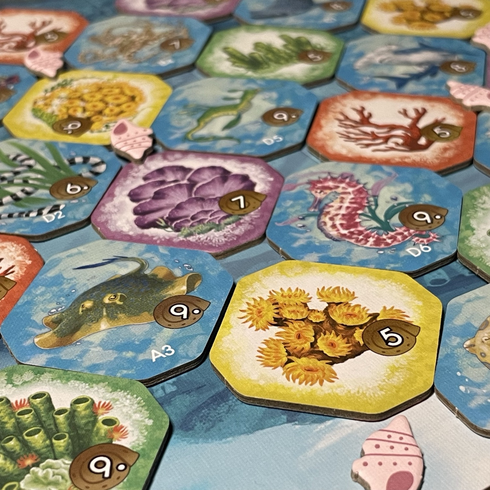
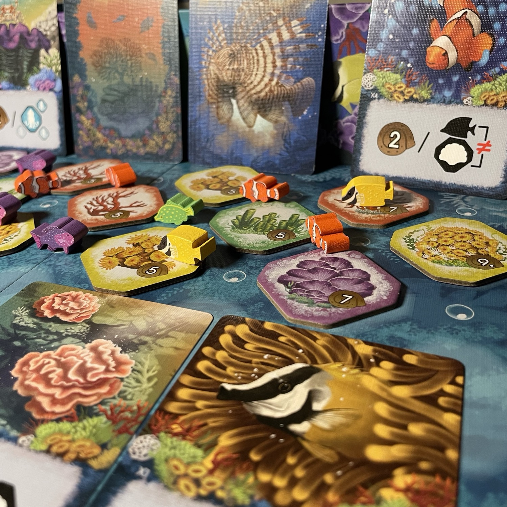
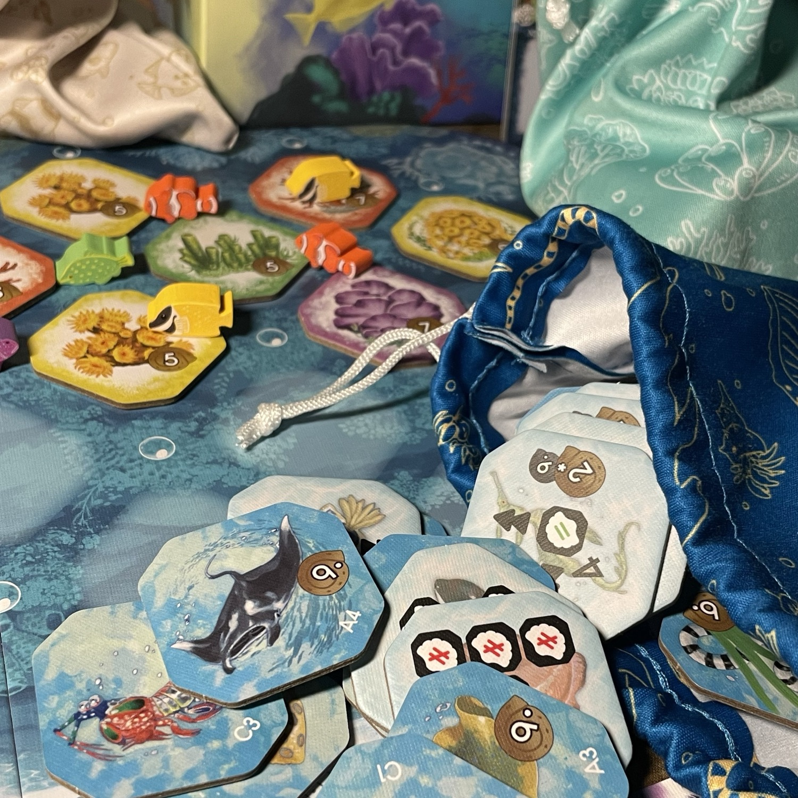

<Setting>

  La <strong>Barriera Corallina</strong> vi attende con il suo sistema di coralli lungo la costa nordorientale dell’Australia (che, per la cronaca, esiste). La più grande struttura vivente <strong>visibile dallo spazio</strong> (già: non si vede solo la muraglia cinese). Una <strong>coloratissima</strong> vita marina popola questa splendida area, dove le forme di vita coesistono interconnesse, dato che i coralli offrono un prezioso habitat per i pesci e la loro <strong>armoniosa simbiosi</strong> attira a sua volta una gran varietà di vita marina. Riproducete questa relazione virtuosa e la vibrante diversità oceanica, con la sua ricca e variegata gamma di vita marina che prospera poco sotto la superficie del mare.

</Setting>

<Rules>

 Per il <strong>Setup</strong> ogni giocatore prende cinque Conchiglie e ne piazza due sulla propria Plancia Oceano. Si selezionano casualmente due Carte Ecosistema, una Blu e una Arancione (obiettivi generali). In base al numero di giocatori, si predispongono un certo numero di Pesci per colore e un certo numero di Tessere Vita Marina (obiettivi specifici) per ogni tipo (si estraggono in ogni partita 10 tipi di Tessere Vita Marina in totale). Poi si collocano nei tre sacchetti tutti i Coralli, le Tessere Vita Marina e i Pesci preselezionati. Quindi, dai sacchetti si pesca un primo pool di 5 Coralli, 5 Pesci e 5 Tessere Vita Marina, da collocare su tre file separate, in modo che ogni tessera Corallo sia associata a un solo Pesce e a una sola Tessera Vita Marina. 
Per cominciare, ogni giocatore sceglie a turno una Tessera Vita Marina tra le disponibili e la colloca sulla propria Plancia Oceano: <strong>da quella tessera ci si espanderà ogni turno</strong>. Dopo che tutti hanno scelto, si rimpingua la fila di Tessere Vita Marina e si inizia. 
<strong>A turno</strong>, ogni giocatore <strong>seleziona una Tessera</strong> (Corallo o Vita Marina) <strong>e un Pesce</strong> tra quelli disponibili. È possibile scegliere anche Pesci e Tessere non appartenenti a un medesimo tris spendendo una <strong>Conchiglia</strong>. Inoltre, sempre al prezzo di una Conchiglia, un giocatore può sostituire un’intera fila di Coralli, Pesci o Vita Marina. Se invece almeno 4 Pesci o 4 Coralli (non Vita Marina) hanno lo stesso colore, prima di scegliere un giocatore può sostituirli senza pagare la Conchiglia. Il giocatore <strong>piazza poi sulla propria Plancia Oceano gli elementi scelti</strong>, in modo che siano <strong>adiacenti</strong> (= condividono un lato o un angolo) <strong>a tessere precedentemente piazzate</strong> (i Pesci andranno collocati su bolle adiacenti a tessere già presenti e su ogni bolla trova posto un solo Pesce). Le tessere, quando vengono piazzate, possono essere <strong>ruotate in qualsiasi direzione</strong>, ma è logico che <strong>si cercherà di comporre un puzzle coerente</strong> rispetto alle condizioni richieste da ogni Tessera Corallo e Vita Marina (ad esempio, i Pesci in corrispondenza dei colori sugli angoli di una Tessera Corallo). Se le condizioni di una tessera, dopo questo passaggio, risultano realizzate, il giocatore può ruotarla sul lato completato e guadagnare una Conchiglia. Più tessere possono essere completate nello stesso turno. Nel momento in cui un Corallo è completo e se ne ruota la Tessera, uno dei Pesci ad esso circostanti (non per forza dello stesso colore del Corallo) deve esservi collocato sopra. Infine, un giocatore può spostare un Pesce che si trovi ancora su una Bolla su una qualsiasi altra Bolla libera: quest’azione, durante il proprio turno, può essere realizzata ogni volta che si vuole pagando 2 Conchiglie. 
Alla fine della partita, ovvero alla fine del 17° turno, quando mancheranno 4 spazi vuoti su ogni Plancia, i giocatori <strong>calcoleranno i punti</strong> per le Carte Ecosistema, per i Pesci Incompleti (1 punto per ogni Corallo completato ad esso adiacente), per le Tessere Vita Marina (2 punti per ogni tessera diversa completata) e per tutte le tessere Corallo completate. Le Tessere Vita Marina forniscono punti vittoria anche se parzialmente completate.

</Rules>

<Feedback>

  <strong>Non credevo</strong> che mi sarei imbattuto in così breve tempo in <strong>un gioco che mi stimolasse e mi piacesse più di <Link to="/reviews/cascadia">Cascadia</Link></strong>. Il flusso del turno è chiaramente ispirato dalle <strong>fortunate meccaniche</strong> dell’illustre predecessore, ma Shallow Sea <strong>le migliora e le articola maggiormente</strong>, con l’inserimento di una terza fila che complica leggermente il momento della selezione: trattandosi però di un gioco lineare e per famiglie, non direi che questo fattore gravi sulla lunghezza complessiva delle partite. Tutto si sviluppa attorno a un <strong>sapiente gioco a incastro</strong> sulla Plancia Oceano, con l’interessante e significativa <strong>innovazione</strong> rispetto allo stesso Cascadia, ma più in generale rispetto ai puzzle game, di poter <strong>attivare e spostare alcuni elementi stessi del puzzle</strong>, ovvero i pesciolini, simulandone il viavai tra un corallo e l’altro.  
I materiali sono certamente di <strong>ottima qualità</strong>, già nel prototipo che ho potuto provare: a parte un piccolo errore di stampa (del tutto trascurabile in questa fase e facilmente risolvibile in seguito) in alcune Tessere Corallo, la cui parte sommitale ora riportava il Corallo completo, ora quello incompleto, le <strong>plance</strong> sono in un cartone sufficientemente robusto, i <strong>colori</strong> dei componenti in gradevole pastello, i <strong>disegni</strong> delle Carte molto attraenti e i <strong>meeple-pesciolini</strong> assolutamente adorabili. 
Per essere un titolo astratto, lo trovo <strong>particolarmente ben ambientato</strong>: la costruzione dell’habitat turno dopo turno risulterà in una soddisfacente porzione di oceano molto colorata, dando l'impressione di trovarsi effettivamente di fronte a una sezione unica di Barriera Corallina (che, ai tempi dello sbiancamento di questo miracolo della natura, dovrebbe metterci di buon umore…). 
È presente anche una <strong>modalità in solitaria</strong> e una <strong>versione leggera per famiglie</strong>. <strong>Consigliato certamente a neofiti ma anche a giocatori con una certa esperienza</strong>: la sfida c’è e senz’altro attrarrà avventori più smaliziati. Aspettiamo con ansia di poter testare il gioco all’esito della campagna KS (io ho già pledgiato!) e di conoscere il famoso Pesce Raro!

</Feedback>

