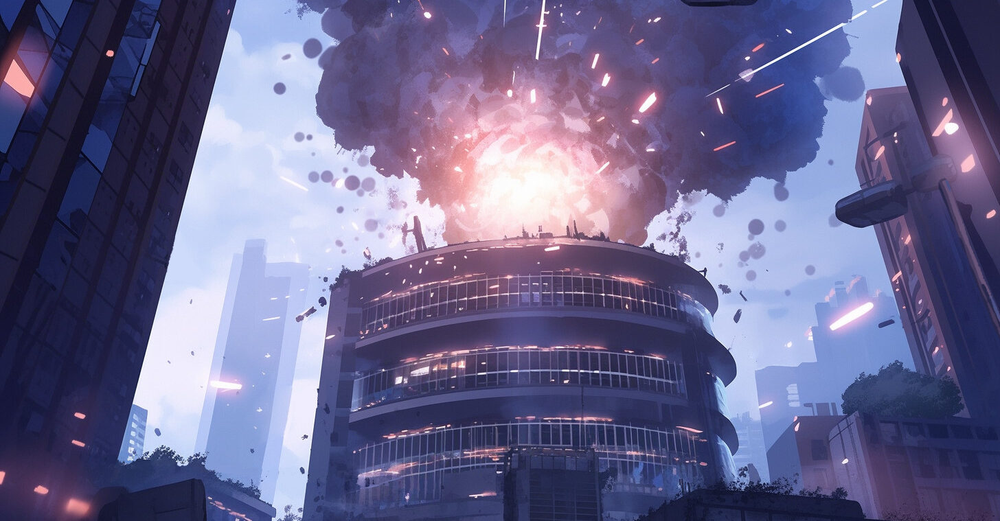
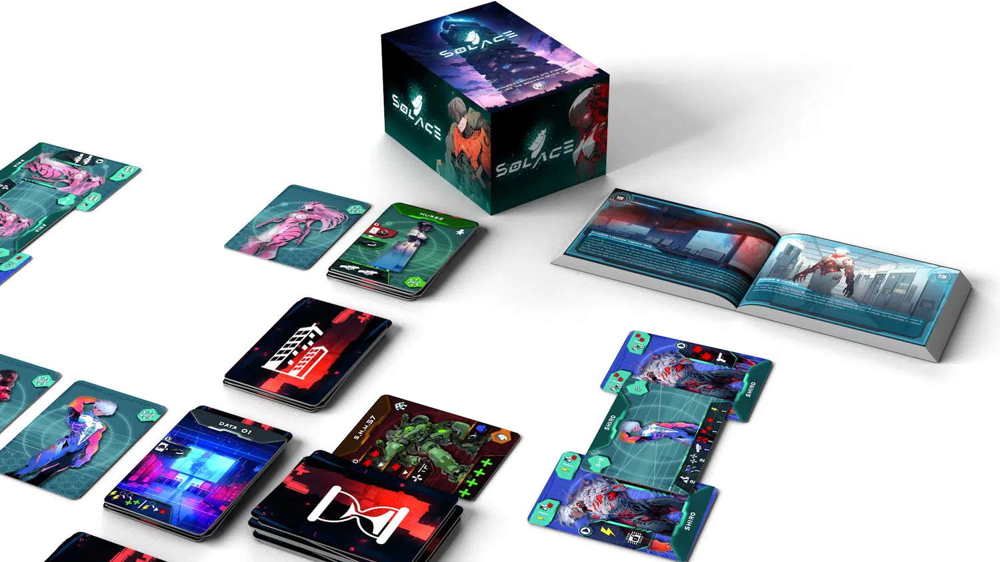
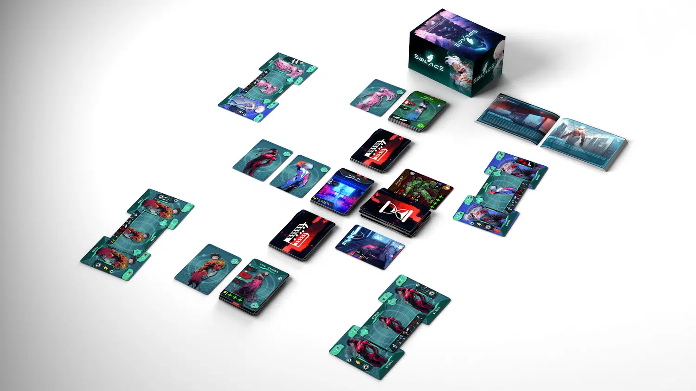

<Setting>

  Fate parte del team FTO, soldati in grado di manipolare le nanomacchine Eternità aumentando le proprie prestazioni in battaglia, formati per neutralizzare minacce terroristiche. E di questi tempi, anche se ormai la morte è solo artificiale grazie alle stesse macchine Eternità, il mondo sta attraversando grandissimi cambiamenti…

</Setting>

<Rules>

  Una torre di carte, un timer e uno o più obiettivi: così inizia una partita a Solace. Durante il turno, i giocatori giocheranno due carte dalla propria mano per poter effettuare le azioni di attacco, movimento o esplorazione. Esse vengono definite da simboli sulle carte e, attenzione, la stessa carta non può essere usata per due turni di fila! Dopo il turno dei giocatori, toccherà alla torre “reagire”. I nemici presenti attaccheranno o cercheranno gli agenti della FTO o, ancora peggio, faranno scattare in anticipo l’allarme! Perché sì, esiste un allarme. Ad ogni turno, inesorabile passerà del tempo e, a meno che non sia già scattato, l’allarme scatterà di certo, e allora saranno grandi e grossi problemi per l’FTO, in quanto arriverà la cavalleria pesante a mettere i bastoni tra le ruote ai giocatori e no, non sarà divertente.

</Rules>

<Feedback>

  Solace è praticamente una visual novel da tavolo. Essendo ancora un prototipo, ho avuto l’occasione di provare solamente una minima parte di quello che sarà la storia e tutto il resto. Eppure, anche così sono in grado di dire che siamo di fronte ad un gioco che sembra promettere davvero bene.  L’evoluzione dei personaggi sembra sempre interessante, mentre la storia e il loop di gioco si rivelano all’altezza delle aspettative, senza stancare nel corso della campagna: siamo di fronte ad un gioco per niente male! Ogni scelta è sudata e dover costantemente prendere decisioni (ad esempio se esplorare la torre o no, per portare avanti obiettivi secondari, o andarsene in anticipo per portare la missione in saccoccia prima che il tempo a propria disposizione sia finito) lascia ai giocatori una tensione senza pari, che in un gioco del genere, molto semplice e adatto a tutti, non ti aspetteresti di certo!

</Feedback>

