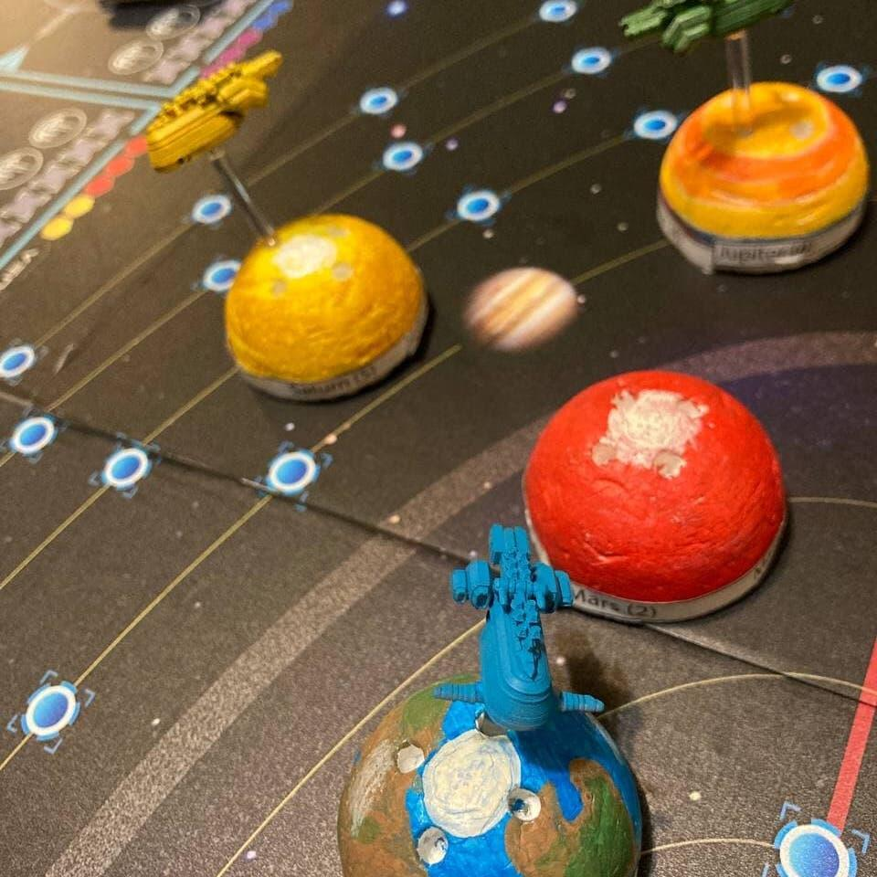
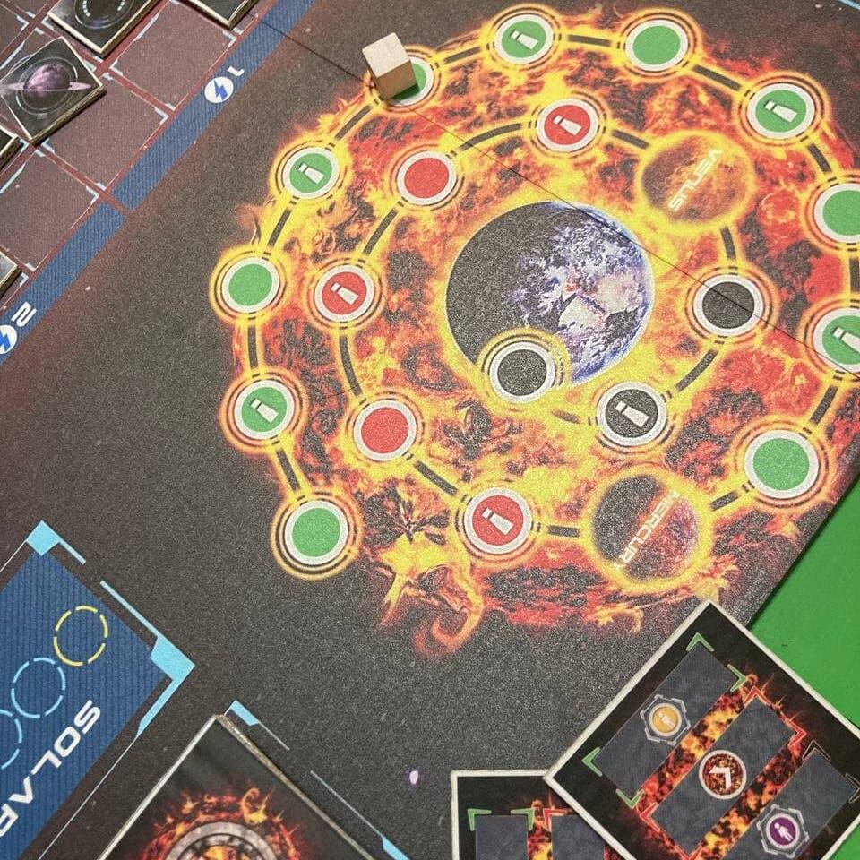

<Setting>

  Anno 2357.
   
  La Terra, dopo secoli di estrazioni minerarie, sta esaurendo le risorse disponibili e le potenze mondiali hanno
  sviluppato una nuova tecnologia per poterne estrarre di nuove dal Sole.
   
  Questa strategia si è rivelata estremamente efficace, ha contribuito ad un balzo tecnologico non indifferente e ha
  lanciato l'umanità in una nuova era di scoperte e viaggi nello spazio, ma le ripercussioni non si son fatte attendere:
  l'eccessivo sfruttamento ha minato il delicato equilibrio della nostra stella, accelerandone l"inevitabile collasso in
  gigante rossa. Mercurio e Venere hanno il destino segnato ed anche la Terra presto risentirà delle radiazioni dovute
  alle tempeste solari.
   
  Ormai sembra chiaro ed inevitabile che l'unica soluzione sia raggiungere il sistema Trappist-1 e colonizzare un nuovo
  pianeta abitabile, ma per farlo sarà necessario portare a termine la costruzione dell'Interstellar, la nave spaziale
  deputata al trasporto, nonché salvataggio, dell'umanità.
   
  L'impresa non sarà di certo semplice soprattutto perché, per via delle condizioni in cui versa la Terra, le risorse
  necessarie per la sua costruzione dovranno essere estratte su altri pianeti del Sistema Solare.
   I potenti dovrebbero cooperare per la riuscita della missione, ma in realtà sono in lotta fra loro; la situazione
  geopolitica è fortemente in bilico e spesso le decisioni prese risultano discutibili e volte soltanto ad avvantaggiare
  la propria fazione.

</Setting>

<Rules>

  È un gioco competitivo per 2-4 giocatori della durata approssimativa di 45 minuti a persona dove la parola d'ordine
  sarà PROGRAMMAZIONE.
   
  Le meccaniche principali sono la gestione risorse e il token building, che all'inizio vedrà i giocatori con lo stesso
  numero e tipo di azioni, ma che nel corso del gioco potrà variare. Starà poi al giocatore decidere come meglio usarli,
  in che ordine e se passare avendone ancora in mano.
   
  <b>Prima Fase</b>
   I token di partenza permetteranno di:
  <ul>
    <li>Acquisire 4 risorse carburante</li>
    <li>Viaggiare nello spazio</li>
    <li>Costruire strutture e migliorie tecnologiche</li>
    <li>Comprare/vendere risorse al mercato</li>
    <li>Sfruttare il sole</li>
    <li>Passare il turno</li>
  </ul>
  Importante l'ultimo token: sarà possibile passare in qualsiasi momento guadagnando così risorse per ogni turno d'attesa,
  fino a che gli altri giocatori non faranno altrettanto. Questa situazione metterà i giocatori davanti ad una scelta: continuare
  a giocare regalando risorse a chi ha già passato, oppure rinunciare a determinate azioni? Oltretutto, chi passa per primo
  avrà l'ulteriore vantaggio di essere il primo giocatore nel round successivo.
   
  <b>Seconda Fase</b>
   
  Verranno usate quattro delle tessere della fase uno, ma dal lato opposto, per:
  <ul>
    <li>Partecipare alla costruzione dell'Interstellar</li>
    <li>Salvare popolazione</li>
    <li>Mandare una propria sonda su Trappist</li>
    <li>Puntare alla leadership della missione</li>
  </ul>
  In questa fase sarà importante aver preparato il terreno precedentemente, perché alcune azioni potrebbero essere precluse
  per mancanza di risorse. I token riportano un simbolo al centro con l'azione principale e i simboli delle altre in piccolo,
  perché potranno essere usati indifferentemente per qualsiasi delle quattro azioni. Importante ricordare che verrà assegnato
  un punto bonus quando utilizzati con un abbinamento corretto simbolo principale/azione. Il gioco termina se:
  <ul>
    <li>La trasformazione del Sole giunge al termine e raggiunge la Terra</li>
    <li>
      Si soddisfano due delle tre seguenti condizioni: si è salvata sufficiente umanità, si sono costruiti sufficienti
      pezzi della Interstellar, qualcuno ha raggiunto Trappist.
    </li>
  </ul>
  A vincere sarà comunque la Nazione che avrà il maggior numero di Punti Prestigio.

</Rules>

<Feedback>

  Ho visto Interstellar al padiglione della Pendragon Game Studios allo scorso Play Modena; esposto a lato dello stand
  in un acquario trasparente (come lo chiamo io) svettava sul tavolo con la sua enorme plancia blu brillante,
  un'infinità di segnalini colorati ed un intero Sistema Solare con tanto di pianeti.
   
  Ne sono rimasta subito affascinata, ma l'accesso era riservato, così quando ho saputo della preview alla fumetteria Il
  Folletto di Biella il mio unico pensiero è stato: ci devo essere!
   
  Ma cosa ne penso? Come detto serve un'ottima programmazione a lungo termine; la scelta dell'ordine in cui svolgere le
  azioni e il sapersi fermare se necessario sono essenziali per sfruttare al meglio tutte le opzioni; inoltre, i
  tracciati da tener d'occhio sono tanti e tutto può cambiare in un secondo.
   
  Non è un requisito essenziale per il divertimento, ma se si vuole puntare alla vittoria serve necessariamente un
  cervello analitico o un'enorme fortuna! Che io non ho XD
   
  All'inizio la mole di informazioni da elaborare ti stordisce ed il primo round serve principalmente per sondare il
  terreno e interiorizzare le regole; i turni scorrono lenti per poi accelerare quando si individua la strategia
  preferita.
   
  È importante decidere su quale ambito della missione investire: vuoi essere il primo a raggiungere Trappist? Oppure
  vuoi aumentare la reputazione concentrandoti sulla popolazione? Entrambe le opzioni, così come il dedicarsi alla
  costruzione dell'Interstellar e puntare ad essere il Leader mondiale, permettono di ottenere risorse, azioni
  aggiuntive e punti prestigio.
   
  Trovo che gli autori abbiano fatto un ottimo lavoro di bilanciamento perché scegliere un'opzione piuttosto che
  un'altra non evidenzia segni di squilibrio, tant'è vero che la vittoria non è scontata fino al conteggio finale dei
  punti; diversi, infatti, sono gli elementi che possono fornire punti extra a fine partita, quindi mai cantar vittoria
  troppo presto.
   
  Poter giocare al fianco degli autori, Davide Calza e Andrea Crespi, è stato un vero onore ed è stato molto emozionante
  ascoltare direttam ente da loro la spiegazione del gioco.
   
  Sperando di avervi incuriositi a sufficienza, vi lascio di seguito il link alla pagina Kickstarter e quello per{" "}
  <a href="https://www.ilfolletto.com/blogs/eris-in-boardgameland/provando-interstellar" target="_blank">
    l'intervista agli autori
  </a>
  .

</Feedback>

