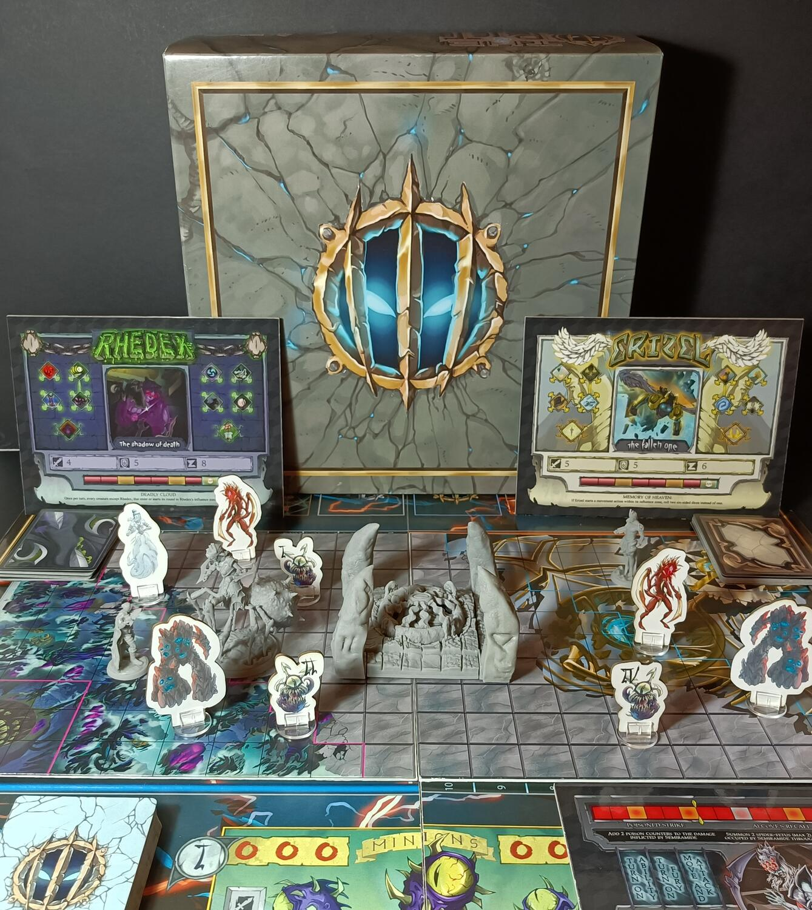
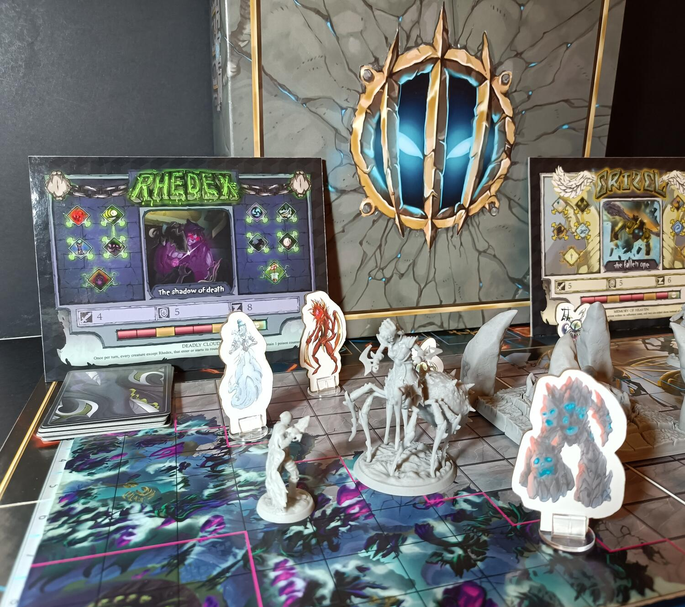

<Setting>

  L'universo è al suo termine. Un manipolo di leggende sta combattendo al centro
  del mondo, <strong>The Pit</strong>, contendendosi il potere di rimodellarlo
  come meglio credono. Vesti i panni di uno di questi leggendari eroi, affronta
  nemici mostruosi, esplora gli angoli più oscuri del The Pit e sopravvivi
  all'Apocalisse. Solo tu hai le capacità per conquistare il potere assoluto!

</Setting>

<Rules>

  The Pit è un dungeon/arena semi-cooperativo con una durata di 8 turni. I
  giocatori vestiranno i panni di potenti eroi per ottenere il potere celato
  nelle profondità di The Pit. Ogni personaggio avrà un mazzo di carte personale
  e un albero di abilità e talenti unici.
   
  Il gioco è diviso in 2 fasi.
   
  Durante la prima fase, composta da 4 turni, i personaggi esplorano l'arena,
  che progressivamente si riempirà di tesori e potenti nemici. In questa fase, i
  giocatori dovranno accumulare sia oggetti che energia per potenziare le loro
  abilità e le loro capacità. Dopo il quarto turno, inizierà la seconda fase. Il
  sigillo verrà attivato, evocando un'antica Nemesi sul campo di battaglia. A
  questo punto i giocatori dovranno collaborare per sconfiggerla prima della
  fine di questa fase, altrimenti l'universo collasserà e il potere di The Pit
  distruggerà tutto.
   
  Se la Nemesi è stata sconfitta, il giocatore che avrà accumulato più punti
  vittoria ottenuti dalle imprese che ha compiuto, vincerà la partita.
   
  Durante ogni turno i personaggi potranno spostarsi nella mappa, sfruttando
  muri, trappole e eventi a loro favore. Utilizzando le carte nel loro mazzo,
  inoltre, potranno attivare potenti combo per decimare le orde dei nemici. La
  rapidità è tutto in questo gioco. Dovrete essere veloci ad accumulare più
  oggetti possibili dagli scrigni, facendo attenzione ai fastidiosissimi Mimic,
  e guadagnare più esperienza possibile prima dell'arrivo della Nemesi.

</Rules>

<Feedback>

  Premetto che ho potuto provare solo il prototipo di The Pit, quindi durante la
  campagna Kickstarter ci potrebbero essere ulteriori cambiamenti, bilanciamenti
  e aggiunte di materiali e componenti.
   
  The Pit è stata una vera scoperta. Ho visto nascere questo progetto ed
  evolversi nel corso del tempo, osservando e ammirando i vari cambiamenti e
  modifiche che lo hanno portato fino alla pubblicazione su Kickstarter. Ho
  sempre appoggiato e apprezzato i progetti tutti italiani, e in questo caso si
  è creato un forte legame con questo titolo.
   
  The Pit è davvero una chicca, un connubio di esplosività, emozioni e
  divertimento in una manciata di turni. Un insieme di meccaniche semplici e
  lineari che ti permettono di passare una bella serata tra amici a suon di
  botte da orbi. Ogni eroe è ben caratterizzato, il che porta a strategie e
  situazioni davvero particolari e divertenti. La randomicità degli eventi e dei
  mostri che si creano sulla mappa, permettono di avere un'altissima
  rigiocabilità. Un punto forte del gioco a parer mio è la sua durata. Una volta
  imparate le regole, una partita può durare anche una mezz'ora scarsa,
  stimolandovi a giocare una partita dietro l'altra. Inoltre, sono presenti
  numerose modalità alternative, come il solo, il tutti contro tutti o il
  cooperativo puro, permettendovi di scegliere tra le alternative che più vi
  piacciono.
   
  Che dire, mi aspetto grandi cose da questo titolo, tante sorprese e novità che
  non vedo l'ora di vedere durante la campagna Kickstarter. Quindi tenete gli
  occhi e le orecchie bene aperte, perchè The Pit aspetta solo voi!

</Feedback>

