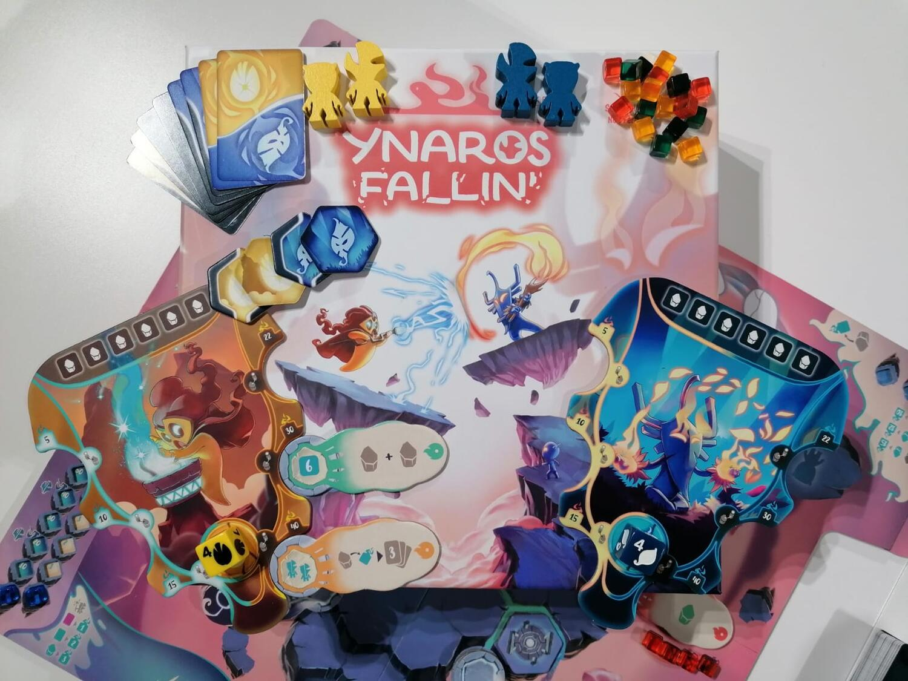
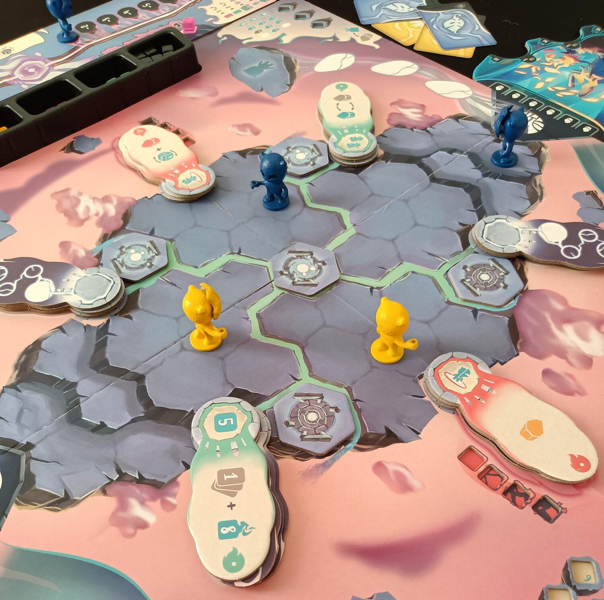
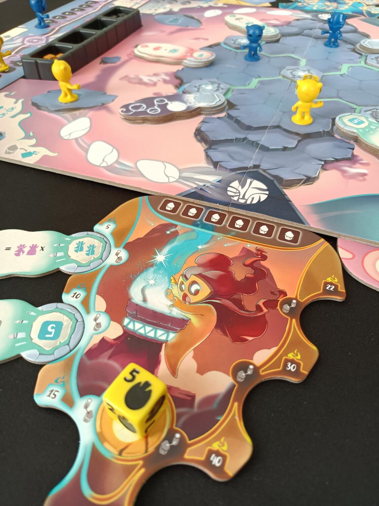

<Setting>

  Naviga attraverso terre selvagge e imbriglia il loro potere per aumentare la
  tua potenza magica. Incontra il tuo avversario e dimostra la tua maestria. Hai
  quello che serve per diventare lo Sciamano più saggio che la Terra abbia mai
  visto?

</Setting>

<Rules>

  In Ynasor Fallin’ dovrete vestire i panni di sciamani pronti a prendere il
  controllo della magia imbrigliata nella terra e nei santuari. Il vostro scopo
  sarà quello di ottenere più punti esperienza possibili oppure sconfiggere
  definitivamente il vostro avversario. Durante la partita potrete reclutare
  seguaci, per farvi aiutare nella conquista delle terre selvagge o addirittura
  renderli nuovi potenti sciamani; viaggiare per le terre desolate e attivare i
  santuari per raccogliere cristalli che vi serviranno per sprigionare utili
  incantesimi. Come già accennato, non solo potrete raccogliere artefatti e
  prendere il controllo di territori per ottenere ulteriore potere, ma potrete
  anche sfidare direttamente il vostro avversario sul campo di battaglia
  utilizzando le carte che pescherete durante la partita. Oltre a ciò, anche i
  cristalli raccolti durante il vostro viaggio vi saranno utili per infliggere
  enormi danni durante le battaglie o per accumulare punti esperienza. La
  partita giungerà al termine quando riuscirete a portare a 0 punti vita il
  vostro avversario oppure riuscirete a ottenere abbastanza punti esperienza e
  diventare così lo sciamano più potente al mondo.

</Rules>

<Feedback>

  Premetto che ho potuto giocare a Ynaros Fallin’ solo in versione prototipo
  Kickstarter, quindi regolamento, componenti e dinamiche di gioco non erano
  ancora del tutto complete, ecco perché non sono entrato molto nel dettaglio
  durante la spiegazione di questi ultimi. Nel corso di questi mesi sono state
  aggiunte varie modifiche e aggiustamenti che renderanno questo gioco un
  gioiellino da non farsi scappare durante la campagna Kickstarter.  
  A primo impatto Ynaros Fallin’ è davvero una gioia per gli occhi. Tanti componenti
  e di ottima fattura, oltre a una scelta di colori che creano un colpo d’occhio
  davvero stupendo al tavolo. Il gioco è veloce e ricco di suspance durante tutta
  la partita, non avendo praticamente tempi morti. Unica pecca che ho trovato durante
  i primi approcci è stato il regolamento, in alcuni casi confusionario o mancante
  di esempi visivi; anche perché le regole non sono poche e le cose che si possono
  fare in un turno sono parecchie. Questo punto ovviamente non è una vera e propria
  critica, anche perché ho seguito direttamente il lavoro di correzione e di aggiunta
  di illustrazioni al regolamento del team della Peakwik games. Oltre ciò, aspetto
  per nulla da sottovalutare, è una serie di mini tutorial presenti nel regolamento
  che aiutano il giocatore a prendere confidenza delle meccaniche step by step. Le
  partite sono sempre esplosive e sul filo del rasoio, oltre al fatto che le possibili
  strategie da poter adottare sono molte, rendendo le partite scontri sempre diversi
  tra loro.
   
  In conclusione, sono sicuro che questo progetto non deluderà le vostre aspettative,
  regalandovi parecchie ore di divertimento al tavolo. Detto ciò, come voi, non vedo
  l’ora di vedere la pagina Kickstarter aprirsi e scoprire le fantastiche sorprese
  che questo team ha in serbo per noi.

</Feedback>

