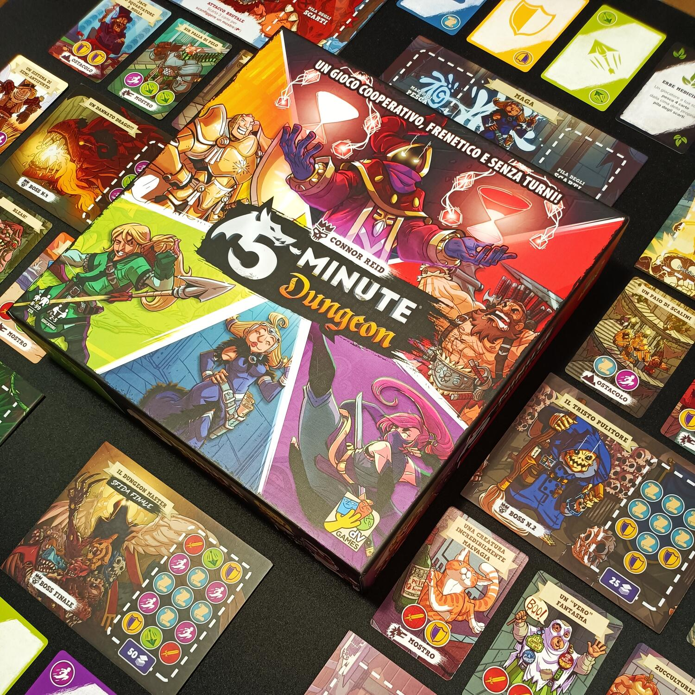
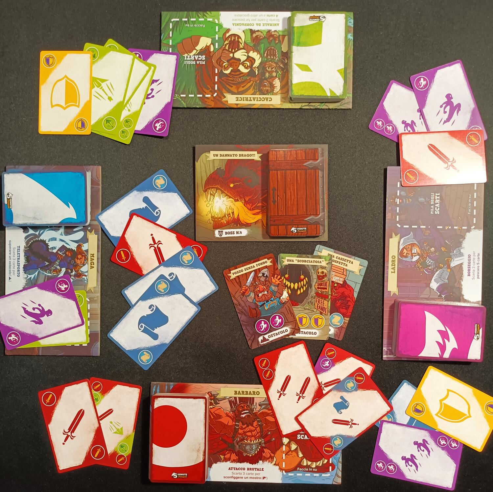

<Setting>

  Riunisci la tua squadra, sfodera tutte le armi e le abilità in tuo possesso e
  affronta il Dungeon. Il tempo non sarà dalla tua questa volta! Avrai solo 5
  miseri minuti per affrontare il potente Boss e i suoi scagnozzi. Ostacoli,
  trappole ed eventi di ogni genere ostacoleranno il tuo cammino, ma ricorda,
  tick tock, tick tock, il tempo scorre. Avrai il coraggio e le capacità per
  abbattere il potente Dungeon Master!?

</Setting>

<Rules>

In 5 Minute dungeon coordinazione, cooperazione e riflessi pronti saranno le vostre armi più potenti. 
Durante la preparazione dovrete scegliere uno dei dieci eroi disponibili e prendere il mazzo di carte a lui legato. A questo punto, una volta scelto il Boss da affrontare, costruite un mazzo Dungeon in base alla difficoltà e aggiungete due carte Sfida per ogni giocatore che partecipa alla partita. Semplice. 
Lo scopo del gioco è quello di affrontare tutte le carte Dungeon, le sfide e ovviamente il potente Boss in soli 5 minuti. Vedrete, è più semplice a dirsi che a farsi. 
Ogni eroe, durante la partita, potrà tenere in mano un numero massimo di carte in base al numero di giocatori (ad esempio in 3 giocatori, 4 carte). In 5 Minute dungeon non esistono turni, ma tutto è in contemporanea. Per iniziare, attivate il timer e girate la prima carta del Dungeon. Per sconfiggere il nemico o superare l’ostacolo dovrete, in squadra, giocare i simboli corrispondenti sulla carta Dungeon. Ogni volta che giocherete una carta, che sia del simbolo della prova o no, pescherete altrettante carte; in parole povere, dovrete, in qualsiasi momento, avere il massimo numero di carte in mano. Fidatevi, ne avrete bisogno. Per affrontare il Dungeon potrete non solo giocare carte con i simboli, ma anche attivare le abilità dei vostri eroi o giocare carte Azione. Ogni volta che giocherete i simboli giusti o tramite un’abilità supererete una carta Dungeon potrete mettere da parte tutte le carte giocate e girare la carta successiva. 
Arrivati al Boss le cose si complicano però: molte delle vostre abilità infatti saranno inefficaci! Inoltre non potrete più giocare carte che non siano dei simboli presenti sulla carta Boss per cercare di pescarne altrettante. Arrivare ben equipaggiati sarà quindi fondamentale. Se riuscirete a battere il Boss entro i 5 minuti, avrete vinto la partita, ma se il tempo scade o ogni giocatore finisce il mazzo da cui pescare, beh, ahimè, avrete perso.

</Rules>

<Feedback>

  Premetto che aspetto questo gioco da diversi anni e che amo i giochi a tempo.
  5 Minute dungeon è uno di quei giochi che puoi intavolare davvero con tutti.
  Regole immediate e semplici, che possono essere spiegate e capite sia da
  neofiti che da bambini. Gameplay iper-interattivo, molto caciarone, ricco di
  adrenalina e ovviamente davvero corto. I cinque minuti scorrono alla velocità
  della luce, e finita una partita ne vorrete subito fare un’altra. I componenti
  sono ricchi di colori, e le illustrazioni belle e davvero simpatiche.
    Ovviamente i difetti però non mancano. Primo, sicuramente, è la scarsa rigiocabilità
  del titolo: da un lato i 10 eroi presentano abilità molto simili tra di loro, dall’altro
  i boss sono soltanto 6, e difficilmente una volta sconfitto uno lo riproverete.
  La seconda nota dolente del titolo è invece la difficoltà. Se da una parte questa
  caratteristica permetterà di aumentare drasticamente la longevità del titolo, poiché
  sarete costretti ad affrontare più volte lo stesso Boss senza riuscire a sconfiggerlo,
  dall’altra, capirete fin da subito che il numero di giocatori in partita fa la
  differenza. Come detto nel regolamento, per ogni giocatore si aggiungeranno 2 carte
  Sfida al mazzo Dungeon. Una bazzecola in confronto alla presenza di un personaggio
  giocante con un mazzo di carte e abilità pronte all’uso. A causa di ciò in due
  giocatori sarà quasi impossibile affrontare alcuni Boss più difficili, e allo stesso
  tempo, con più giocatori i Boss più semplici saranno davvero una passeggiata. Al
  di là dei difetti però, ho trovato questo gioco davvero divertente. 5 Minute dungeon
  non è un titolo che cerca di essere un capolavoro, ma un bel passatempo da fare
  quando non si sa cosa intavolare o da provare con giocatori poco avvezzi allo stare
  seduti a pensare. Un'espansione è già uscita e probabilmente porterà nuove meccaniche
  e longevità al titolo.
   
  Che dire, se cercate qualcosa di davvero immediato, semplice, interattivo e veloce
  da intavolare, questo fa al caso vostro. Vi sfido a battere il Dungeon Master,
  io non ci sono ancora riuscito!

</Feedback>

