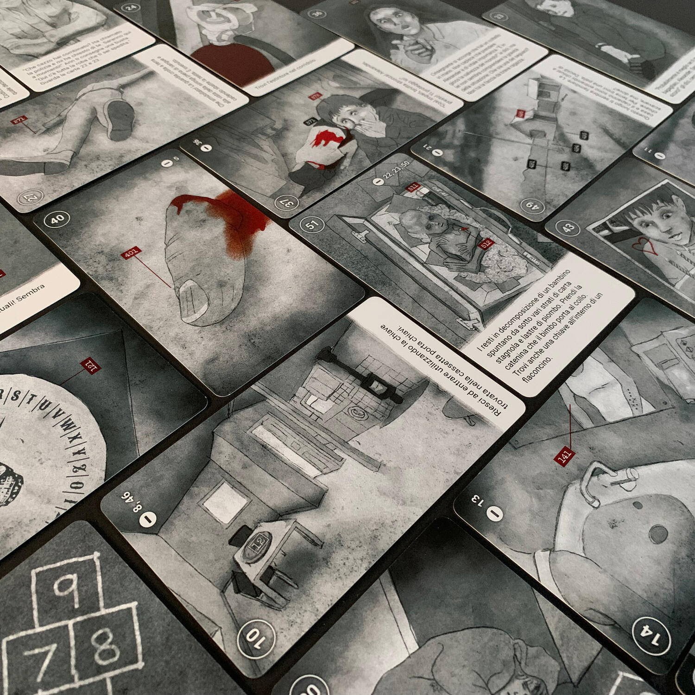
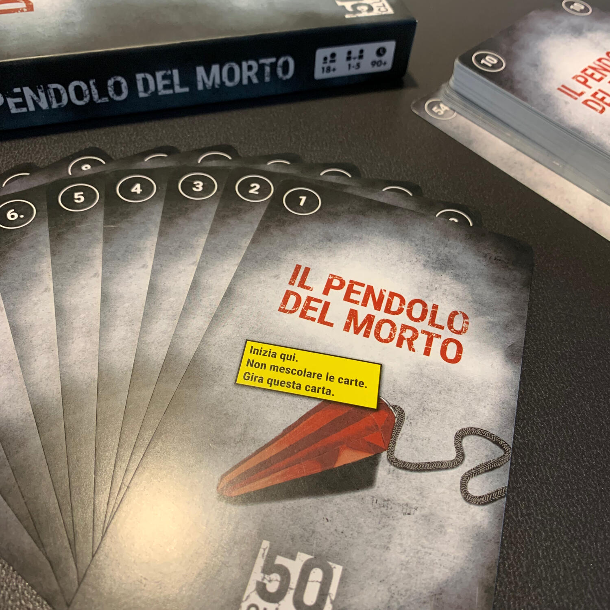

<Setting>

  Maria viene arrestata: ha ucciso Re Leopold.  
  Un'investigatrice ha trovato una valigia sepolta in un bosco. All'interno, oltre
  a fogli di piombo e di carta stagnola, c'è il cadavere di un bambino.  
  Trovando questa valigia, l'anima del monarca verrà liberata.
   
  Maria viene condannata all'ergastolo in un reparto psichiatrico. È confusa,
  forse per gli effetti degli psicofarmaci, ma ha ancora alcune certezze: suo
  figlio è in pericolo, suo figlio è il prescelto, suo figlio è l'unico in grado
  di fermare l'entità.
   
  Maria aveva già organizzato tutto, non resta che mettere in atto il piano.

</Setting>

<Rules>

  50 clues: la trilogia di Leopold è una <strong>miniserie</strong> di{" "}
  <strong>tre</strong> escape room da tavolo.
   
  Ogni capitolo è una scatola a sé stante, che continua la storia da dove
  l'aveva lasciata la precedente e <strong>ti prende a sberle l'anima</strong>.
   
  Immergersi in questo viaggio è molto semplice: si pesca la prima carta e si
  gioca. D'un tratto sarete voi a dover interpretare Maria e ad aiutarla nella
  sua missione, abbinando oggetti e risolvendo enigmi. Una pratica{" "}
  <strong>applicazione web</strong> vi guiderà in questi compiti e vi aiuterà
  nel caso in cui vi foste bloccati.  
  Tutto qui.

</Rules>

<Feedback>

  E chi lo ha detto che il gioco da tavolo parla solamente di navi spaziali,
  carri armati e punti vittoria? In queste avventure si affronteranno{" "}
  <strong>temi importanti</strong>, strazianti e pesanti. Molte volte vi
  domanderete "ma sei serio?", molte volte vi rifiuterete di fare quello che il
  gioco si aspetta (ma poi lo farete lo stesso). Se siete sensibili, evitate.{" "}
  <strong>Evitate, davvero.</strong> Quello che questo gioco vi lascerà è
  paragonabile a quello che vi lascerebbe un libro, con l'unica differenza che
  sarete voi ad aver pensato a che azione far compiere alla protagonista.  
  Tralasciando l'ambientazione e i pensieri che vi accompagneranno andando a dormire,
  la qualità degli <strong>enigmi</strong> è molto buona: ce ne sono di logica, di
  matematica, di pensiero laterale… insomma, proprio un bel mix, ma non per questo
  complicato. Sono associati quasi sempre alla trama che state vivendo. Inoltre,
  nel caso in cui vi bloccaste, ricordatevi che l'applicazione vi saprà sicuramente
  aiutare.
   
  La trama potrebbe risultare difficile da seguire, sia perché la parte narrativa
  è molto striminzita, sia perché la vostra attenzione sarà rivolta a come risolvere
  gli enigmi.  
  Se siete degli amanti delle escape room da tavolo, questa{" "}
  <strong>sicuramente è da provare</strong>.

</Feedback>

