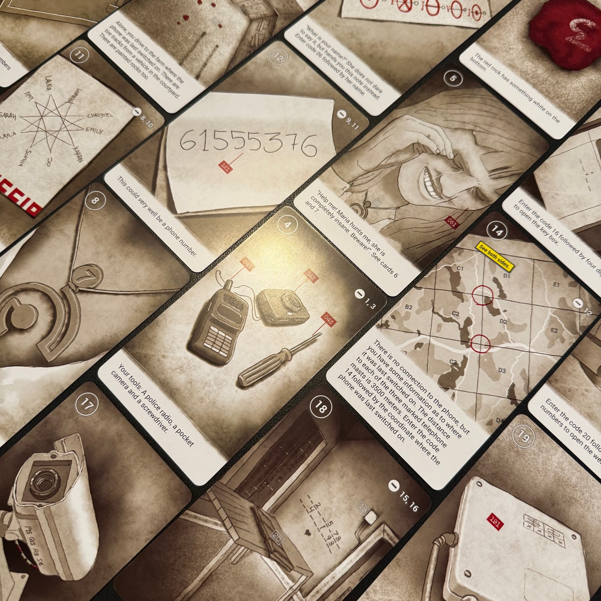
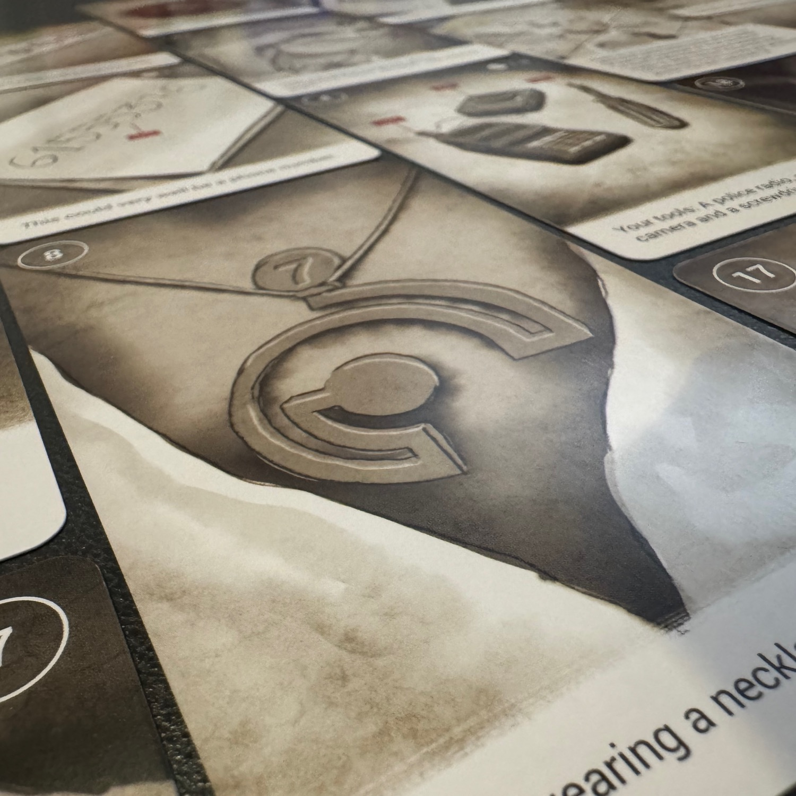

<Setting>

  Alcuni anni fa, un ragazzo è rimasto vittima di <strong>un’autobomba</strong>, ma il suo corpo non è mai stato ritrovato. Di lui sono state rinvenute solo delle tracce di sangue sulla scena del crimine. Ora, sono emersi dei nuovi indizi, ma non tutti vogliono <strong>che il ragazzo venga trovato</strong>.

</Setting>

<Rules>

  Anche questa trilogia di 50 Clues, simile a quella di <Link to="/reviews/50-clues-la-trilogia-di-leopold/">Leopold</Link> e a <Link to="/reviews/50-clues-sunshine-island/">Sunshine Island</Link>, si presenta come una miniserie composta da <strong>tre escape room da tavolo</strong>. Ogni capitolo costituisce una scatola indipendente che prosegue la trama dal punto in cui l'ha lasciata il capitolo precedente. 
  L'esperienza di immergersi in questo viaggio è <strong>estremamente intuitiva</strong>: si inizia pescando la prima carta e ci si impegna in un susseguirsi di enigmi, <strong>storie avvincenti</strong> e <strong>colpi di scena</strong>. Per avanzare nella trama, è necessario utilizzare i numeri riportati sulle carte, inserendoli in un <strong>sito web</strong> dedicato che monitora il progresso. Questo sito segnala gli errori commessi e, a discrezione del giocatore, fornisce suggerimenti utili. 
  Se i numeri sono delimitati in bianco, basta girare una nuova carta contrassegnata da quel numero. Nel caso in cui il numero sia rosso, si procede ad abbinarlo con un altro numero rosso (ad esempio, associare la benzina a una macchina per… fare benzina). Infine, se il numero è nero, si comunica all'applicazione che si è pronti a seguire quella specifica pista. Questo <strong>approccio ricorda Unlock</strong>, ma risulta ancora più semplice. 
  Si prosegue rivelando carta dopo carta fino a che non si raggiunge la fine dell'avventura!

</Rules>

<Feedback>

  Come promesso nella recensione di <Link to="/reviews/50-clues-sunshine-island/">Sunshine Island</Link>, sono riuscito a trovare il tempo per giocare anche questa trilogia: <strong>una garanzia</strong>.  
  La cosa più interessante, per quanto mi riguarda, è che in questi episodi <strong>si trovano molti dei personaggi del caso di Leopold</strong>… ma vista dall'altro lato: <strong>con gli occhi di Maria</strong>! Una scelta davvero splendida!  
  Essendo un "sequel" della prima, potete immaginare che il clima e i <strong>dettagli macabri</strong> non mancheranno nemmeno qui: <em>sangue, armi, bambini appesi, morte</em>. 
  Rallentiamo un po', va.  
  Le impressioni sono pressoché le stesse delle altre due trilogie (vi invito ad andare a leggere gli altri articoli) se non che, forse, questa è stata la mia preferita.  
  <Link to="/reviews/50-clues-la-trilogia-di-leopold/">Leopold</Link>, il primo lavoro, è stato un ottimo punto di partenza e, con questa seconda trilogia, l'autore <strong>ha imparato dai propri errori</strong>. La storia è sicuramente più facile da seguire, le scelte sono ancora malate e <strong>le "trappole" sono davvero divertenti</strong>: se ti distrai sicuramente cadrai in qualche tranello!  
  Rispetto alla terza, il livello globale è molto simile, ma con enigmi a volte veramente complessi… ed è per questo che l'ho apprezzata leggermente di più: sistemi matematici, approssimazioni, modi fantasiosi per calcolare distanze… davvero molto suggestiva! Per non parlare dell'enigma del faro… wow! Ma zero spoiler, giusto? 
  Volete iniziare con una 50 Clues? Fatele in ordine cronologico!  
  Spero vivamente che ci sia una quarta trilogia: ormai ci ho preso davvero gusto!

</Feedback>

