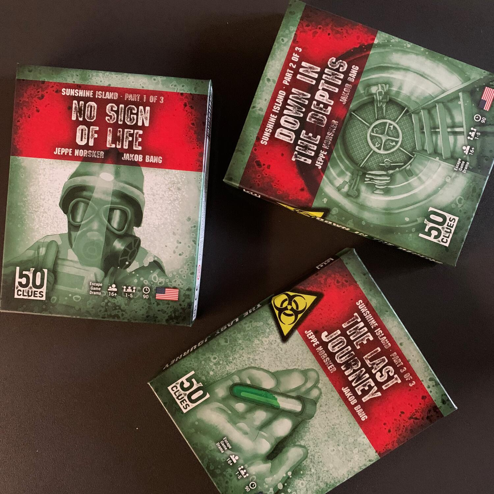
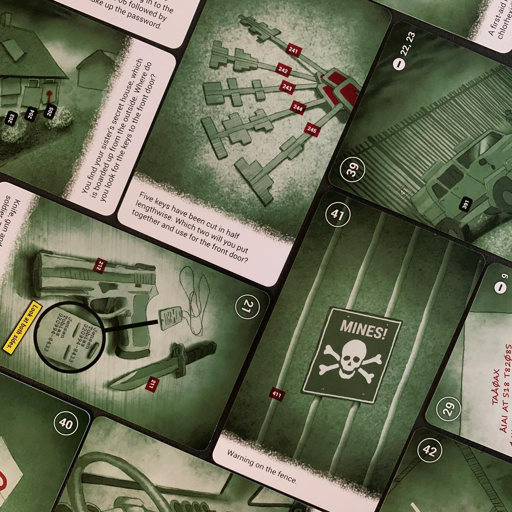
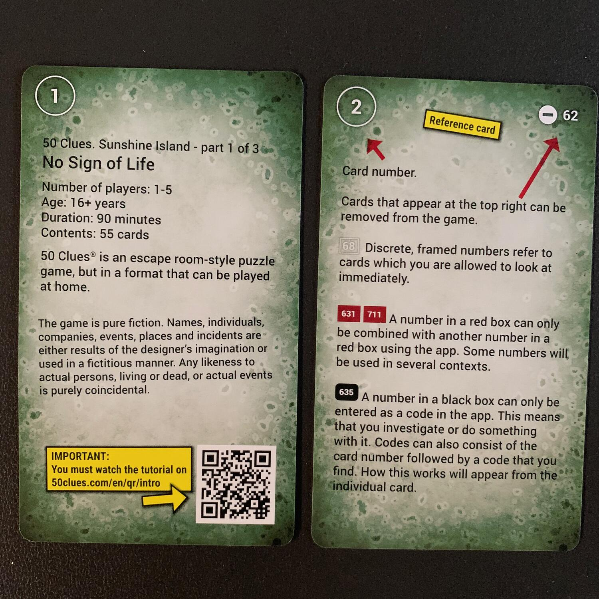

<Setting>

  "Se non hai notizie di me ogni settimana,{" "}
  <strong>allora sono nei guai</strong>".
   
  Con le mani tremanti e le lacrime agli occhi, apri la scatola di cartone
  sigillata chiamata "Giorno 8", come la definiva tua sorella.  
  Non ti ha mai rivelato quale fosse la sua missione, ma è una <strong>    ricercatrice specializzata in agenti biologici</strong> per le Forze Armate e la paura nei suoi occhi, quando ti ha lasciato
  la scatola, era inequivocabile.  
  Questa volta c'era qualcosa di insolito.  È sempre stata molto puntuale
  nel chiamarti ogni settimana… ma è già l'ottavo giorno e{" "}
  <strong>non si è ancora fatta sentire</strong>. Perché non ti ha chiamato? Sta
  bene?
   
  Tu sei <strong>Sigrid</strong> e rischierai la vita per salvare tua sorella e
  per arrivare in fondo a questa storia.  
  Cosa sono questi funghi? Chi o cosa sono MALM e GAIA? Quanta pressione esercita
  un litro d'acqua? Come influisce il vento quando si spara con un M82?  
  Ma soprattutto, Sigrid è un uomo o una donna? lol. (#ignoranza)

</Setting>

<Rules>

  Anche questa terza trilogia di 50 clues, come{" "}
  <Link to="/reviews/50-clues-la-trilogia-di-leopold/">quella di Leopold</Link>
  , è una <strong>miniserie di tre escape room</strong> da tavolo: ogni capitolo
  è una scatola a sé stante, che continua la storia da dove l'aveva lasciata la
  precedente.  
  Immergersi in questo viaggio è molto semplice: si pesca la prima carta e si gioca,
  enigma dopo enigma, storia dopo storia, colpo di scena dopo colpo di scena.
   
  Per proseguire, bisogna <strong>    utilizzare i numeri presenti sulle carte</strong>, inserendoli in un sito web che tiene traccia del progresso, che segnerà
  gli errori e, se volete, vi darà dei suggerimenti. Se i numeri sono bordati in
  bianco, semplicemente, girerete una nuova carta contrassegnata da quel numero;
  se il numero è rosso, lo abbinerete con un altro numero rosso (ad esempio, potete
  abbinare la benzina con una macchina per… fare benzina); infine, se il numero è
  nero, direte all'app che siete pronti per seguire quella strada. Come Unlock, ma
  più semplice.

</Rules>

<Feedback>

  Camus afferma che "la vita è la somma di tutte le tue scelte".  
  Tagliamo corto: tutti avete almeno giocato almeno un’escape room da tavolo e, se
  siete arrivati fino a qui, probabilmente, cercate qualcosa di diverso. <strong>    Ma cos’è un escape room se non una serie di codici e di scelte inseriti
    all'interno di una trama?</strong> Poco più.
   
  Perché 50clues è diverso? Per la tipologia di codici, per le scelte e, soprattutto,
  per la trama.  
  Molti codici sono sempre la stessa cosa, i soliti lucchetti, le solite porte
  da aprire, i soliti corridoi da prendere… ma il punto è come capite cosa fare.
  Alcuni <strong>enigmi</strong>, infatti, sono <strong>"pratici"</strong>, nel
  senso che <strong>serve senso pratico</strong> per risolverli. Facciamo un
  esempio per non fare spoiler: come potete suonare un campanello dalla parte
  opposta della strada sapendo che avete un'ottima mira e che, vicino a voi, c'è
  una bottiglia di coca cola e una mentos? Questo esempio, abbastanza goliardico
  e con poco senso, rende bene l'idea. In ogni caso, credo che{" "}
  <strong>la difficoltà di questi enigmi sia più alta della media</strong>: non
  che mi dispiaccia, anzi!
   
  Il secondo motivo per cui 50 clues è diverso sta nelle opzioni di scelta. Che
  difficile è prendere certe scelte? Non sto parlando dell'ordine in cui
  inserire un codice, bensì{" "}
  <strong>se la vita di un uomo merita di essere vissuta</strong> o se è meglio
  ucciderlo per proseguire con più calma, basandosi su quello che avete capito e
  sul film che vi siete fatti. Vi assicuro che premere ENTER dopo aver impostato
  il comando non è per niente facile. E magari è anche sbagliato.  
  L'ultimo motivo, nonostante a tratti sia davvero difficile da seguire, è la trama.
   
  Più che in un’escape room, <strong>    vi trovate davanti a un film, a una serie TV, condensata in 3 mazzetti</strong>, che proseguono man mano che risolvete enigmi. Ci sono informazioni,
  dettagli che pensate di aver capito e che poi si rivelano falsi, citazioni e rimandi
  ad altre serie TV, personaggi che entrano e che escono, colpi di scena… Insomma,
  tanta, tanta roba.
   
  Ovviamente non è tutto oro.  
  Questa terza trilogia{" "}
  <strong>non esiste in italiano e l'inglese non è semplicissimo</strong>, ma
  con un po' di pazienza, e con un traduttore alla mano, tutti possono giocare…
  anche se forse non sarà la stessa cosa.  
  Nonostante abbia visto un grande miglioramento rispetto alla <Link to="/reviews/50-clues-la-trilogia-di-leopold/">
    prima trilogia
  </Link>, se vi ho incuriositi, e se reputate che il vostro inglese non sia in forma,
  vi consiglio di partire dall'inizio, giusto per capire l'antifona e quello che
  potreste trovare… per poi lanciarvi a capofitto su questa!
   
  Non mi esprimo sulla seconda trilogia… in quanto adesso vedo di recuperarla e di
  giocarla!
   
  Voi l'avete giocata? Merita? Fatemelo sapere!

</Feedback>

