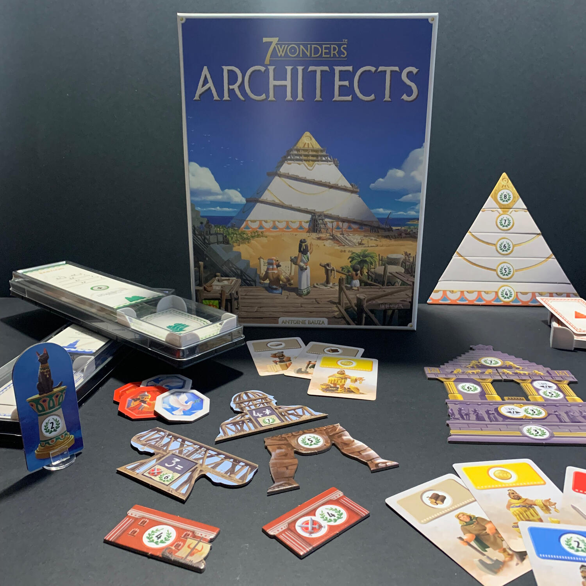

<Setting>

  Guidate una delle sette grandi città dell'Antico Mondo, vestite i panni di
  imperatori e governatori devoti alle divinità pagane, imponete il vostro
  assetto militare. Sfruttate le risorse naturali delle vostre terre, prendete
  parte all'eterna marcia del progresso, sviluppate le vostre relazioni
  commerciali.
   
  Ma soprattutto, costruite la vostra meraviglia. E fatela meglio degli altri.
   
  Che questa sia la statua di Zeus a Olimpia oppure il colosso di Rodi, ha poca
  importanza. L'importante è vincere. Sicuramente non partecipare.

</Setting>

<Rules>

  Avete presente 7 Wonders? Il gioco che ha vinto il maggior numero di premi a
  livello mondiale? Il gioco che ha inventato il draft insomma?
   
  Dimenticate (quasi) tutto!
   
  Qui siamo al cospetto del fratello minore, ma non per questo meno valido.
   
  Pescate una carta da uno dei tre mazzetti a vostra disposizione e mettetela
  immediatamente in gioco, applicandone gli effetti.
   
  Risorse e monete vi permetteranno di costruire pezzo dopo pezzo, masso dopo
  masso, la vostra immensa meraviglia.
   
  L'esercito vi permetterà di non temere i vicini, di difendervi e attaccare al
  contempo, facendo capire chi comanda.
   
  La ricerca scientifica vi sarà utile per potenziare le vostre azioni, turno
  dopo turno e di avere una marcia in più.
   
  I punti vittoria, infine... beh, sono punti vittoria.
   
  Nel momento in cui la prima meraviglia viene completata, la partita finisce.
   
  Solamente una civiltà potrà dire di esserci riuscita.

</Rules>

<Feedback>

  7 Wonders: Architects è probabile che sarà il gioco entry-level che
  sbaraglierà la concorrenza. Facile da spiegare, bellissimo da vedere e veloce
  da intavolare.
   
  In altre parole il gioco perfetto per sostituire la tombola durante le
  festività.
   
  Non aspettatevi niente di complicato, nessun calcolo matematico e la grande
  quantità di alea metterà giocatori scafati e principianti nelle stesse
  condizioni.

</Feedback>

