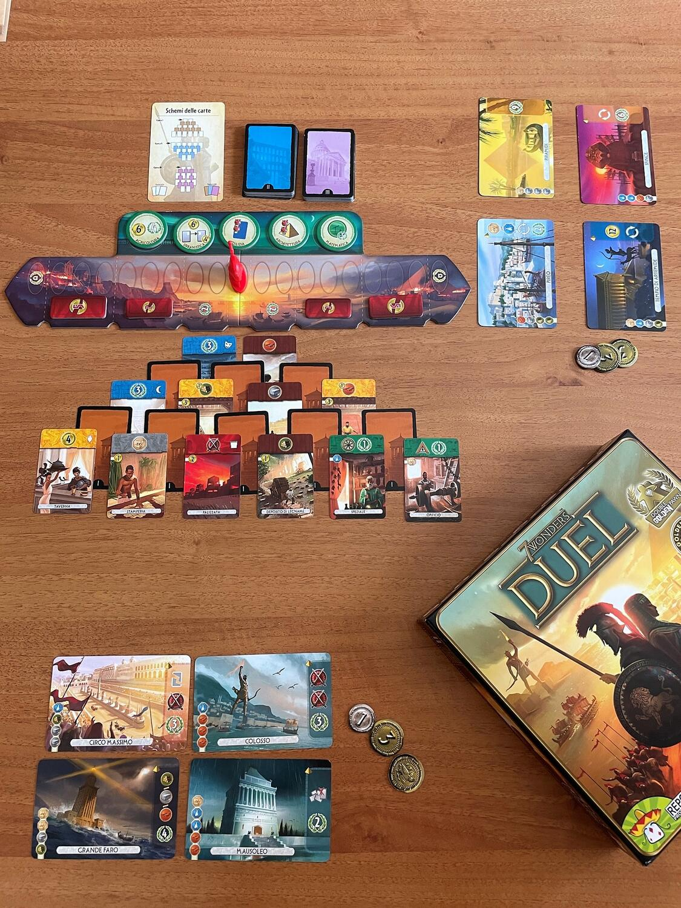
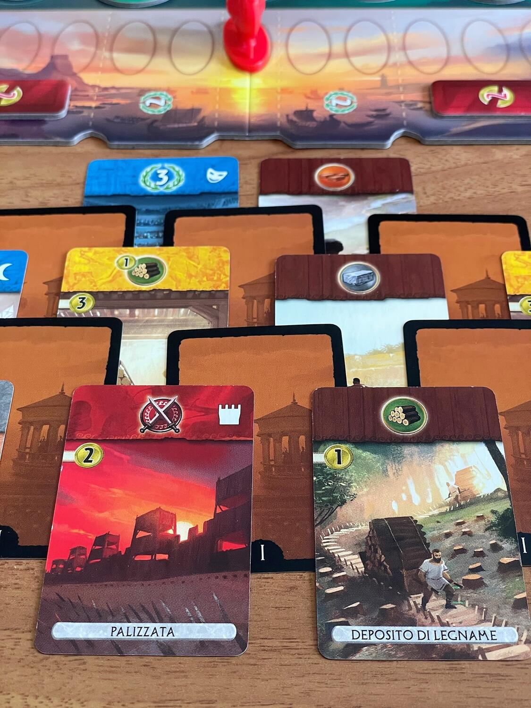

<Setting>

  In 7 Wonders Duel dovrete sviluppare la Città più potente dell’antichità,
  sconfiggendo l’avversario attraverso strategie militari, scoperte scientifiche
  e grandi costruzioni.

</Setting>

<Rules>

  Una partita a <em>7 Wonders Duel</em> si divide in tre Epoche, in ciascuna
  delle quali si gioca con uno specifico mazzo di <strong>carte</strong>; lo
  scopo di ciascun giocatore è quello di costruire la propria “città” formata
  dalle più svariate <em>Strutture</em>, rappresentate dalle carte, e realizzare
  le 4 Grandi <em>Meraviglie</em> del mondo che sceglie all’inizio della partita
  (tramite una meccanica di draft).&nbsp;
   
  Ciascuna carta, Struttura o Meraviglia, necessita di specifiche{" "}
  <em>risorse e/o monete</em> per poter essere realizzata; inoltre, esistono 7
  tipi diversi di Strutture: carte marroni e grigie che forniscono risorse;
  carte blu che valgono punti vittoria; carte verdi che danno punti vittoria e
  un simbolo scientifico; carte gialle che producono monete, risorse, punti;
  carte rosse che aumentano la potenza militare; carte viola che valgono punti
  vittoria.
   
  <strong>Durante il proprio turno</strong>, ciascun giocatore sceglie una delle
  carte disponibili dallo schema al centro del tavolo e, successivamente, potrà
  svolgere una delle seguenti azioni:
   
  <ul>
    <li>      costruire la Struttura scelta pagando l’eventuale costo in monete e/o
      risorse (le risorse sono date dalla produzione delle proprie carte, non
      sono elementi fisici del gioco)</li>
    <li>scartare la carta per ottenere monete</li>
    <li>      costruire una Meraviglia, posizionando la carta scelta (di cui non va
      pagato il costo) al di sotto della Meraviglia che si vuole realizzare, a
      patto di avere risorse e/o monete a sufficienza per la costruzione.</li>
  </ul>
   
  In 7 Wonders Duel è possibile <strong>vincere in 3 modi</strong>:
  <ul>
    <li>      per <em>supremazia militare</em>: se un giocatore, attraverso gli Scudi
      forniti dalle carte rosse, riesce a portare la pedina Conflitto nella
      casella finale del tracciato sul lato dell’avversario, vince
      immediatamente la partita.</li>
    <li>      per <em>supremazia scientifica</em>: se un giocatore raccoglie 6 simboli
      scientifici diversi, attraverso le carte verdi ed eventuali segnalini
      Progresso, vince immediatamente la partita.</li>
    <li>      per <em>vittoria civile</em>: alla fine della terza Epoca, se non si sono
      verificate le vittorie immediate per supremazia, si passa al calcolo dei
      punti vittoria dati dalle proprie Strutture e Meraviglie realizzate, dalla
      posizione sul tracciato militare e dalle monete avanzate; il giocatore con
      il punteggio più alto vince.</li>
  </ul>

</Rules>

<Feedback>

  Penso che 7 Wonders sia un gioco pluripremiato non a caso, essendo
  perfettamente ben riuscito anche in questa versione per 2 giocatori.
   
  Un <strong>gioco di strategia di livello medio-facile</strong>, profondo ma al
  tempo stesso <strong>adatto a tutti</strong>, consentendo di inquadrare
  pienamente le sue meccaniche già dopo un paio di partite. La durata, inoltre,
  è relativamente contenuta, quindi si presta ad essere intavolato spesso in
  ogni situazione.
   
  Di questi tempi, inoltre, un titolo del genere ha decisamente il merito di
  venire incontro, come molti altri del resto, alle esigenze di giocatori privi
  di un vasto gruppo di gioco e che si trovano più spesso solamente in coppia.
   
  La componente “fortuna” è limitata all’ordine con cui vengono posizionate le
  carte al centro del tavolo: per il resto, c’è ampio spazio per strategia e
  pianificazione.
   
  Una nota “negativa” forse va riscontrata nella grafica delle carte, pur molto
  bella, che dovrebbe dare senso all’ambientazione, ma che dopo qualche partita
  viene totalmente ignorata, dato che i giocatori finiscono per focalizzarsi
  solamente sul bonus che ogni carta offre.
   
  In conclusione, 7 Wonders Duel è senza dubbio un <strong>must-have</strong>,
  uno di quei giochi che chiunque dovrebbe avere in collezione, che sia neofita
  o veterano dei GDT.

</Feedback>

