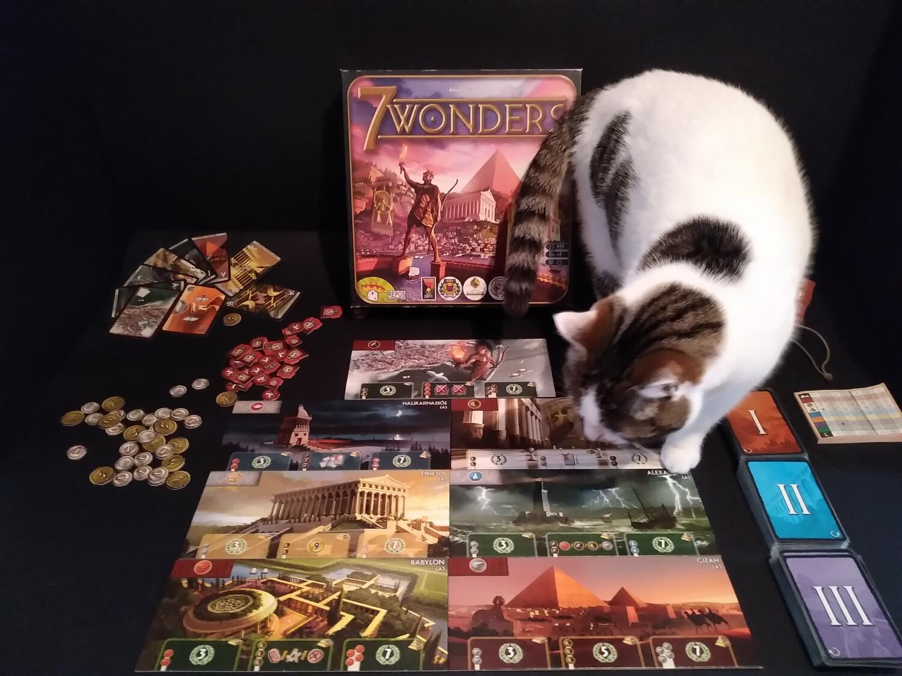
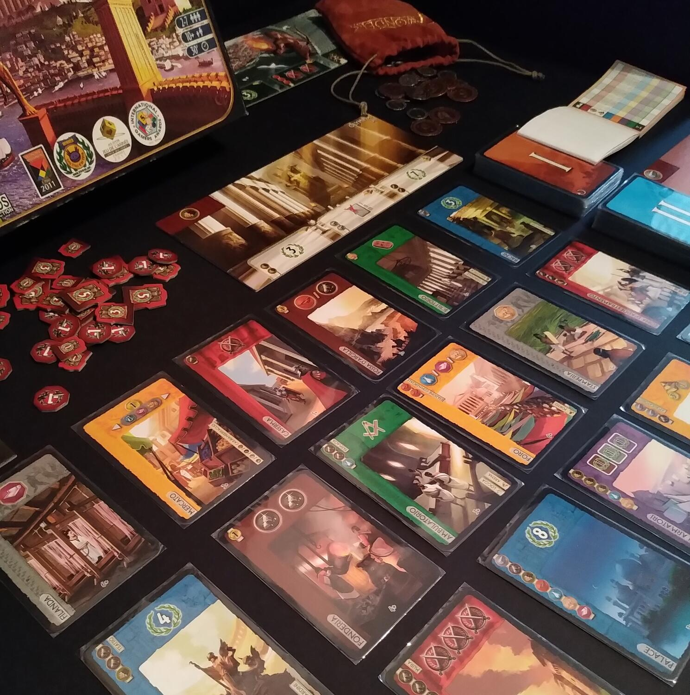

<Setting>

  Immaginiamoci di compiere uno splendido viaggio nel tempo e di risalire a
  quell'epoca straordinaria in cui il bacino del Mediterrano era culla di
  fiorenti civiltà e polo d'attrazione per artisti e sapienti da ogni parte del
  globo. Dalle coste della Grecia alle spiagge della Turchia, dalle sabbie che
  circondano il Nilo al più lontano entroterra mediorientale, in queste terre
  baciate dal sole e dall'abbondanza sorsero i più grandi tesori architettonici
  di tutti i tempi e passati alla storia come le Sette Meraviglie del Mondo
  Antico. Il Colosso che troneggiava sul porto dell'isola di Rodi; il Faro di
  Alessandria che illuminava la via dei naviganti; i lussureggianti giardini
  pensili di Babilonia, sulla cui reale esistenza archeologi e storici dibattono
  ancora oggi; la statua di Zeus a Olimpia, opera del grande Fidia; il mausoleo
  di Alicarnasso, edificio sepolcrale le cui dimensioni possiamo solamente
  immaginare; il tempio di Artemide a Efeso di cui resta un'unica solitaria
  colonna ancora visibile; le piramidi di Giza sopravvissute fino ai giorni
  nostri.

</Setting>

<Rules>

  7 Wonders vi farà rivivere quest'epoca di grandezza, attraverso la costruzione
  di una delle sette Meraviglie del Mondo Antico.
   
  Ogni giocatore sceglierà (o otterrà a caso) una plancia Meraviglia che
  determinerà l'edificio di sua competenza, la risorsa iniziale a disposizione e
  i benefici derivati dal progredire della costruzione della Meraviglia stessa
  nelle sue singole fasi.
   
  La partita si sviluppa attraverso tre epoche, ciascuna caratterizzata da un
  mazzo di carte contenenti materie prime e manufatti utili per la costruzione
  della Meraviglia, nonché strutture civili, scientifiche, commerciali, militari
  e gilde che determineranno il progresso, la potenza militare e la ricchezza
  della propria civiltà.
   
  Ogni giocatore riceve una mano di sette carte e ne sceglie una da giocare
  simultaneamente a tutti gli altri giocatori, per poi passare le carte restanti
  al giocatore accanto e procedere quindi con una nuova selezione dalla mano a
  sua volta ricevuta da un altro giocatore. Il passaggio e la selezione di carte
  terminano al sesto round, quando il giocatore sceglierà la sua sesta carta e
  scarterà l'ultima rimastagli in mano.
   
  Le carte possono essere giocate pagandone il prezzo in monete, risorse oppure
  gratuitamente in concatenazione con altre carte giocate in precedenza. In
  mancanza di determinate risorse, al giocatore è anche concesso di ottenerle
  commerciando con i giocatori delle città confinanti.
   
  In alternativa alla costruzione di una carta, il giocatore può scegliere di
  completare una fase della propria Meraviglia: in questo caso pagherà il prezzo
  indicato sulla plancia Meraviglia in corrispondenza della fase che si desidera
  completare.
   
  Terminata la terza epoca, si procede con il conteggio dei punti totali, grazie
  all'aiuto di un ottimo blocchetto colorato, già contenuto all'interno della
  scatola.

</Rules>

<Feedback>

  Il ritmo di 7 Wonders è veloce e sempre vario, con rari momenti di intoppo
  qualora al tavolo ci sia qualcuno affetto da paralisi da analisi. Tuttavia,
  una volta entrati nel meccanismo del gioco, anche il più riflessivo sarà
  intuitivamente portato a impostare una propria strategia.
   
  Il gioco riunisce intorno al tavolo da 2 a 7 giocatori, sebbene il regolamento
  per 2 giocatori non risulti del tutto convincente - non a caso è stato poi
  realizzato, espressamente pensato per 2 giocatori, 7 Wonders Duel.
   
  Si tratta, inoltre, di un ottimo titolo introduttivo a giochi di media
  difficoltà, non appesantito da regolamenti corposi o infinite combinazioni di
  gioco.
   
  L'ambientazione, sorretta da una grafica molto apprezzabile, ricrea l'idea
  dello sviluppo di epoche e civiltà, anche se dopo molte partite si tenderà a
  concentrarsi di più sull'azione di gioco.
   
  Nonostante le meccaniche possano non apparire estremamente originali, le
  strategie di gioco non sono affatto ripetitive o predeterminate: i punti di
  forza di 7 Wonders sono l'ottimo bilanciamento e l'altissima rigiocabilità,
  dovuti alla varietà di plance Meraviglia, al numero di giocatori, alle
  numerosissime possibilità di approccio al gioco. Nessuna strategia, peraltro,
  risulta migliore di un'altra e il fattore fortuna non è determinante, poiché
  la meccanica del “draft” fa circolare le carte in maniera equa. Le Meraviglie
  confinanti influenzeranno le nostre scelte, alzando piacevolmente l'asticella
  dell'interazione: tenere sempre d'occhio gli avversari durante il corso della
  partita darà molti vantaggi.
   
  Se dovessimo necessariamente trovare una piccola pecca in uno dei giochi che
  abbiamo intavolato più volte e con più soddisfazione, potremmo forse citare la
  qualità dei materiali: carta e cartone sono facilmente soggetti a usura.
  Enormemente apprezzata è stata la realizzazione delle monete in metallo come
  strategia promozionale in occasione dell'uscita dell'espansione 7 Wonders
  Armada.
   
  Adatto sia come filler sia come protagonista assoluto della serata, 7 Wonders
  non dovrebbe mancare sullo scaffale di ogni appassionato!
   E se qualcuno fosse preoccupato dalla effettiva rigiocabilità del titolo,
  esistono anche numerose espansioni, che contribuiscono a rendere il gioco più vario
  e complesso…ma per il cui approfondimento sarà necessaria una nuova recensione!

</Feedback>
