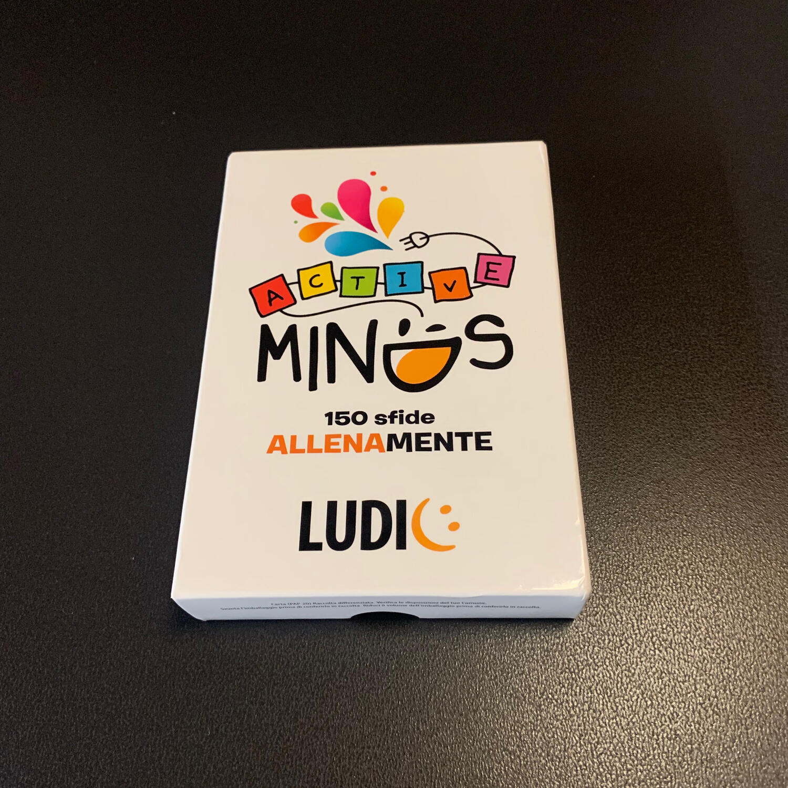
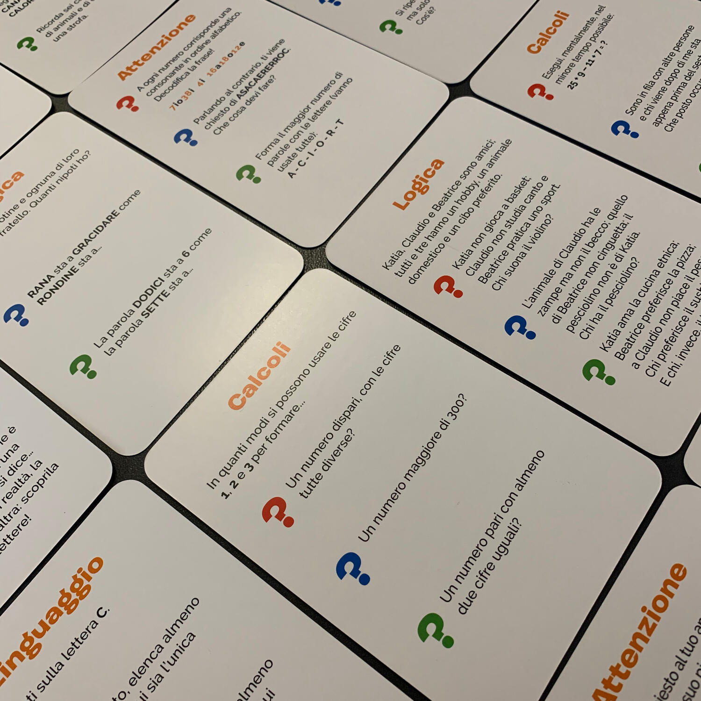

<Setting>

  Quanti anni ha Camilla sapendo che ha 2/3 dell'età del nonno? Che cos’è il
  Ribaltofono? Quante volte compare la lettera E in "precedentemente"? Che
  numero segue 0-1-1-2-3?
   
  Quante volte ci hanno posto quesiti di questo genere e avremmo voluto
  affrontare subito il successivo?  
  Se anche per voi è così, Active minds è quello che cercate!

</Setting>

<Rules>

  Si mette il mazzo sul tavolo, visibile a tutti, si sceglie un colore (rosso,
  blu o verde) e si è pronti a giocare. Ogni giocatore legge sulla carta la
  domanda del colore scelto e cerca di rispondere correttamente nel minor tempo
  possibile. Ci sono domande semplici dove dare la risposta è veramente
  questione di millesimi di secondo; altre, invece, richiedono qualche appunto
  preso su un foglio di carta. Tutto è lecito. Quando un giocatore è pronto a
  dare la risposta, gira la carta e confronta la sua risposta con la soluzione.
  Se ha sbagliato, non potrà più rispondere per l'intero round, altrimenti si
  appropria della carta, facendo punto. Si continua fino a raggiungere la fine
  del mazzo e... chi ha più punti è il vincitore.

</Rules>

<Feedback>

  Active minds è il classico gioco più difficile da spiegare che da giocare...
  Le domande non richiedono il possesso di nessuna forma di matematica
  "avanzata", solamente senso pratico e un po' di capacità astrattive. È un
  ottimo party game diverso dal solito, che mira non solo a far passare tempo di
  qualità assieme, ma anche a migliorare le capacità cognitive, che male
  sicuramente non fanno.
   
  Consiglio di giocare soprattutto con ragazzi che frequentano le medie che,
  avendo alcuni semplici concetti di logica freschi di lezione, riusciranno a
  sopraffare i genitori convinti di stracciarli.  
  Personalmente ho fatto anche qualche partita durante alcuni viaggi in auto, dove
  una persona leggeva il quesito e gli altri cercavano di rispondere correttamente
  il più velocemente possibile unendo le proprie forze contro il gioco.  
  Active minds è nulla più, nulla di meno di quanto descritto fino ad ora, ma è
  stato capace di tenermi compagnia per delle belle serate.

</Feedback>

