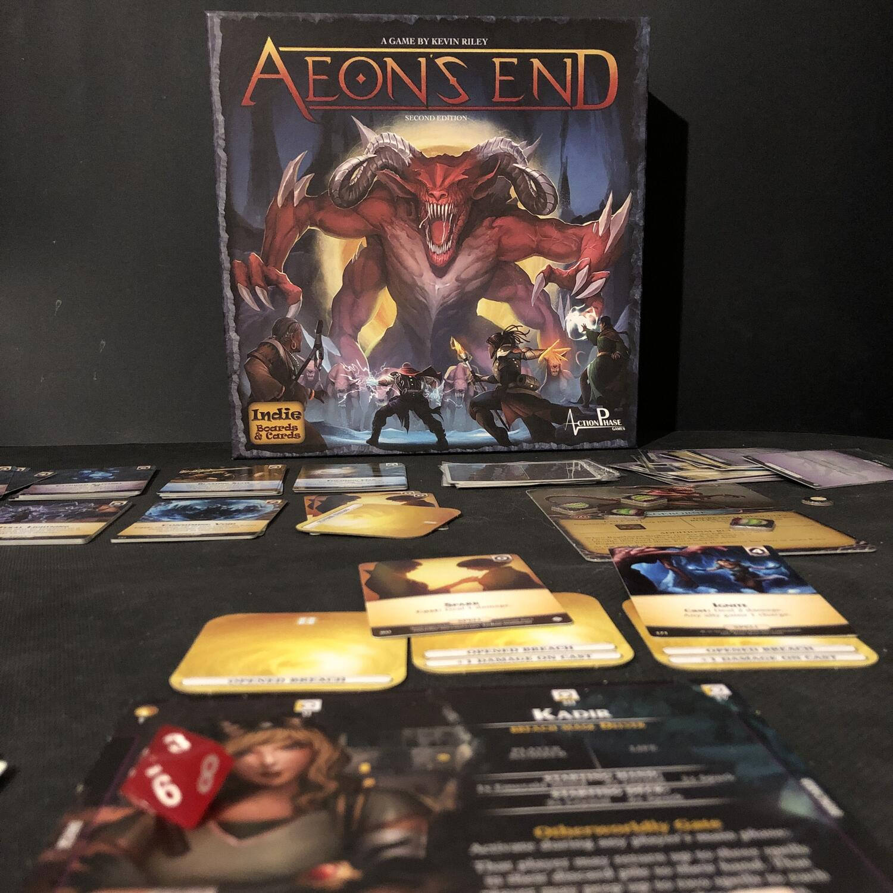
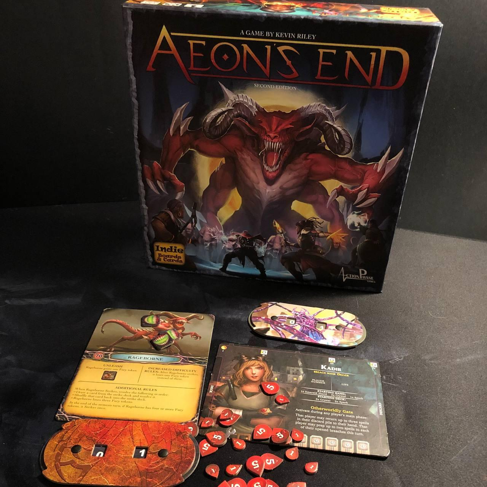

<Setting>

  In Aeon's End i giocatori impersonano dei potenti maghi, protettori di
  Gravehold, una città sotterranea costantemente bersagliata dagli attacchi di
  potenti Nemesi il cui unico scopo è portare distruzione. Ogni mago collaborerà
  con gli altri portando al gruppo la propria visione su come attingere il
  potere magico dalle brecce, infinite fonti di potere interdimensionale e punto
  di accesso al nostro mondo delle crudeli nemesi. Riuscirete a salvare il
  mondo?

</Setting>

<Rules>

  Lo scontro con la Nemesi vedrà da 1 a 4 giocatori impersonare altrettanti
  maghi, ognuno dotato di poteri speciali, che all'atto di gameplay puro vorrà
  dire amministrare il proprio mazzo iniziale in modo da poter acquistare al
  mercato comune contenente 9 carte che possono essere o : gemme (generatrici
  della “moneta” di gioco), reliquie (artefatti dagli effetti variabili) e
  incantesimi in grado di ferire la Nemesi e i suoi terribili Minion. In ogni
  round l'ordine di turno sarà prestabilito e nascosto. Si sa solo che i maghi
  hanno quattro turni e le Nemesi invece 2. Di fatto la cosa più terribile che
  può succedere in Aeon's end è il quarto turno di fila della Nemesi…

</Rules>

<Feedback>

  Innanzitutto bisogna considerare che, per quanto “non dichiarato”, Aeon's End
  è un LCG. Questa è una recensione del primo Aeon's End che, come scatola base,
  ha 2 principali problemi: poche Nemesi, di cui una ingiocabile (Crooked Mask),
  e rigiocabilità limitata. Più espansioni si aggiungono più la rigiocabilità
  sale ed esplodono le cose da fare. Da qui il voto 5 in longevità. La cosa più
  bella di Aeon's End è indubbiamente l'insolita meccanica con cui viene gestito
  il mazzo. Infatti, al contrario dei soliti deck-builder, qui il mazzo non si
  mescola mai se non tramite effetti speciali. Questo si traduce nella
  possibilità di poter gestire i propri turni con precisione, portando a catene
  di combo incredibili, e non c'è niente di più bello di comprendere al meglio
  questa meccanica e poi vederla in pratica. Insomma, se vi piacciono i
  deck-builder e i cooperativi, non c'è un buon motivo per non aggiungere Aeon's
  End alla vostra collezione, tanto più in ragione della difficoltà nel vincere
  non indifferente a altre due folli opzioni di difficoltà aggiuntive che
  saranno pane per i vostri denti!

</Feedback>

