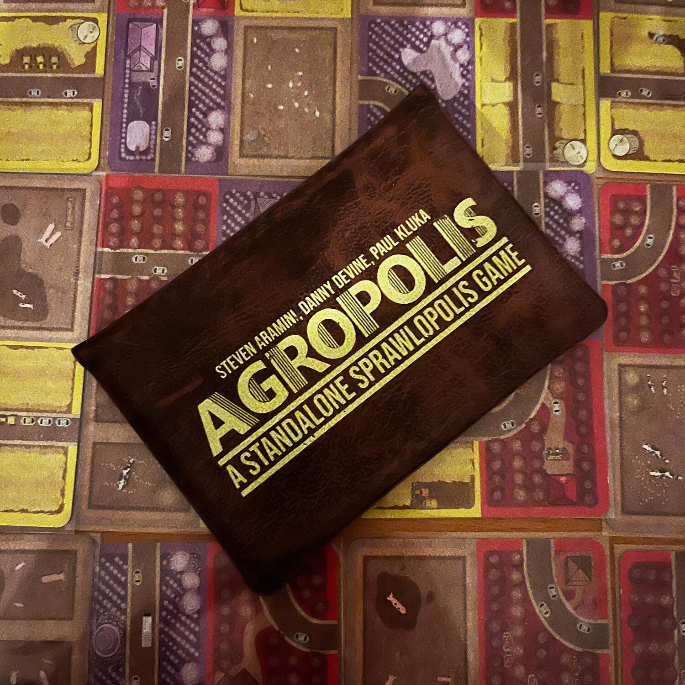
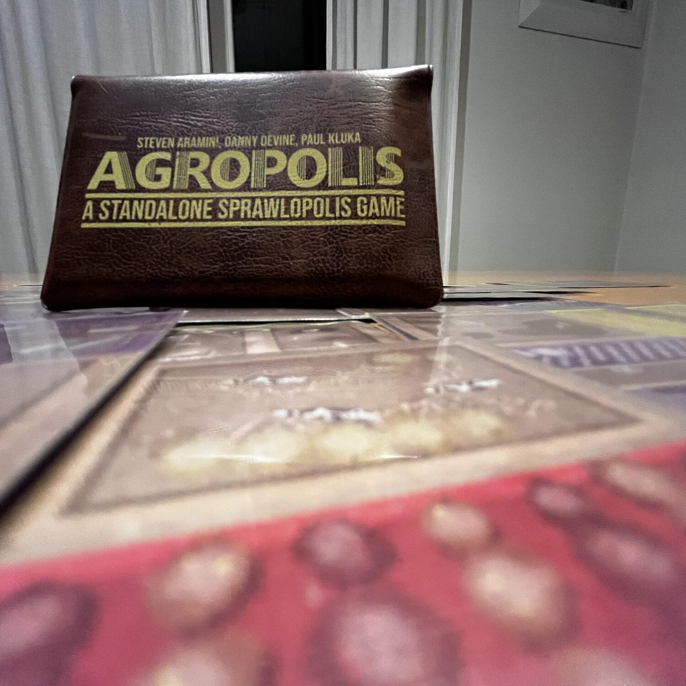
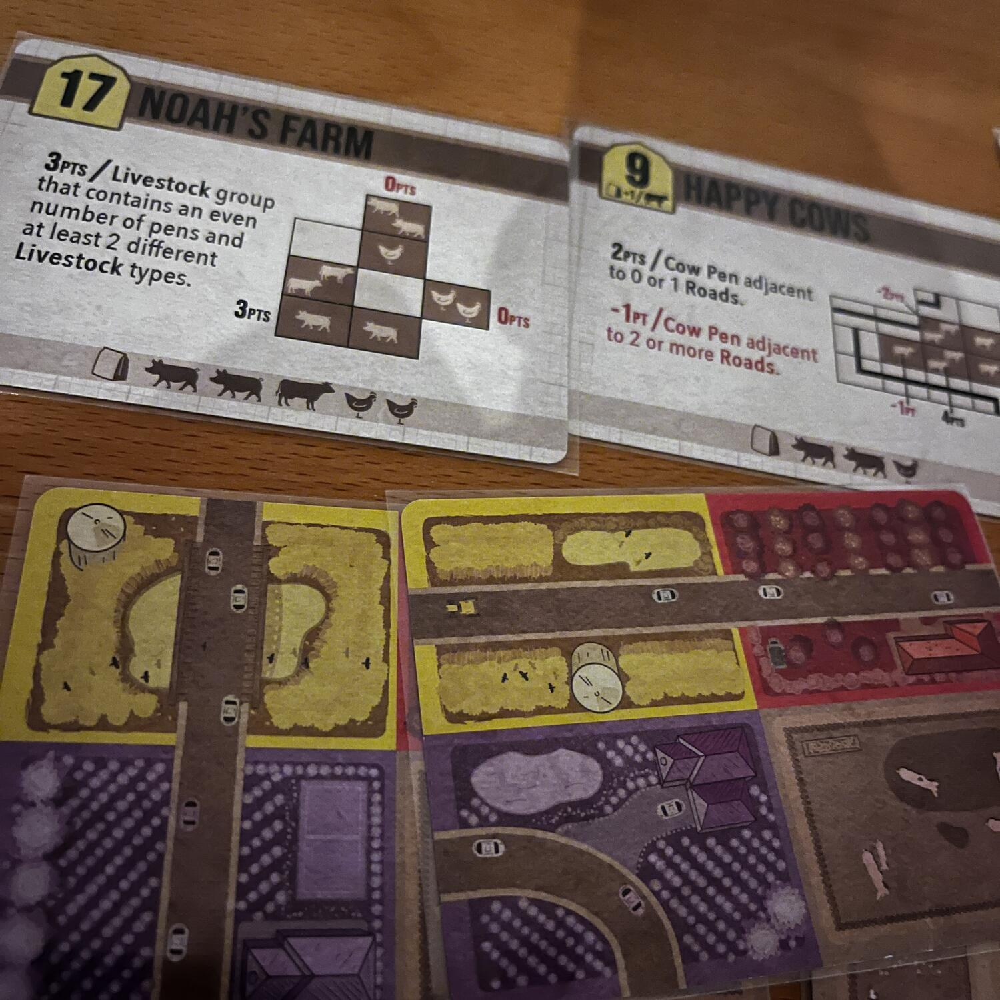

<Setting>

  Se ve lo state chiedendo, sì: è praticamente{" "}
  <Link to="/reviews/sprawlopolis/">Sprawlopolis</Link> ambientato in campagna,
  con qualche differenza.  
  Se non sapete di cosa sto parlando, leggete pure la recensione o continuate anche
  solo a leggere questa, perché stiamo parlando di un gioco di appena 18 carte che
  vi farà costruire la campagna dei vostri sogni!

</Setting>

<Rules>

  In Agropolis da 1 a 4 giocatori inizieranno con una mano composta da 1 carta e
  3 obiettivi di fine partita; inoltre, vedranno la prossima carta da pescare.
  Il primo giocatore poi pescherà 2 carte <em>et voilà</em>: il gioco può
  iniziare! Il giocatore di turno dovrà giocare dalla sua mano una carta in modo
  che si possa collegare ortogonalmente, anche sovrapponendosi parzialmente, ad
  una carta già in gioco (ogni carta è divisa in quattro settori di colore
  diverso e un numero di strade) in modo da fare più punti possibile. Passerà
  poi le due carte rimanenti al giocatore successivo e pescherà una carta.
   
  La partita finirà al termine delle carte e si procederà alla conta dei punti.
  In ogni partita il calcolo di punteggio è fisso: si somma l’area più grande
  per ogni settore, meno il numero di strade presenti, indipendentemente dalla
  loro lunghezza. A questi punti si sommano i punti dati da ogni obiettivo. Il
  punteggio andrà poi sottratto dal valore di ogni carta obiettivo. Il vostro
  punteggio è ancora superiore a zero? Bene: <strong>avete vinto!</strong>

</Rules>

<Feedback>

  Che dire, Agropolis parte da una formula già vincente, quella già trovata in
  Sprawlopolis, e in perfetta salsa{" "}
  <Link to="/publishers/button-shy">Button Shy</Link>, che regala ai giocatori
  un’esperienza di gioco senza niente da invidiare ai grandi titoli… Se
  consideriamo che parliamo di un gioco composto da solo 18 carte, non è poco!
   
  Come il suo predecessore, ha ancora qualche problema con delle combinazioni di
  obiettivi che rendono il gioco impossibile, ma sono molte meno e, soprattutto,
  permette di avere delle modifiche alla difficoltà date da dei modificatori
  sulle carte obiettivo, che offriranno ai palati più esigenti un livello di
  difficoltà sempre in linea con le proprie aspettative!  
  Insomma, se vi è piaciuto il papà <Link to="/reviews/sprawlopolis/">
    Sprawlopolis
  </Link> questo Agropolis può tranquillamente coesistere con lui nella vostra collezione,
  contando che tra l’altro esiste l’espansione Combopolis. Se non vi è piaciuto il
  gioco originale, non sarà di certo questo a farvi cambiare idea, ma se non avete
  ancora avuto occasione di provare né uno né l’altro, vi consiglio direttamente
  questo, che è decisamente una versione più matura!

</Feedback>

