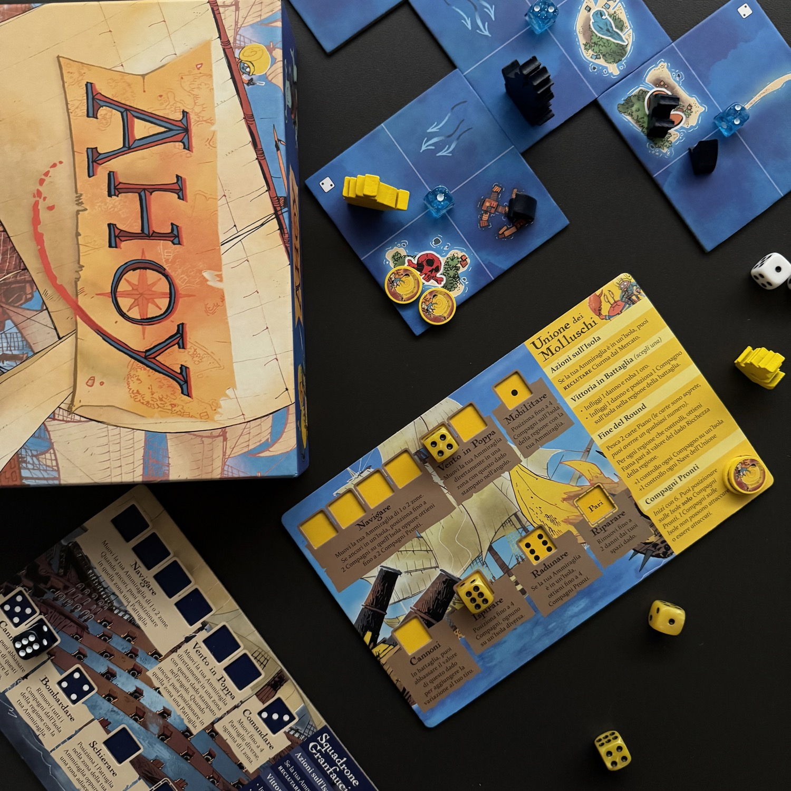
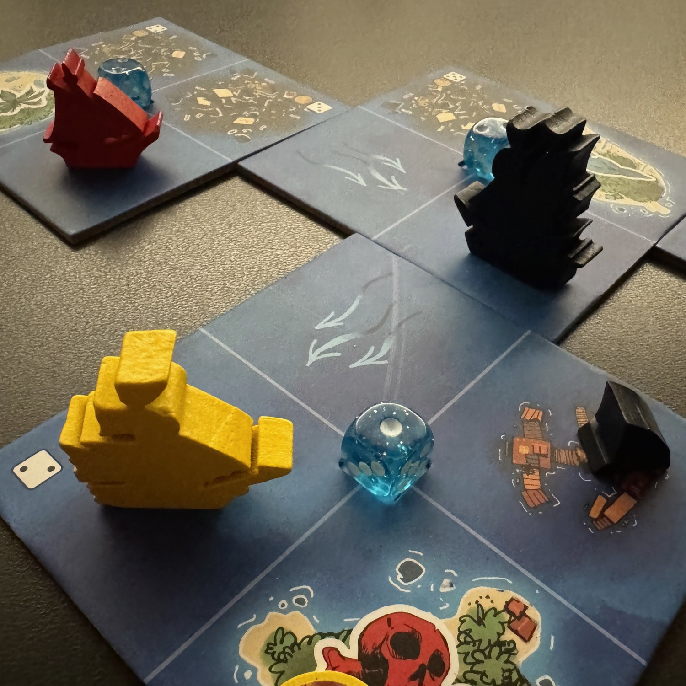
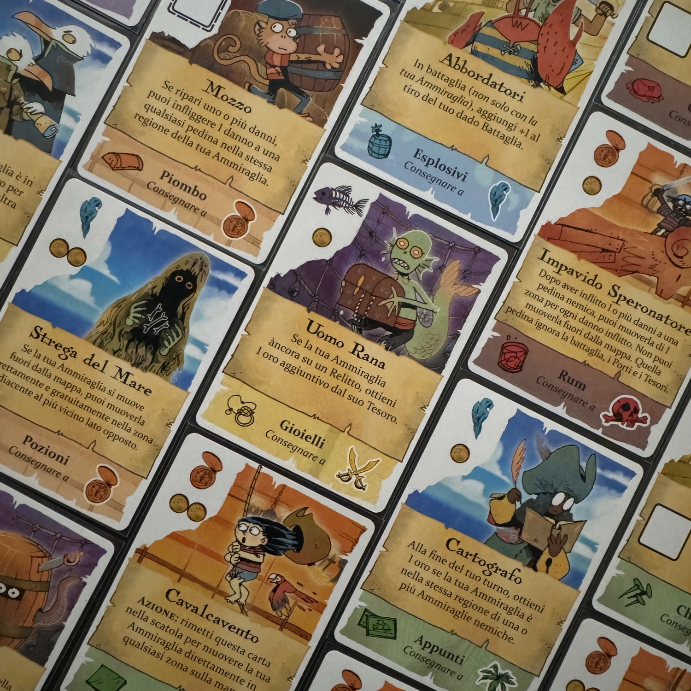

<Setting>

  Siete pronti ragazzi? Sì, signor capitano! 
Non ho capito bene! Sì, signor capitano! 
Imbracciate le armi, issate le vele e con il vento in poppa andate alla conquista dei sette mari!  
Fate quello che volete perché un pirata è libero! 
Ahoy! Voi siete pirati!

</Setting>

<Rules>

 All'inizio di ogni turno, <strong>ogni giocatore tira i dadi della propria fazione</strong>. Successivamente, a turno, i giocatori posizionano <strong>due di quei dadi</strong> negli spazi della loro plancia per eseguire varie azioni: queste includono principalmente il movimento sul tabellone, ma a seconda della fazione possono anche comprendere altre attività, come preparare i cannoni per la battaglia o reclutare l'equipaggio. Ci sono poi alcune azioni aggiuntive che non richiedono l'uso di dadi e possono essere realizzate anche più volte durante un turno. 
In Ahoy sono presenti <strong>4 fazioni</strong>: lo Squadrone Granfauci, l'Unione dei Molluschi e due Contrabbandieri. Mentre le prime due faranno punti a seconda delle proprie <Link to="/mechanisms/maggioranze">maggioranze</Link> nelle varie regioni dell'oceano, le altre giocheranno a un gioco di <Link to="/mechanisms/pick-up-and-deliver">pick up and delivery</Link>. 
All'inizio il tabellone oceano è piccolo (solo due tessere oceano 2×2) ma <strong>verrà allargato</strong> a seconda di come viene esplorato il profondo blu. Esplorare l'oceano serve sia per aprire nuove regioni - dove poi calcolare le varie maggioranze -, sia per trovare le isole tra le quali prendere e consegnare i beni. 
Va da sé che, per <strong>accumulare Fama</strong>, è necessario muoversi, esplorare e posizionare altre tessere oceano. Lo <strong>Squadrone Granfauci cerca di sparpagliare i suoi squali</strong> per costruire roccaforti, mentre <strong>L'Unione dei Molluschi cerca di generare compagni</strong> e di distribuirli sul tabellone, sfruttando la forza delle carte piano a sua disposizione. I <strong>Contrabbandieri</strong>, invece, cercano di <strong>ottenere un carico e di venderlo</strong> per guadagnare fama. Quando i Contrabbandieri consegnano una merce, il valore di ricchezza della regione (ovvero i punti che questa genererà ogni turno) viene incrementato di uno; inoltre, il Contrabbandiere dovrà scommettere su chi avrà la maggioranza della regione dove è stato consegnato quel determinato bene. Alla fine del round, si calcola la maggioranza per ogni regione e si incrementano così i punti per lo Squadrone e per l'Unione, mentre i Contrabbandieri faranno punti a mano a mano che consegneranno le merci.  
Quando uno o più giocatori terminano un round con più di <strong>30 Punti Fama</strong>, si contano i punti extra dei Contrabbandieri per le scommesse che hanno fatto e… chi ha più punti è il vincitore!

</Rules>

<Feedback>

  Ho apprezzato davvero tanto la <strong>semplicità e l'immediatezza</strong> delle due fazioni che giocano sulle maggioranze, super asimmetriche ma comunque <strong>sempre bilanciate</strong> nel corso della partita: l'impressione che avrete è quella di avere una coperta troppo corta e di voler fare molto di più di quanto, in potenza, potete. Quindi, cosa farete? Cercherete di sparpagliare gli squali nella maggior parte delle regioni avendo poca forza offensiva o combatterete per le regioni che vi porteranno più punti?  
Anche l'altra fazione è molto divertente da utilizzare e sarà proprio con questa che farete aumentare la ricchezza delle varie regioni e controllerete la durata della partita.  
<strong>Tutta l'asimmetria, inoltre, viene ancora più rafforzata dalle carte equipaggio</strong> che potrete comprare sulle varie isole, avendo così azioni sempre più forti oppure nuove tattiche da poter mettere sul tavolo. 
<strong>Il dettaglio che ho apprezzato meno, invece, è che queste due fazioni sono identiche</strong> mentre mi sarebbe piaciuto, ovviamente, poter disporre di una quarta fazione, con un quarto set di regole totalmente diverso dalle altre. 
<strong>Ho avuto anche l'occasione di giocare il gioco in 2</strong> e devo dire che mi è piaciuto davvero tanto, forse più che in 4. Con questo numero di giocatori, i due Contrabbandieri non vengono giocati e, ogni turno, alternandosi, gli altri giocatori aumenteranno di uno il valore di ricchezza di una regione. Il resto delle regole è lo stesso ma la partita gira più velocemente e sicuramente con più controllo, offrendo così un gioco molto più astratto rispetto all'altra configurazione.  
In ogni caso, <strong>Ahoy è un titolo che porto sempre con me nelle serate in ludoteca</strong> proprio per l'immediatezza e perché credo sia un proxy perfetto verso titoli ancora più sfidanti.  
Davvero, provatelo, non vi pentirete!  
Forza squali!

</Feedback>

