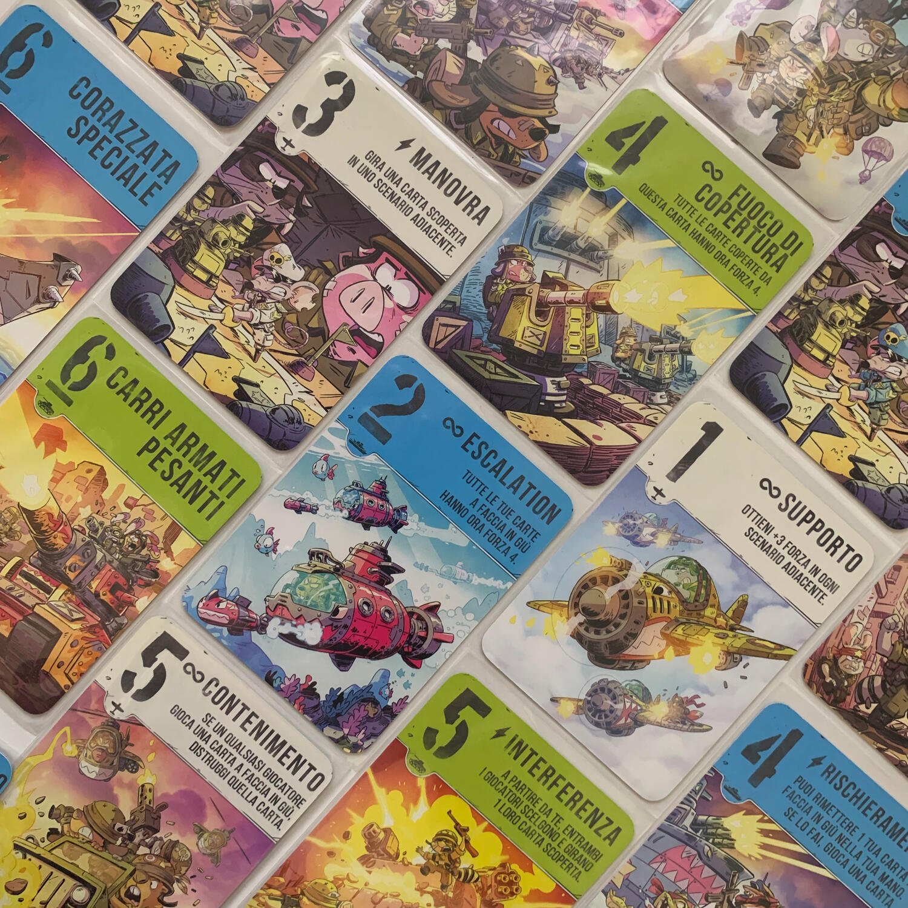
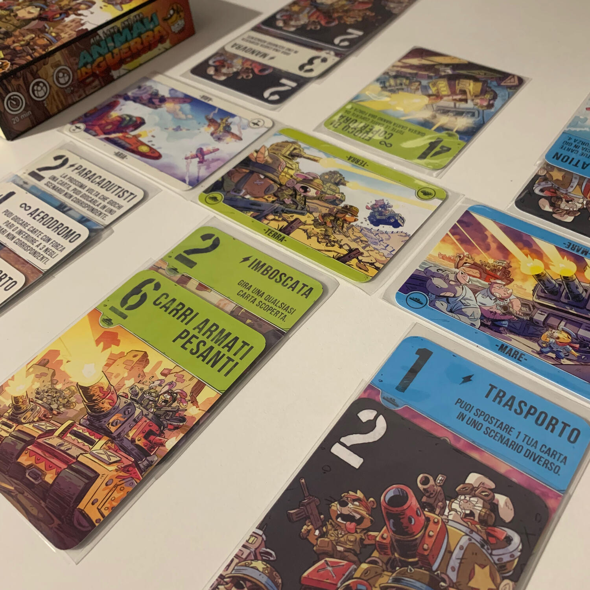
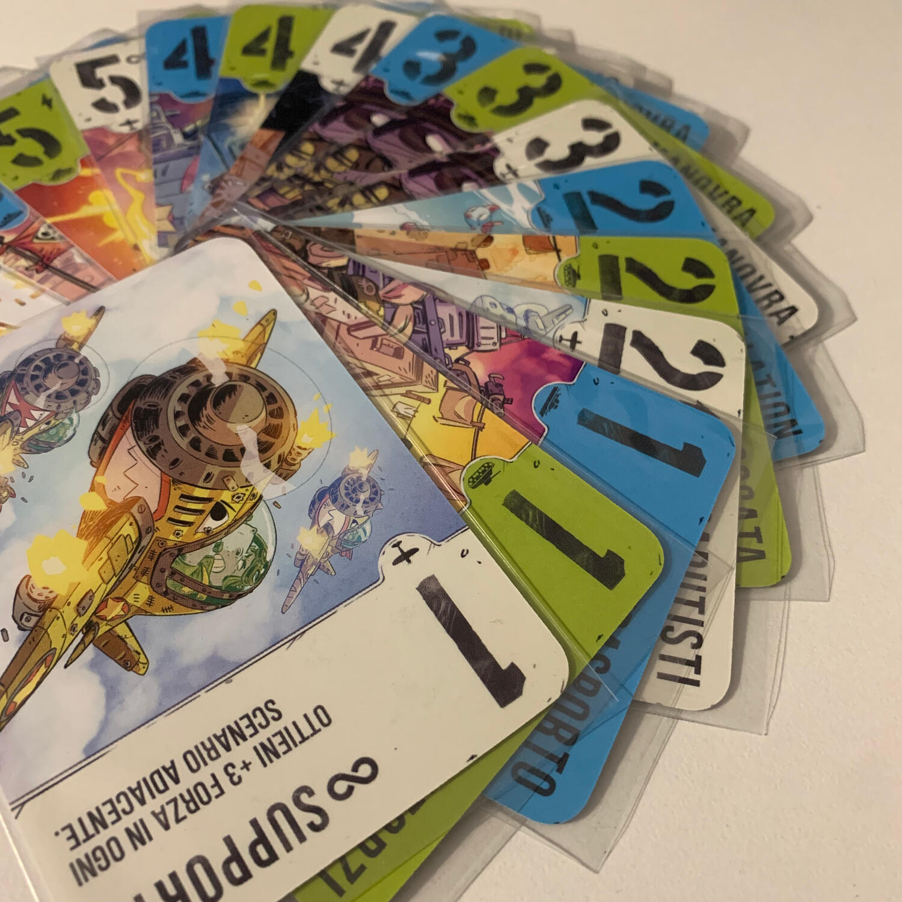

<Setting>

  La guerra infuria!
   
  Radunate le vostre forze e affrontatevi{" "}
  <strong>in aria, a terra e sul mare</strong>! Superate in astuzia e in{" "}
  <strong>strategia</strong> il vostro avversario e rivendicate la vittoria!{" "}
   
  Non sarà facile, ma sarà glorioso!

</Setting>

<Rules>

  A inizio partita si posizionano in ordine casuale le{" "}
  <strong>3 carte scenario</strong> (aria, terra, mare), una a fianco dell'altra
  e, delle <strong>18 carte battaglia</strong>, solamente 12 vengono distribuite
  ai giocatori, <strong>6 per giocatore</strong>. Queste carte, oltre ad avere
  una forza di attacco (1-6) e <strong>un'abilità speciale</strong>, definiscono
  lo scenario in cui possono essere giocate. Inoltre, il retro di tutte le carte
  rappresenta un jolly che permette di giocare la carta, voltata, in qualsiasi
  scenario, sacrificando però ogni abilità e avendo sempre una forza di 2.
   
  Il gioco è molto lineare: ogni turno i giocatori giocano una carta e, non
  appena tutte le carte vengono giocate, la battaglia termina.
   
  Si verifica, per ogni scenario, chi ne ha il <strong>controllo</strong>,
  ovvero chi ha la forza bellica maggiore. Chi{" "}
  <strong>controlla almeno 2 scenari su 3</strong> (non c'è mai parità), vince
  la battaglia e colleziona 6 punti; chi la perde, invece, ne fa 0.
   
  Se durante la partita si capisce che non ha più senso combattere perché la
  fine è scontata, è <strong>possibile arrendersi</strong> e consegnare, così,
  una vittoria a tavolino all'avversario, il quale guadagnerà un ammontare di
  punti in base a quante carte sono già state giocate.
   
  Questa, però, è solo la prima battaglia, perché per vincere la guerra bisogna
  raggiungere i 12 punti. Armiamoci e partite!

</Rules>

<Feedback>

  Air, Land, &amp; Sea: animali in guerra è un <strong>ottimo gioco</strong> da
  tavolo per <strong>2 giocatori</strong>, capace di offrire tutto quello che si
  può cercare in un filler da mezz'ora in una scatolina davvero piccola.
   
  Ho una domanda per voi: leggendo le regole, vi è venuto in mente un gioco di
  simile? vincere 2 territori su 3, poter abbandonare se si va a perdere, avere
  un mazzo piccolo? Hey, ma questo è{" "}
  <Link to="/reviews/marvel-snap/">Marvel Snap</Link> da tavolo! L'applicazione
  ha sicuramente preso ispirazione da questo titolo e ne ha cambiato alcuni
  elementi per renderlo ancora più eccezionale, primo tra tutti il turno
  simultaneo.
   
  Tornando al gioco, come avete potuto leggere,{" "}
  <strong>le regole sono davvero poche</strong> e dal momento in cui si apre la
  scatola, al punto in cui si gioca la prima carta, passano pochi minuti.  
  Tutto questo però non limita il gioco, il quale, nonostante si basi su sole 18
  carte, offre <strong>sfide sempre appaganti</strong> e con il giusto livello di{" "}
  <strong>strategia</strong>. Questo è possibile per 2 motivi: le abilità delle unità
  sono molto varie e possono avere effetti devastanti in uno scontro, portando anche
  a ribaltamenti inaspettati; il secondo fattore è il fatto che si gioca con 12 carte
  delle 18 disponibili, rendendole di facile memorizzazione (ma al contempo non si
  può avere mai la certezza delle carte che avrà in mano l'avversario).
   
  Non mi è mai capitato di pensare di ritirarmi dopo aver visto le 6 carte della
  manche, qualsiasi esse fossero. <strong>    Avere carte con forza bassa non implica assolutamente la disfatta</strong>, ma solamente un modo diverso di giocare. Ma capita di ritirarsi, capita
  eccome, quando si fiuta il bluff dell'avversario e voi non volete cadere nella
  sua trappola e vedere le vostre truppe dilaniate. Quindi, armati di un bel sorriso
  beffardo, calate la mano e gli consegnate meno punti di quelli che pensava già
  di avere in saccoccia. Certo, avete perso la battaglia… ma lui non l'ha vinta come
  pensava di vincerla.  
  Tirando le somme, credo che questo sia un gioco che tutti dovrebbero avere
  nella libreria, o meglio ancora nello zaino: potete tranquillamente giocarlo
  al parco mentre siete in pausa pranzo con i colleghi, mentre aspettate
  l'aperitivo al bar o ancora tra la pizza e l'arrivo dell'amaro.

</Feedback>

