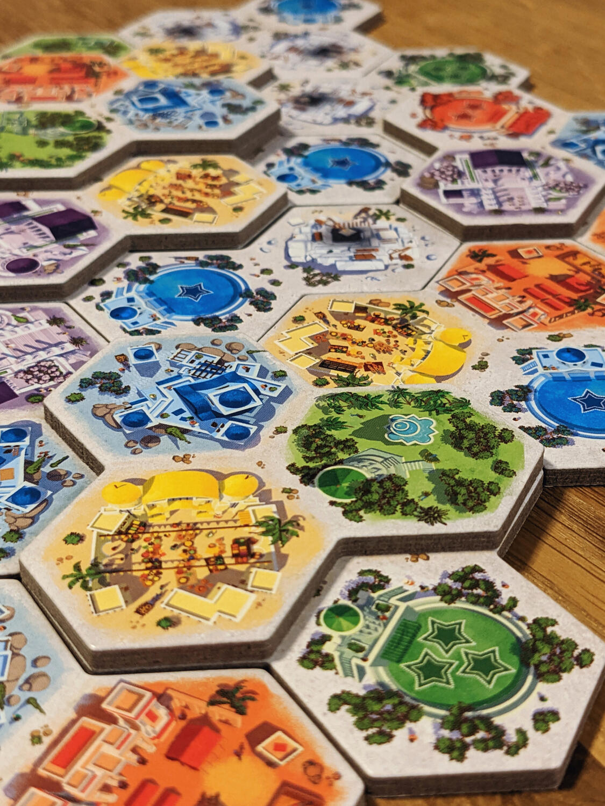
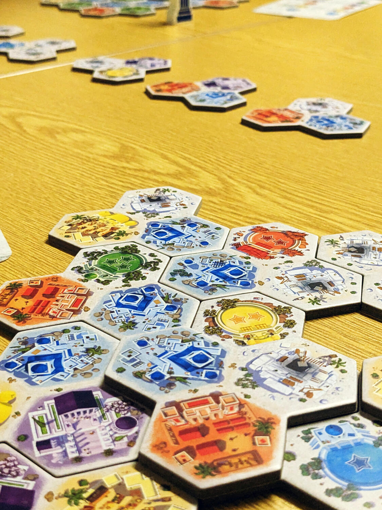
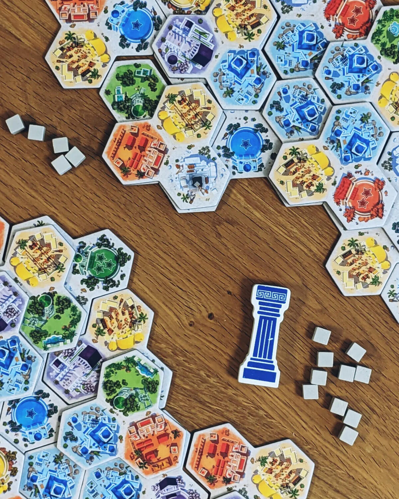

<Setting>

  In Akropolis vestirai i panni di un architetto dell'antica Grecia. Il tuo
  compito sarà quello di costruire un’acropoli su un terreno difficile e pieno
  di colline, che dovrai sfruttare a tuo vantaggio. Ma la città non si sviluppa
  solo in orizzontale, bensìanche in verticale. Dovrai quindi ottimizzare lo
  spazio in tre dimensioni, e piazzare le tue tessere nei punti migliori in modo
  da includere piazze, caserme, mercati, case, templi e giardini. Alla fine, il
  giocatore che avrà costruito la migliore acropoli vincerà la partita e
  guadagnerà il prestigioso titolo di mastro architetto.&nbsp;

</Setting>

<Rules>

  Akropolis è un gioco di piazzamento tessere in cui i pezzi sono una sorta di
  “triangoli” formati da tre esagoni. Su ognuno di questi esagoni sarà
  raffigurato un quartiere colorato, una piazza colorata o una cava bianca.
  Durante il tuo turno sceglierai una delle tessere esposte e la posizionerai
  nella tua città, dove potrai collocarla accanto o addirittura sopra alle altre
  (purché tu riesca in questo modo a coprire almeno due tessere diverse).
   
  La prima tessera che si vede in esposizione è gratuita, le altre hanno un
  costo in pietre crescente: una pietra per la seconda tessera, due per la terza
  e così via. Per ottenere le pietre dovrai coprire le cave con altre tessere:
  una pietra per ogni cava coperta.
   
  Come accennato, piazze e quartieri sono codificati con colori. Ogni quartiere
  colorato ha un diverso tipo di condizione di punteggio: i giardini verdi
  contano sempre, le case blu contano solo se appartengono al gruppo contiguo
  più grande, i mercati gialli contano solo se non sono adiacenti ad altri
  mercati, le caserme rosse contano solo se si trovano ai confini della città e
  i templi viola contano solo se completamente circondati. Ma non è tutto,
  poiché ogni quartiere otterrà un punteggio pari al livello su cui è stato
  costruito: ad esempio, un tempio completamente circondato nel terzo livello
  della tua acropoli vale 3 volte tanto quanto uno costruito nel primo livello!
   
  Per quanto riguarda invece le piazze, queste si riconoscono per la presenza di
  stelle, le quali fungeranno da moltiplicatore per ciascuno dei quartieri
  colorati. Non avere stelle di un determinato colore significa rinunciare ai
  punti di quello stesso colore.
   
  Il gioco termina quando finiscono le tessere. A quel punto, l’acropoli che
  avrà totalizzato la maggior quantità di punti sarà la vincitrice.

</Rules>

<Feedback>

  Akropolis è diventato presto uno dei nostri giochi di piazzamento tessere più
  amati. Le diverse condizioni di punteggio dei quartieri regalano momenti di
  intensa strategia, ed è sicuramente ciò che rende fantastico questo puzzle
  game.
   
  Un set di regole semplici ed eleganti, sommate al gameplay scattante, lo
  rendono un titolo adeguato ad ogni tipo di giocatore e situazione. Inoltre, la
  qualità dei componenti (specialmente le tessere spesse e resistenti) lo rende
  anche piacevole da maneggiare. Ma quello che rende Akropolis veramente
  speciale, è l'elemento di piazzamento tessere in verticale, cosa che lo
  differenzia dagli altri esponenti di questo genere, dandogli un tocco unico ed
  interessante. Se ti piace questa meccanica, vale decisamente la pena dare
  un'occhiata a questa piccola gemma.

</Feedback>

