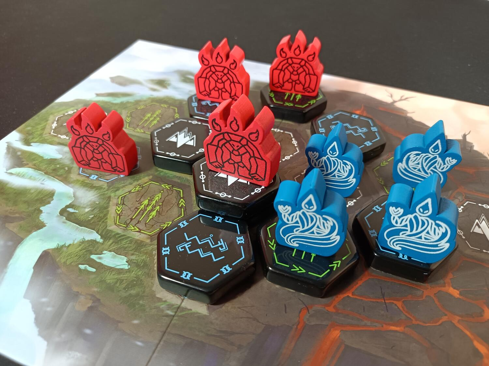
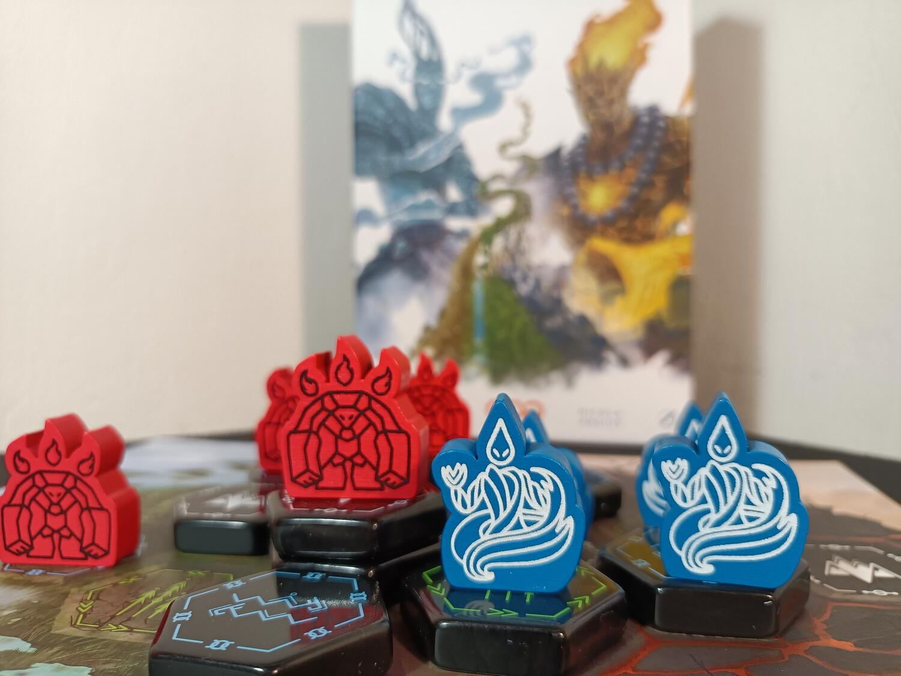
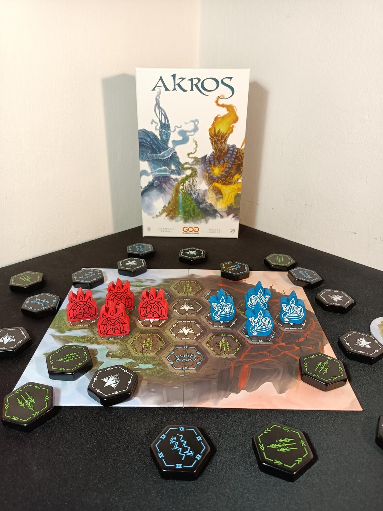

<Setting>

  In principio era il Caos, pigro, informe e mutevole. Insoddisfatto del nulla
  che lo circondava, decise di prendere forma nei cinque elementi, dividendo la
  propria primordiale essenza in frammenti di esistenza autocoscienti. Quattro
  di essi assunsero una forma fisica e tangibile, mentre il quinto, lo Spirito,
  si erse incorporeo al di sopra di essi, etereo, irraggiungibile. Da allora
  Fuoco, Aria, Acqua e Terra si sfidano nella creazione di nuovi mondi tramite
  l’intervento delle loro manifestazioni fisiche più incredibili e stupefacenti.
  Levigano la terra spazzandola con cicloni inarrestabili, rovesciano acqua per
  animare laghi, fiumi e mari e instillano il prezioso seme della vita laddove
  prima c’era soltanto roccia e lava. Ora l’ennesimo duello è iniziato, conteso
  tra la sfuggente progenie di Acqua ed Aria e quella inarrestabile di Fuoco e
  Terra. Ancora una volta un nuovo mondo sta per nascere...

</Setting>

<Rules>

Akros è un gioco scacchistico asimmetrico, nel quale dovremo gestire una delle potenti fazioni degli elementali, i Jinn, elementali dell’aria e dell'acqua rapidi e sfuggevoli, o gli Ifrit, elementali del fuoco e della terra, potenti ma lenti.  
L’obiettivo del gioco è quello di avere la maggioranza di almeno due tipologie dei territori tra Mari, Foreste o Montagne. All’inizio di ogni turno, il giocatore che comanda i Jinn pescherà dal sacchetto tre tessere territorio casuali, ne sceglierà una e passerà le restanti due al giocatore che comanda gli Ifrit, il quale ne terrà una per sé, ponendo l’altra sulla plancia Tempio. Ogni turno, pertanto, sarà il giocatore Jinn a pescare le tessere ma chi agirà per primo sul campo sarà il giocatore Ifrit: solo dopo la sua azione toccherà al giocatore Jinn agire. Nel corso dei turni le tessere non selezionate andranno a riempire il Tempio (di fatto costruendo tre pile da 3 in ciascuno degli spazi dedicati ai turni 7, 8 e 9) e, una volta che il sacchetto sarà vuoto, i giocatori utilizzeranno le tessere messe da parte per gli ultimi turni di gioco. 
A questo punto, gli Ifrit faranno la prima mossa, posizionando una tessera territorio su uno spazio territorio di tipologia corrispondente e, soprattutto, adiacente ad una delle loro pedine, poiché gli Ifrit si muovono di una casella alla volta e in adiacenza. Diversamente, i Jinn potranno posizionare le tessere territorio in qualsiasi punto della mappa, poiché si muovono liberamente da un punto all’altro della plancia. L’unica limitazione che hanno i Jinn è che non possono trovarsi in un territorio “conteso”, cioè adiacente a due o più pedine Ifrit. Ciò significa che se il giocatore Jinn non ha dove collocare una tessera territorio in forza di questa limitazione, questa tessera verrà scartata fuori dal gioco.  
La partita termina al nono turno: a questo punto si conteranno i punti derivanti dai territori sotto ogni pedina delle due squadre e si confronteranno per determinare chi possiede la maggioranza in ciascuna delle tre tipologie di territorio. In caso di pareggio il giocatore Ifrit vince.

</Rules>

<Feedback>

  Akros è un gioco semplice e immediato, poche regole che creano un titolo
  davvero simpatico da intavolare e giocare. Le partite sono veloci, il che
  permette di farne più di una consecutivamente. Pur essendo asimmetrico, il
  bilanciamento delle due parti è ottimo, con un approccio al gioco
  completamente diverso. I componenti sono di ottima fattura e davvero belli da
  vedere al tavolo. Il regolamento è ben scritto, anche se spiega il gioco
  principalmente tramite esempi, piuttosto che attraverso regole dirette, cosa
  che potrebbe dar fastidio ad alcuni lettori. La rigiocabilità è alta, pur
  essendo un gioco semplice e ripetitivo.  
  In conclusione, Akros è un buon titolo per due giocatori, consigliato per coloro
  che cercano un gioco strategico ma allo stesso semplice e veloce da intavolare.

</Feedback>

