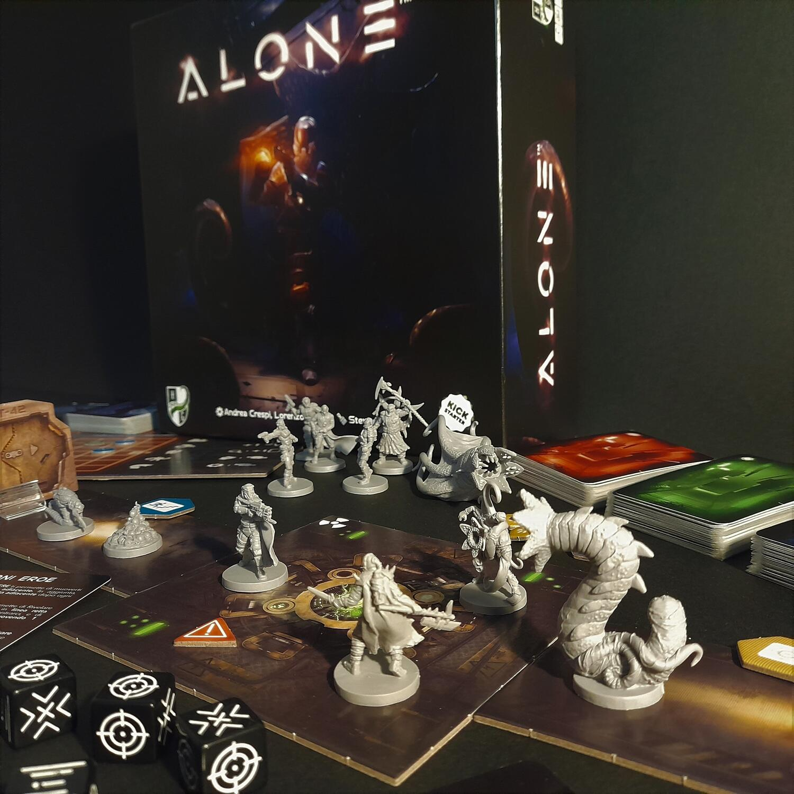

<Setting>

  Ti risvegli solo, l'oscurità rischiarata unicamente dalle scintille
  provenienti dai mal ridotti impianti di una sconosciuta colonia abbandonata e
  dalle poche luci d'emergenza. Ricordi lo schianto della tua astronave, ma non
  hai idea di come tu sia finito lì. Un rumore improvviso, in fondo al
  corridoio, ti distoglie dalle tue riflessioni. No, non era il suono metallico
  di un impianto in avaria… era il movimento di qualcosa, qualcosa di grosso,
  orrendo, mostruoso. Devi riavviare i sistemi, scoprire quale minaccia si cela
  nell'oscurità e tentare di debellarla!

</Setting>

<Rules>

  In Alone un giocatore impersona l'eroe mentre fino ad altri 3 il male. Il
  primo conosce solo le missioni che dovrà risolvere per sopravvivere allo
  scenario e i pochi metri di buio corridoio su cui si trova. Il male, invece,
  dietro al suo schermo, è onnisciente: dispone della mappa completa su cui
  piazza e muove creature, trappole e pericoli d'ogni sorta, e non esiterà ad
  usarli tutti per eliminare l'eroe. Questi dovrà cautamente esplorare la
  stazione abbandonata, centellinando le azioni di ogni turno tra il movimento,
  la ricerca di oggetti utili, il combattimento o la fuga, conscio però che i
  sistemi della sua tuta possono memorizzare solo piccole parti della stazione.
  Ogni 8 turni, infatti (una partita è composta da 24 turni, oltre i quali si
  entra in modalità incubo), la mappa scoperta verrà eliminata, salvo alcune
  porzioni presso l'eroe, e questi potrà contare solo sulla sua memoria per
  orientarsi all'interno della struttura. Come se non bastasse, ogni angolo può
  nascondere un pericolo mortale. Ad ogni azione dell'eroe i giocatori del male
  possono rispondere con una reazione, che può essere generica (muovere o
  piazzare nemici) o specifica, in base alle carte in mano ai giocatori. Queste
  carte provengono da 2 di 4 mazzi reazione, ognuno con caratteristiche diverse
  (furia, velocità, trappole e terrore).
   
  Se l'eroe riesce a risolvere la missione finale è il vincitore della partita,
  ma se dovesse perire nell'intento sarà invece il male a trionfare.

</Rules>

<Feedback>

  Alone non è un gioco semplice, per nessuna delle due parti: da un lato,
  soprattutto durante le prime partite, è davvero difficile per l'eroe
  orientarsi nella stazione, capire qual è la strada più corta per risolvere una
  missione, da dove provengono i nemici o semplicemente dove ci si trova sulla
  mappa. La gestione del tempo inoltre è importantissima: le mosse sono davvero
  da centellinare, e arrivare alla modalità incubo, dopo i 24 turni di gioco,
  significa morte quasi certa. Dall'altro lato la situazione non è semplice
  nemmeno per i giocatori del male: i movimenti e la generazione dei mostri,
  come anche la disposizione dei pericoli, va fatta oculatamente e in relazione
  alle mosse future dell'eroe. Perché se è vero che un verme gigante potrebbe
  rappresentare un ostacolo quasi insormontabile per il malcapitato astronauta,
  è anche vero che se generato nel corridoio sbagliato potrebbe non avere mai
  occasione di incontrarlo.
   
  Dopo la prima partita, però, la voglia di rigiocare è tanta, incrementata
  dalla variabilità delle situazioni che si possono incontrare. Difficilmente
  una partita sarà simile ad un'altra e c'è anche una modalità campagna tutta da
  approfondire. Miniature, illustrazioni e materiali di qualità rendono poi
  sempre piacevole maneggiare il gioco.
   
  Poco riuscita, forse, la versione in 3 e 4 giocatori, Alone si presta,
  infatti, ad un ottimo 1vs1. Bisogna anche tenere conto di una certa dose di
  fortuna (pesca di carte, tiri di dado), e di un regolamento non proprio esile,
  sebbene poi, durante la partita, il tutto giri in modo lineare. Se questo non
  vi disturba, in un paio d'ore di gioco verrete trasportati in un'ambientazione
  tra Alien e Dead Space, condita con i classici elementi horror e
  fantascientifici. Un gioco atipico, ma sicuramente da provare e avere in
  collezione.

</Feedback>

