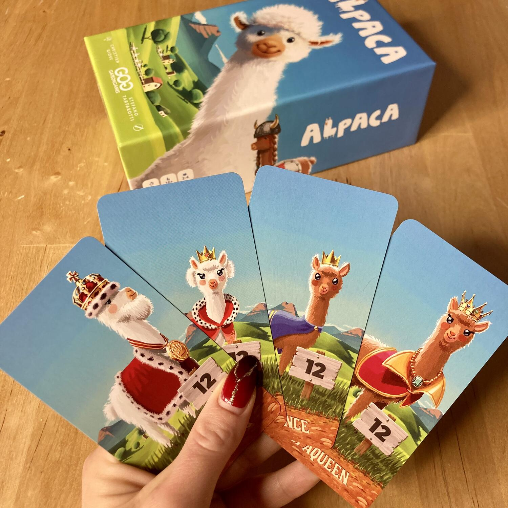
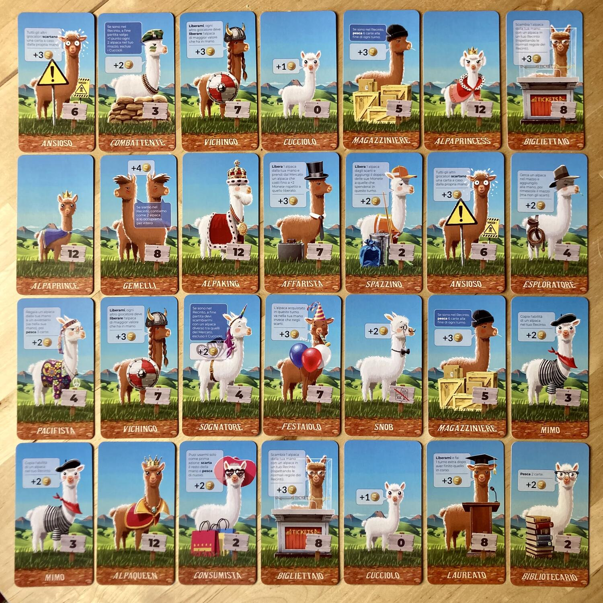

<Setting>

  Immagina di trovarti tra le colline verdi e fiorite, con il viso delicatamente
  accarezzato da una leggera brezza, nell’aria il profumo d’erba appena
  tagliata… e poco più in là, giusto a qualche decina di metri da te, tanti
  animaletti coccolosi e morbidelli che pascolano tranquilli; alcuni ti guardano
  dall’alto in basso con uno sguardo giudicante e snob, altri sono così simili
  da sembrare gemelli, altri ancora sono vivaci e attaccabrighe, sembrano dei
  veri combattenti! E poi ci sono i cuccioli, candidi come il cotone, che
  curiosi ti vengono incontro!
   
  Ti avvicini e ti soffermi ad osservare quei buffi musetti: guardandoli ti
  viene quasi voglia di aprire un allevamento di… alpaca!

</Setting>

<Rules>

  La preparazione è davvero semplice:
   
  <ol>
    <li>      Ogni giocatore riceve un mazzo iniziale composto da{" "}
      <strong>4 carte Recinto</strong> in costruzione e{" "}
      <strong>6 carte Cucciolo</strong>. Lo mescola, lo mette a faccia in giù
      vicino a sé e poi pesca 5 carte, che userà come mano iniziale.</li>
    <li>Al centro del tavolo mettete a faccia in su:</li>
    <ul>
      <li>Il mazzetto degli Alpaca Nobili</li>
      <li>Il mazzetto degli Alpaca Snob</li>
      <li>6 mazzetti di alpaca marroni</li>
      <li>4 mazzetti di alpaca bianchi</li>
    </ul>
  </ol>
  NB: Ogni mazzetto è composto da 4 carte uguali.
   
  I mazzetti alpaca da inserire si possono scegliere casualmente oppure decidere
  a piacimento, a patto di mantenere sempre la quantità di alpaca marroni e bianchi.
  Gli Snob e la Famiglia Reale, invece, devono sempre essere presenti. Le tessere
  Recinto vanno tenute in una riserva generale alla portata di tutti.  
  <strong>    Chi ha accarezzato un alpaca più di recente è il primo giocatore</strong>{" "}
  e ottiene la pucciosa miniatura!
   
  Ogni giocatore, nel suo turno, può svolgere queste tre azioni nell’ordine che
  preferisce:
  <ul>
    <li>      <strong>        Giocare uno o più alpaca dalla propria mano per attivarne l’abilità</strong>
      . Le abilità attivabili in questo modo sono quelle ATTIVE ovvero quelle nel
      fumetto bianco; se il fumetto è blu l’abilità è PASSIVA e si attiverà SOLO
      quando l’alpaca sarà messo nel recinto.</li>
    <li>      <strong>Acquistare un alpaca dal Mercato</strong> (1 per turno) giocando
      uno o più alpaca dalla propria mano fino a raggiungere il valore
      richiesto. L'alpaca acquistato viene immediatamente messo negli scarti
      (NB: se un alpaca viene giocato per la sua abilità non potrà essere
      sfruttato per le sue monete e viceversa!)</li>
    <li>      <strong>Mettere un alpaca nell'Allevamento</strong> (1 per turno). Si può
      giocare un alpaca dalla mano e porlo dietro a un Recinto che abbia spazio
      libero. Ogni recinto può ospitare due alpaca (salvo indicato diversamente
      dalle carte) e se non si hanno spazi disponibili, bisognerà costruirne uno
      nuovo rimuovendo dal gioco una carta Recinto in costruzione dalla propria
      mano.</li>
  </ul>
  Quando non si può o non si vuole più svolgere alcuna azione, occorre scartare
  tutte le carte ancora in mano, più quelle giocate, e pescarne 5 nuove dal
  proprio mazzo.
   
  Per finire, quando un giocatore avrà riempito 4 recinti il gioco terminerà e
  si potrà procedere al conteggio dei punti indicati dal valore di ogni alpaca:
  chi avrà più punti sarà dichiarato vincitore!

</Rules>

<Feedback>

  Sicuramente la peculiarità del gioco è l’estetica tenera e pucciosa data dalle
  bellissime illustrazioni di Stefano Tartarotti; è davvero difficile resistere
  a quel musetto morbidoso in copertina!!
   
  Anche le dinamiche dei turni però non sono male! Solo il meccanismo di scarto
  e ripristino della mano a fine turno ci ha lasciato un po’ perplessi.
   
  Addentrandoci più in profondità nella meccanica del deck building, ho
  riscontrato un leggero sbilanciamento tra la strategia che determina la scelta
  degli alpaca dal mercato e la fortuna per la quale questi riescono ad arrivare
  nella mano di gioco con combinazioni utili.
   
  Il gioco comunque scorre bene, bastano davvero pochi round per interiorizzare
  le regole e iniziare a pensare alla strategia migliore. Non ha una difficoltà
  elevata ma, come per tutti i titoli che necessitano di una qual certa
  pianificazione a lungo termine, più si gioca e più sarà semplice giocare.
   
  L’interazione è minima: principalmente si punta a rubarsi gli alpaca migliori
  dal mercato e, grazie ad alcune abilità, è possibile far scartare carte agli
  avversari, abilità molto interessante quando si gioca in 3 o 4!
   
  In conclusione, posso dire che il gioco è promosso e che può essere un ottimo
  alleato per introdurre dei neofiti al deck building o per passare una serata
  ludica poco impegnativa, ma sempre con stile!

</Feedback>

