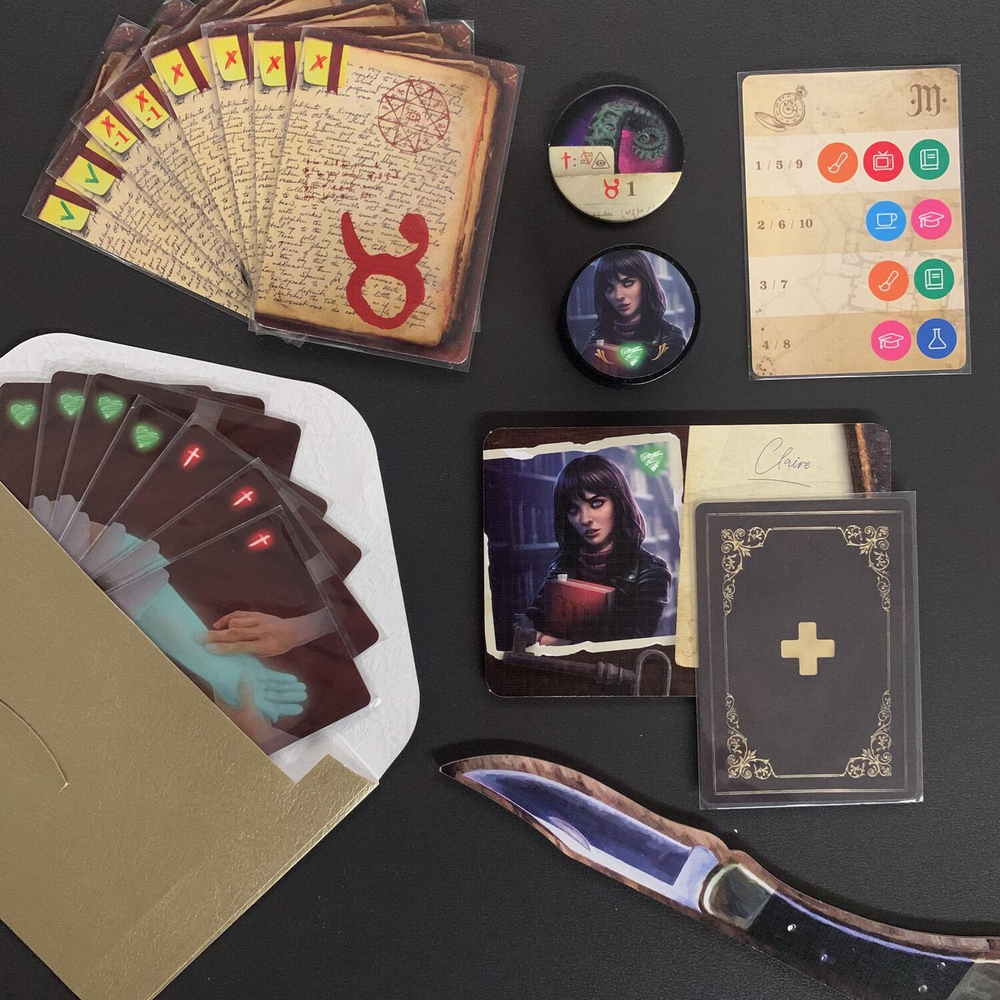
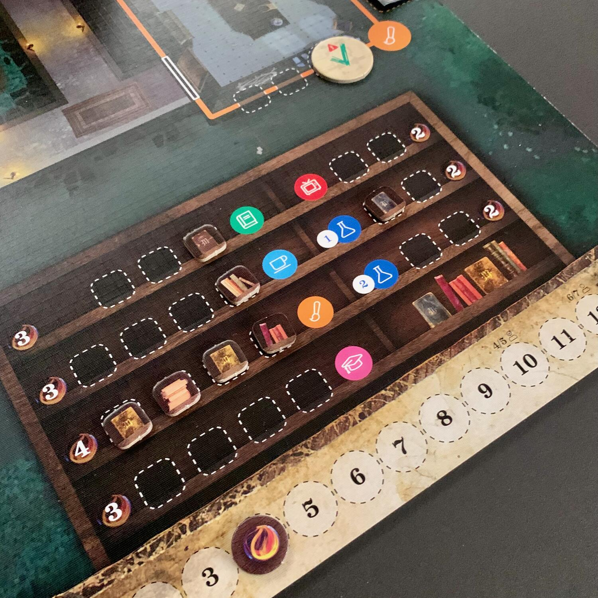

<Setting>

  Avete presente <strong>Among Us</strong>? Quel gioco dove ci sono quei
  personaggi-pollici colorati con la visiera in vetro che vanno in giro per
  astronavi aliene ad ammazzarsi cercando di far cadere la colpa sugli altri?
   
  Avete presente giochi come <strong>The resistance: Avalon</strong> o{" "}
  <strong>Secret Hitler</strong>, che fanno della discussione il loro forte?
   
  Avete presente <strong>Lovecraft</strong>, <strong>Cthulhu</strong> e tutti
  gli altri antichi?  
  Prendete questi 3 elementi e mescolateli assieme.
   
  Ecco a voi Among Cultists!

</Setting>

<Rules>

  <strong>In una partita a 6 giocatori, ci saranno 5 investigatori e un cultista.</strong>
   
  Gli investigatori vincono entro il decimo round se raggiungono 12 Punti
  Vittoria o se riescono a eliminare il cultista tramite una votazione; il
  cultista, invece, vince se 4 investigatori crepano oppure se questi non
  riescono a completare il loro obiettivo.
   
  <strong>A inizio partita vengono distribuiti i 6 ruoli con i relativi mazzi di carte</strong>
  . Il mazzo conterrà 3 tipologie di carte: le carte <strong>    vivo / morto</strong>, le carte <strong>successo / fallimento / sabotaggio</strong> e la carta{" "}
  <strong>itinerario</strong>. Mentre il mazzo degli investigatori conterrà solamente
  carte vivo e carte successo, quello del cultista sarà misto.
   
  <strong>Si chiudono gli occhi e si segue un rituale</strong> che permetterà al
  cultista di sapere chi sono gli investigatori "nati morti": infatti, ogni giocatore
  riceve la prima carta del proprio mazzo energia che definisce se si è vivi o morti
  a inizio partita. In una partita a 6, il cultista è sempre vivo ma uno o due investigatori
  saranno deceduti… solo che questi non lo sanno ancora.  
  Il gioco è diviso in round e ogni round ha 4 fasi:{" "}
  <strong>movimento, evento, azione e pulizia</strong>.  
  Nella fase di <strong>movimento</strong>, uno alla volta, <strong>i giocatori si sposteranno sulla plancia</strong> da un luogo a un altro, seguendo quanto dettato dalla <strong>carta itinerario</strong>, che "obbligherà" gli investigatori a seguire un determinato percorso
  e lo "consiglierà" al cultista… il quale potrà decidere di non seguirlo e bluffare
  a piacere, rischiando di farsi beccare. <strong>Ogni volta che si incontrerà qualcuno sul proprio percorso, ci si scambierà una carta vivo / morto, ponendola nel "mazzo energia" dell'altro giocatore</strong>
  . Va da sè che solamente il cultista potrà consegnare una carta "morto" a un
  investigatore, ma non viceversa, in quanto quest'ultimo non ha quella carta
  nel suo mazzo. E se si incontrano 3 giocatori contemporaneamente? Dipende se
  c'è luce! Al buio tutti si passeranno una carta in cerchio; con la luce, si
  saluteranno cordialmente.
   
  Una volta che tutti i giocatori si sono spostati, verrà pescato un{" "}
  <strong>evento</strong>, che farà succedere qualcosa: portali verso l'orrore
  cosmico verranno aperti, appariranno passaggi segreti tra stanze, salterà la
  luce e molto, molto altro.  
  Nella fase <strong>azione</strong> si esegue un'azione o di stanza o di personaggio.
  Quella di stanza sarà possibile per gli investigatori che sono situati in una delle
  stanze permesse dalla propria carta itinerario. Ricordiamoci che uno dei modi che
  hanno per vincere gli investigatori è quello di fare 12 punti: per ottenerli <strong>dovranno raccogliere set di libri dalle varie stanze</strong>.  
  Le azioni, principalmente, ruotano attorno o ai libri o al controllo dello
  stato del team. Sarà quindi possibile <strong>raccogliere i libri</strong>{" "}
  girando delle carte posizionate in precedenza dagli stessi giocatori nella
  stanza, che indicano se la ricerca è andata a buon fine oppure no (insomma
  capiremo se il cultista è passato di là). Altrimenti si potrà{" "}
  <strong>controllare lo stato di un altro giocatore</strong> nella nostra
  stessa stanza. In questo caso si guarderanno, dopo averle mescolate, le carte
  del mazzo energia e, se si troverà una carta "morto", sapremo che
  l'investigatore ha fatto una brutta fine.{" "}
  <strong>L'investigatore dovrà sempre dire la verità, mentre il cultista potrà bluffare!</strong>
   
  Se c'è stato un omicidio, si farà una votazione per amazzare un membro del
  team. Se in questo modo si becca il cultista… gli investigatori hanno vinto!{" "}
   
  Si termina con la fase di <strong>pulizia</strong>, nella quale, se abbastanza
  investigatori sono morti, il cultista può palesarsi e dichiarare di aver completato
  il proprio obiettivo. Altrimenti il round termina e si comincia nuovamente dalla
  fase di movimento, passando il pugnale primo giocatore in senso orario.

</Rules>

<Feedback>

  Probabilmente, se siete qui è perché state tenendo d'occhio anche voi{" "}<a href="https://boardgamegeek.com/geekpreview/63/spiel-23-preview?sort=hot" target="_blank">i giochi più attesi dello Spiel</a>{" "}
  e siete curiosi di capire com’è 'sto <strong>Among Us da tavolo.</strong>
   
  Sono un giocatore di The Resistance: Avalon da anni e puntualmente mi faccio
  una partita con gli amici per provare il brivido del bluff, oppure per
  fregarli creando in loro falsi ricordi di "comportamenti sospetti" mai
  esistiti.{" "}
  <strong>    Quando è arrivato Among Cultists, l'ho provato, ma dopo ogni partita mi sono
    puntualmente ritrovato a chiedermi se avrei preferito giocare ad Avalon.</strong>{" "}
  E non sono un tipo nostalgico, assolutamente. Certo, sono due giochi distanti
  tra loro, hanno due pesi diversi, due durate diverse… ma sempre di Social
  Deduction si parla.  
  Among Cultists prende la sensazione che si ha giocando ad Avalon e cerca di incastrarla
  in Among Us, mettendo il tutto in un gioco da tavolo. Per farlo, però, ha bisogno
  di <strong>molte sovrastrutture</strong>, tante azioni diverse, movimenti, eventi,
  un <strong>setup davvero lento </strong>(attorno ai 20 minuti) e infinite interazioni
  difficili da tenere a mente che portano a raccogliere prove man mano che si gioca.{" "}
   
  Ma il punto rimane solo uno: è bello? vale la spesa? gira bene?  
  <strong>È carino. È un mezzo diverso e più articolato del solito per discutere su chi sta perculando chi.</strong> Non vi direi di comprarlo alla cieca, senza averlo mai provato, ma se
  trovare un tavolo in associazione, dategli una chance: potrebbe essere il vostro
  gioco! Ha un flow abbastanza articolato ma che si padroneggia tranquillamente dopo
  una partita di prova da 20 minuti.  
  <strong>Tutte le partite che ho fatto mi hanno divertito e rilassato, con quella punta di ansietta che si prova quando si è un cultista e non si sa bene più da che parte girarsi per non farsi beccare.</strong>
   
  Qui, come in Avalon, ci sono <strong>molti ruoli</strong>, tra cui il classico
  Veggente, ovvero un investigatore che conosce il cultista ma che, se viene
  scoperto da questo e additato a fine partita, fa vincere il male.  
  Una cosa di cui si sente tanto la mancanza è una <strong>    tabellina riassuntiva</strong> del turno che, vi assicuro, alla prima partita è essenziale.
   
  Per concludere, <strong>Among Cultists è un progetto che ha del potenziale</strong>. Credo che se il regolamento perdesse quelle 5-6 pagine e il flusso di
  gioco fosse semplificato un po', per <strong>portare l'attenzione più sulla discussione che sulle azioni o i dettagli di poco conto</strong>, potrebbe essere davvero il gioco capace di scalzare Avalon.
   
  Provatelo e fatemi sapere se sto davvero diventando un nostalgico!

</Feedback>

