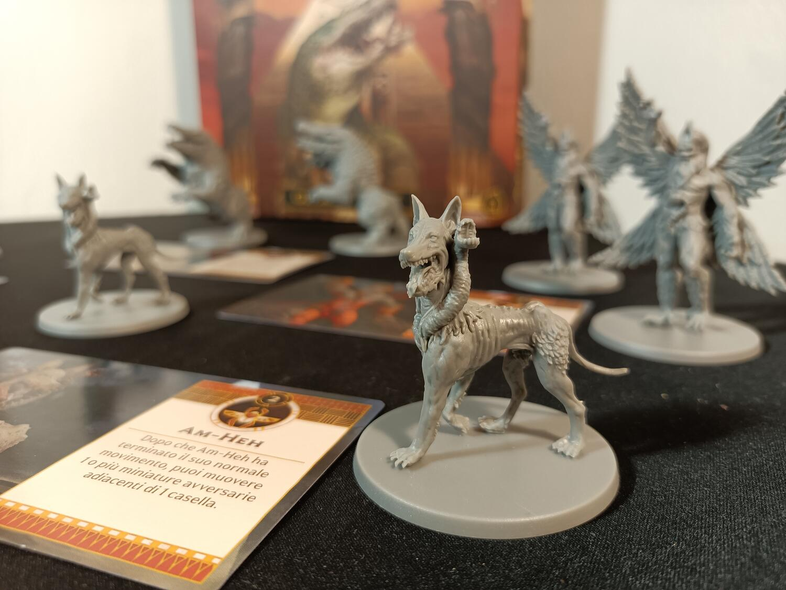
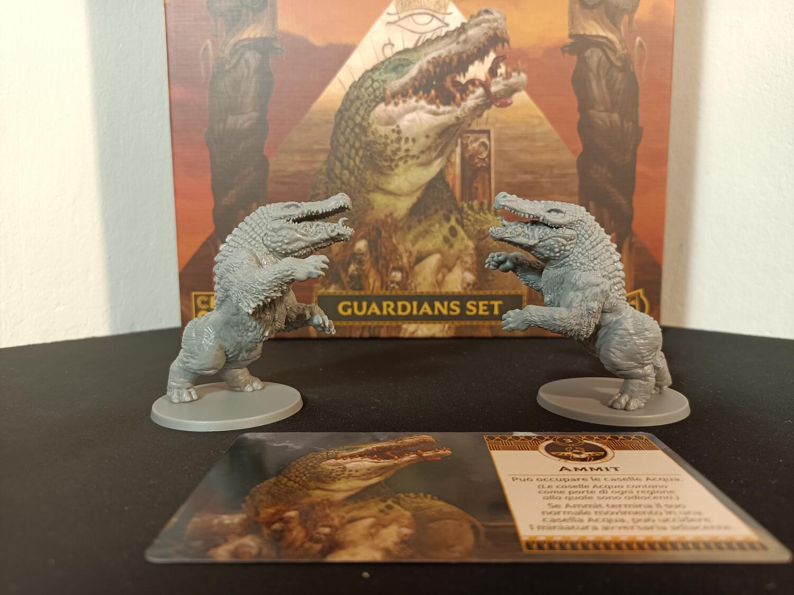

<OriginalReviewLink slug="ankh" />

<Panoramic>

  Nuovi e potenti Guardiani al servizio degli Dei si sono schierati, pronti per
  la guerra. Controlla i loro poteri e gestisci al meglio le tue risorse per
  diventare l’unica divinità dell’antico Egitto.  
  Questa espansione di Ankh aggiunge ben 5 nuovi Guardiani da poter sostituire ai
  Guardiani del gioco base: una di primo livello, due di livello due e tre di livello
  tre. Potrete sfruttare gli immensi poteri di Ammit, la quale potrà spostarsi sia
  sulla terra che sulle caselle acqua, mangiando e uccidendo gli avversi che si sentono
  abbastanza coraggiosi da avvicinarsi alle rive del Nilo. Arruolate Pazuzu e posizionatelo
  vicino a due monumenti per guadagnare forza nei combattimenti. O richiamate il
  leggendario Shesmu che annichilirà completamente i Guardiani avversari.

</Panoramic>

<Feedback>

  Il Guardian Set di Ankh arriva con ben 11 bellissime miniature Guardiano. Come
  sempre, la qualità di queste ultime sono sempre spettacolari, come ci ha
  abituati la CMON. Purtroppo, questa espansione è probabilmente la più magra
  tra le tre uscite. La spesa non vale il misero contenuto che propone. La
  consiglio solo ai giocatori che hanno già consumato per bene il gioco base ed
  eventuali altre espansioni, e che ricercano un’ulteriore varietà e
  rigiocabilità. I nuovi Guardiani risultano comunque molto divertenti da
  giocare, aggiungendo delle nuove possibili strategie e dinamiche al tavolo.
   
  In conclusione, il Guardian Set è un’espansione da prendere come ultima
  aggiunta, o solo nell’eventualità in cui si ricerchi una maggiore varietà da
  partita a partita.

</Feedback>

