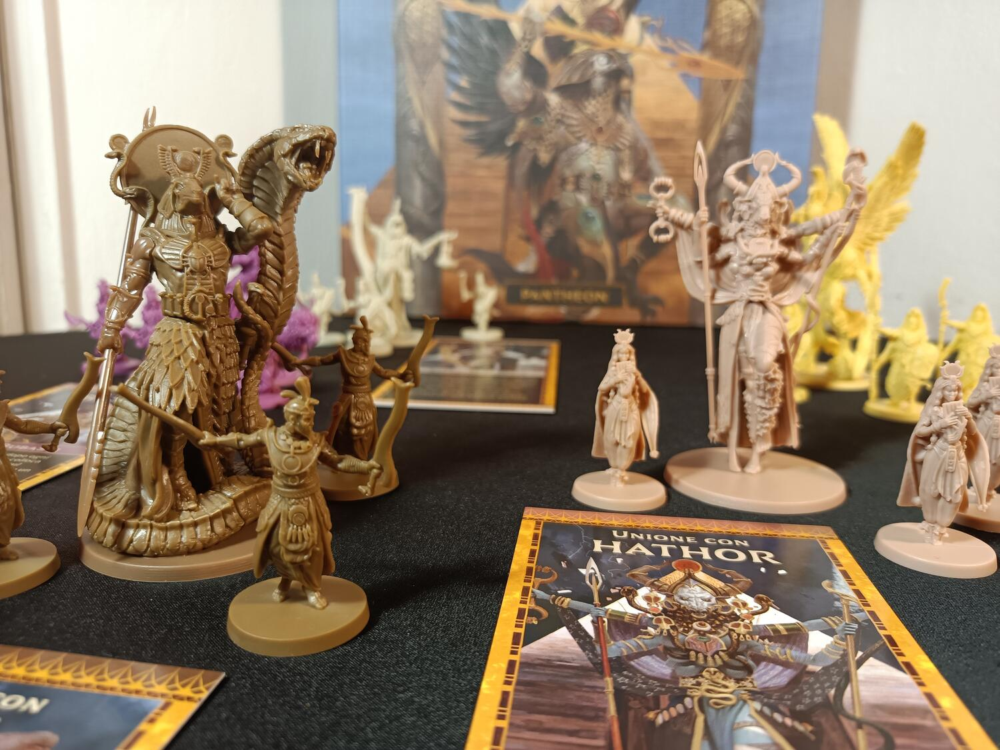
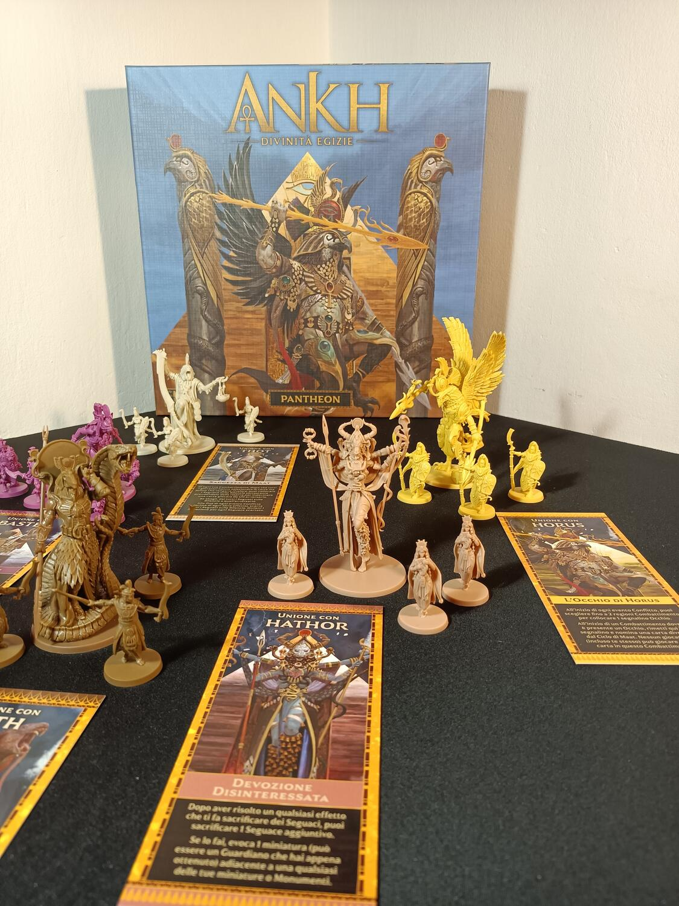

<OriginalReviewLink slug="ankh" />

<Panoramic>

  Nuove divinità si sono unite alla guerra. Sarai tu a vestire i panni di una di
  esse e a guidare l’Egitto negli anni a venire. Bastet, Hator, Thot, Horus e
  Seth sono le nuove potentissime e complesse divinità che potrete gestire in
  questa espansione. Sfrutta i poteri di Seth per portare dalla tua parte gli
  eserciti avversari, o usa l’occhio di Horus per prevedere le sorti delle
  battaglie. Riuscirai a gestire la saggezza di Thot per indovinare i piani
  degli avversari e potenziarti a dismisura? Oppure preferirai la devozione
  disinteressata dell’immenso Hator per espanderti senza limiti nelle regioni
  dell’Egitto?

</Panoramic>

<Feedback>

  L’espansione Pantheon porta nuova linfa vitale al famoso e acclamato gioco
  Ankh. 35 nuove magnifiche miniature, tra cui ben 5 maestose miniature divinità
  sono contenute in questa esplosiva scatola.  
  Questa espansione non aggiunge nuove meccaniche al gioco base, ma semplicemente
  longevità e rigiocabilità. Superate un certo numero di partite, infatti, sentirete
  il bisogno di avere un ventaglio più ampio di scelte, e probabilmente questa espansione
  è quella che fa per voi. Le integrazioni contenute porteranno nuove dinamiche al
  tavolo creando nuove strategie e situazioni ad ogni partita. I poteri delle nuove
  divinità sono davvero belli e divertenti da giocare, ma per nulla facili da gestire
  o sfruttare al meglio. Poteri come quelli di Bastet o Thot necessitano di una discreta
  esperienza del gioco per essere apprezzati. Al contrario l’esplosività di Seth
  e Hator vi lasceranno senza parole.  
  Per concludere, consiglio questa espansione a tutti i giocatori che hanno già
  intavolato un po’ di volte Ankh e che ricercano un ventaglio più ampio di
  scelte ad inizio partita, come a quelli che cercano un livello leggermente più
  alto di complessità al tavolo, senza però l’appesantimento di nuove regole.

</Feedback>

