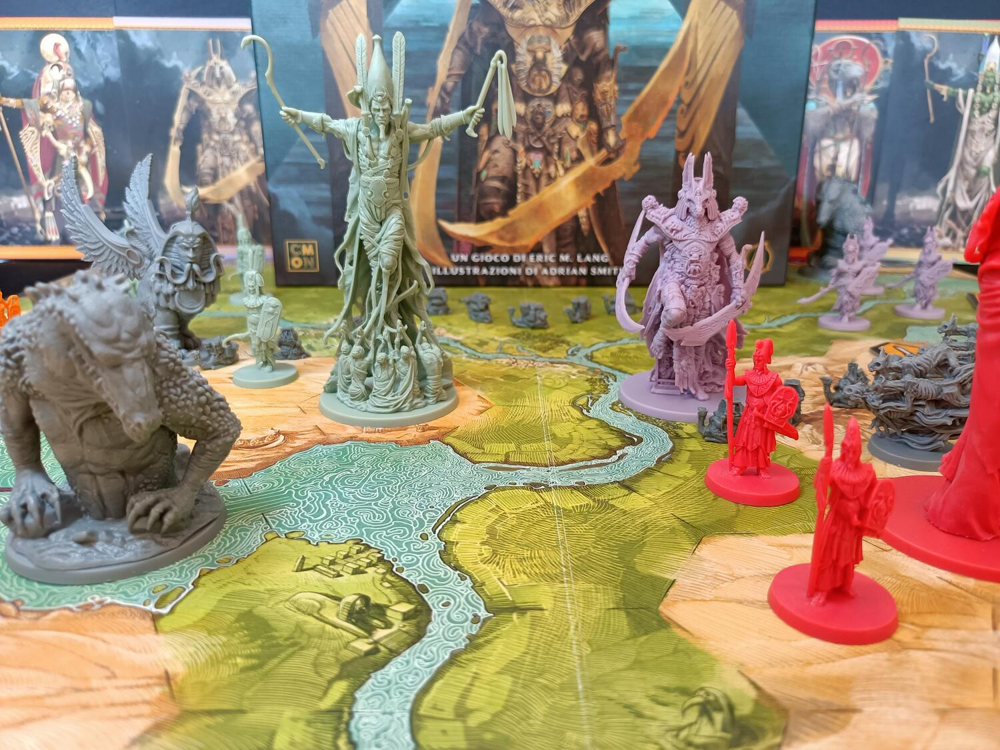
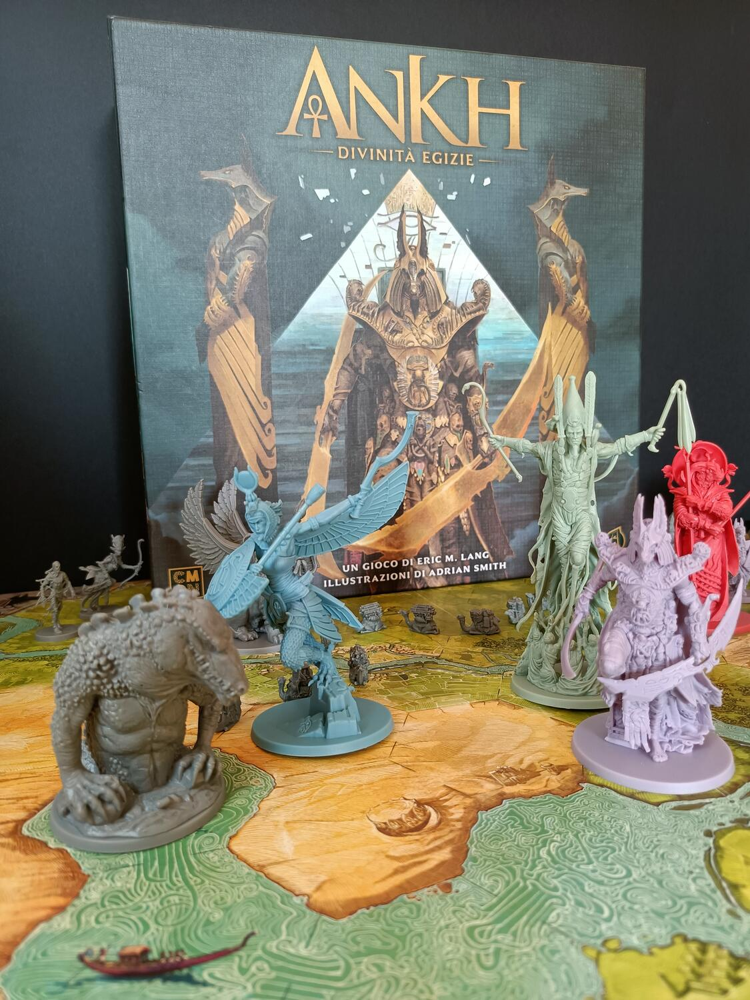
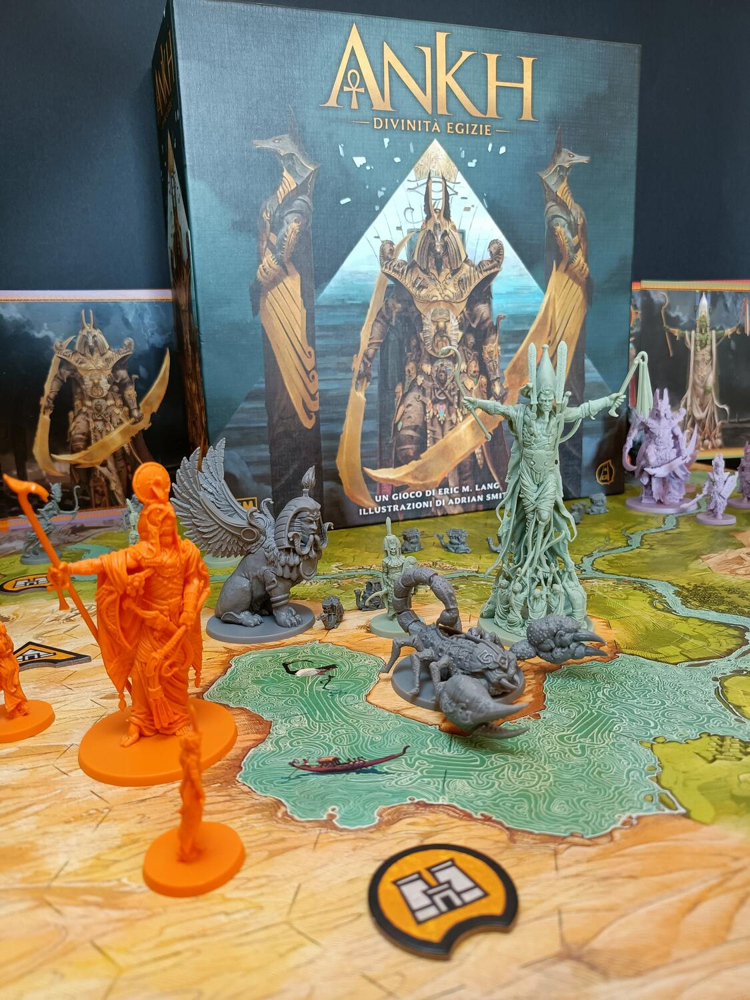

<Setting>

  In tempi antichi, lungo il grandioso Nilo, le genti crescevano forti, nutrite dalle sue ricche acque e alimentate
  dalle sue benedizioni. Mentre il popolo fioriva, così facevano le sue divinità. Le persone costruivano monumenti,
  compivano sacrifici e veneravano le loro divinità. In cambio, le divinità concedevano loro conoscenza, strumenti e
  ricchezze. Ma alcune divinità erano migliori di altre. Quelle che ricevevano costante devozione crescevano potenti,
  gloriose e influenti. Potevano allungare una mano e cambiare il mondo per solo capriccio. Coloro i cui nomi non
  graziavano più le labbra della gente, vedevano invece le loro forme alterare, i loro passi vacillare e i loro poteri
  diminuire. Il cambiamento era arrivato nella terra del Nilo. E con il cambiamento venne anche la guerra. Le divinità
  non erano mai state creature fraterne tra loro e in quel momento, vedendo la loro stessa esistenza minacciata, avevano
  radunato le loro forze, schierando i propri devoti e mettendoli in marcia verso la guerra. Alla fine, quando la sabbia
  si sarà posata, il sangue sarà divenuto asciutto e i venti si saranno trasformati in brezze leggere, solo una divinità
  emergerà trionfante in questa nuova era di monoteismo. Chi sarà?

</Setting>

<Rules>

  In Ankh dovrete vestire i panni di una delle potenti divinità dell’antico Egitto e combattere battaglie campali sul
  delta del Nilo. Solo uno di voi diverrà l’unica divinità. Dopo aver scelto lo scenario da giocare in base al numero di
  giocatori e alla difficoltà dovrete posizionare l’esercito e il Dio sulla mappa. L’Egitto già ad inizio partita sarà
  diviso in varie regioni, circoscritte non solo dal fiume Nilo ma anche da eventuali carovane di cammelli. È importante
  ricordare che le unità che si trovano in due regioni separate, anche se i loro esagoni si toccano, non sono adiacenti
  tra di loro, e che in ogni regione si affronteranno battaglie distinte seguendo un ordine numerico. Durante il loro
  turno i giocatori dovranno effettuare una o due azioni tra quelle elencate: Muovere le unità: si può muovere una
  qualsiasi miniatura di massimo 3 spazi, oltrepassando il fiume e i confini, ovviamente tenendo conto che due unità non
  possono stare nello stesso esagono. Evocare una miniatura: potrete giocare una vostra miniatura adiacente ad una già
  presente sul campo di battaglia o ad un monumento in vostro possesso. Ottenere seguaci: otterrete un seguace per ogni
  monumento (vostro o neutrale) con almeno una vostra miniatura adiacente. Sbloccare un potere Ankh: pagando un numero
  predefinito di seguaci in base al livello, potrete non solo sbloccare un potere Ankh per tutta la partita, ma
  eventualmente anche ottenere un Guardiano da aggiungere alle vostre schiere. Durante il proprio turno il giocatore
  dovrà effettuare un’azione e eventualmente, se non ha attivato un evento portando il segnalino in fondo al tracciato,
  un’altra ad una linea inferiore rispetto alla prima. Nel caso in cui il giocatore inneschi un evento, dovrà prima
  effettuare la sua azione e poi risolverlo. Gli eventi possono essere di tre diversi tipi: Controllare un monumento: il
  giocatore può prendere il controllo di un monumento neutrale se ha almeno una sua miniatura adiacente ad esso.
  Carovana di cammelli: il giocatore potrà dividere una regione in due nuove regioni, decidendo anche l’ordine di
  risoluzione delle battaglie. Conflitto. Durante il conflitto i giocatori si sfideranno nelle varie regioni con i loro
  eserciti, contando la loro forza, tenendo conto che ogni miniatura ha 1 di forza, a meno di eventuali bonus, e che le
  divinità non possono mai morire, e usando le carte a loro disposizione. In ordine di numerazione, i giocatori presenti
  in ogni regione potranno ottenere punti Devozione tramite la maggioranza dei vari monumenti e le eventuali vittorie.
  La partita terminerà se un giocatore riesce ad arrivare in fondo al tracciato dei punti Devozione, o al termine
  dell’ultimo conflitto. In quel caso il giocatore con più punti vince la partita, diventando la nuova e unica divinità
  dell’antico Egitto.

</Rules>

<Feedback>

  Sebbene abbia sempre odiato l’ambientazione dell’antico Egitto, Ankh è divenuto uno dei miei giochi preferiti, se non
  il mio preferito. Questo titolo nasce come somma delle esperienze che Eric M. Lang ha accumulato nel corso degli anni,
  grazie ai suoi titoli precedenti, Blood Rage e <Link to="/reviews/rising-sun/">Rising Sun</Link>, riuscendo a portare
  sui nostri tavoli tutto ciò che volevamo e aspettavamo. Partendo dai componenti non posso dire altro che: magnifici.
  La CMON è sempre stata sublime nella realizzazione di miniature, ma in questo caso si è davvero superata: tante e di
  ottima fattura, ricche di dettagli, in particolare le divinità, che torreggiano sulla mappa durante tutta la partita.
  Forse le plance avrebbero potuto essere di materiale migliore, ma non è comunque un fattore così limitante. Uno degli
  aspetti che più mi ha sorpreso di Ankh è stata la scalabilità. Risulta essere un ottimo gioco per tutte le quantità di
  giocatori, persino in due, fattore per nulla scontato, principalmente mettendolo in relazione con i predecessori, che
  in alcune configurazioni erano davvero ingiocabili. Oltre questo, la presenza di vari scenari, che cambiano le regole
  e stravolgono il gioco in maniera spesso molto positiva, aumentano di molto la rigiocabilità del titolo. Un aspetto
  che non si smette mai di apprezzare di Ankh è il perfetto bilanciamento delle fazioni e la completa assenza del
  fattore fortuna durante tutto il gioco. Gli esiti della partita saranno sempre nelle vostre mani, sia quando vincerete
  che perderete. Questo aspetto mi ha fatto apprezzare ancora di più questo titolo rispetto a Blood rage e Rising Sun,
  poiché, principalmente nel primo titolo, il fattore fortuna si sentiva parecchio, e secondo me, in giochi come questi
  può risultare davvero fastidioso. Un altro punto degno di attenzione è la durata.Se paragonata a quella di Rising Sun,
  che poteva addirittura eccedere le tre ore di gioco, quella di Ankh risulta decisamente più agevole, aggirandosi sui
  90 minuti secchi, o addirittura qualcosa in meno nel caso di pochi giocatori. In conclusione, Ankh è un gioco fatto e
  finito, senza sbavature o difetti. A parte l’ambientazione, che potrebbe non piacere, questo titolo è una gioia per
  gli occhi come per la mente: una perfetta armonia di tattica e strategia, che non viene interrotta da maldestri colpi
  di fortuna, e perfettamente rilegata da semplici e facili regole.

</Feedback>

