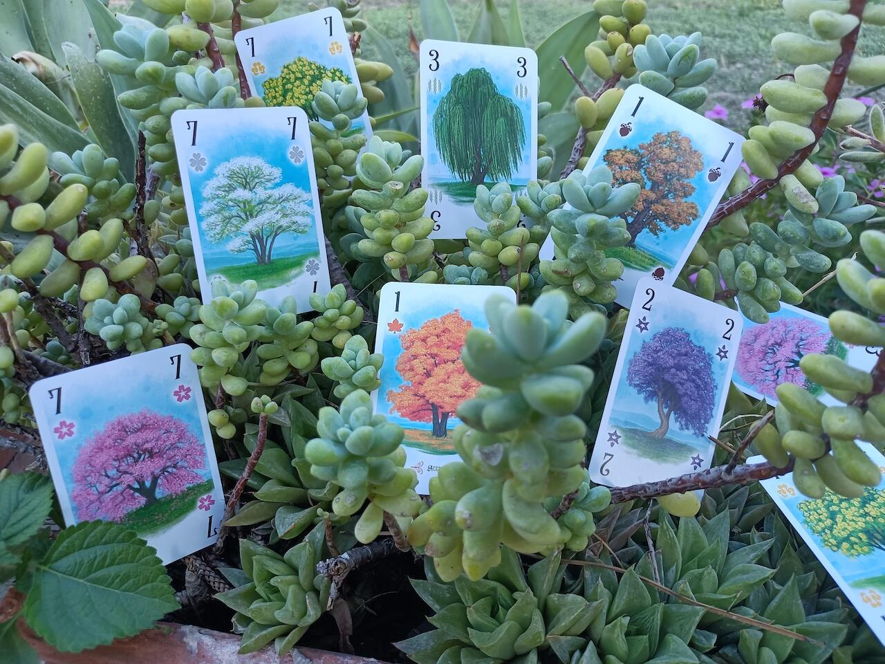

<Setting>

  La natura è fantastica, stupenda e geometrica. La bellezza di un viale
  alberato è data non solo dai suoi colori e dalla maestosità degli alberi, ma
  principalmente dall’ordine delle piante, dalla loro disposizione
  nell’arboreto. In questo gioco ogni giocatore compete per diventare il
  direttore più esperto, gestendo non solo quali alberi piantare, ma anche quali
  tenere da parte per aggiudicarsi la fama universale tra gli amanti della
  natura.

</Setting>

<Rules>

  In Arboretum ogni giocatore parte con 7 carte in mano. A turno, dovrà pescarne
  due, o dal mazzo di pesca o dalla pila degli scarti di uno dei giocatori;
  dovrà poi posizionare una carta nel suo viale, disponendola ortogonalmente ad
  una carta già presente; infine, dovrà scartare una carta nella propria pila
  degli scarti. La partita terminerà quando il mazzo di pesca sarà terminato.{" "}
   
  Il vero fulcro e la vera complessità del gioco risiedono nel punteggio di fine
  partita: infatti, una volta terminato il mazzo, per ogni singola tipologia di pianta
  (le quali presentano ognuna 8 carte numerate da 1 ad 8) ogni giocatore dovrà rivelare
  le carte tenute in mano e chi avrà la somma più alta riceverà i punti per il relativo
  arboreto. In questo conteggio, inoltre, bisognerà tenere conto del fatto che se
  un giocatore possiede l’1 di una tipologia di pianta, l’8 di quella medesima tipologia
  nella mano di un avversario varrà 0.  
  Il vincitore di una tipologia di pianta potrà contare i punti del proprio
  viale se possiede alberi di quel tipo. Un viale è una sequenza di carte
  adiacenti ortogonalmente, di valore crescente, in cui la prima e l’ultima
  carta sono della stessa specie. Ogni carta del percorso deve avere un valore
  maggiore delle precedenti, ma i valori non devono essere per forza
  consecutivi. Inoltre, le carte in mezzo, possono essere anche di altre specie.
  Ogni arboreto conferirà poi punti in questo modo:
  <ul>
    <li>1 punto per ogni carta del viale</li>
    <li>      1 punto extra per ogni carta del viale se questo è almeno di 4 carte e
      sono tutte della stessa specie</li>
    <li>1 punto extra se il percorso inizia con un 1</li>
    <li>2 punti extra se il percorso finisce con un 8</li>
  </ul>
  Questo passaggio si farà per ogni specie di albero. Il giocatore con più punti
  vittoria sarà dichiarato il vincitore.

</Rules>

<Feedback>

  Arboretum è un gioco che affascina sin da subito; non solo per i suoi colori e
  per la sua grafica, ma principalmente per la sua semplicità. Le regole sono
  veloci e immediate, ma che racchiudono un mondo di strategia. La possibilità
  di poter ostacolare gli avversari con le carte conservate in mano e la
  gestione di una mano di carte molto limitata vi faranno spesso riflettere ed
  ammirare questo gioco. La profondità strategica non sta solo nella gestione
  delle carte in mano, ma anche nella disposizione spaziale delle varie specie e
  dei viali che di volta in volta creerete. La componente di alea sarà comunque
  presente, ma grazie a ciò, vi permetterà di gestire situazioni sempre diverse,
  aumentando notevolmente la rigiocabilità del titolo. La scalabilità è ben
  bilanciata, poiché con meno giocatori saranno rimosse alcune specie dal mazzo.
  Questo ultimo fattore, inoltre, permette di limitare il tempo di gioco sempre
  sui venti minuti circa. A mio avviso, Arboretum non ha difetti: un perfetto
  filler da intavolare sempre e dovunque, da provare almeno una volta e che
  sicuramente vi affascinerà fin dalla prima partita. Promosso a pieni voti!

</Feedback>

