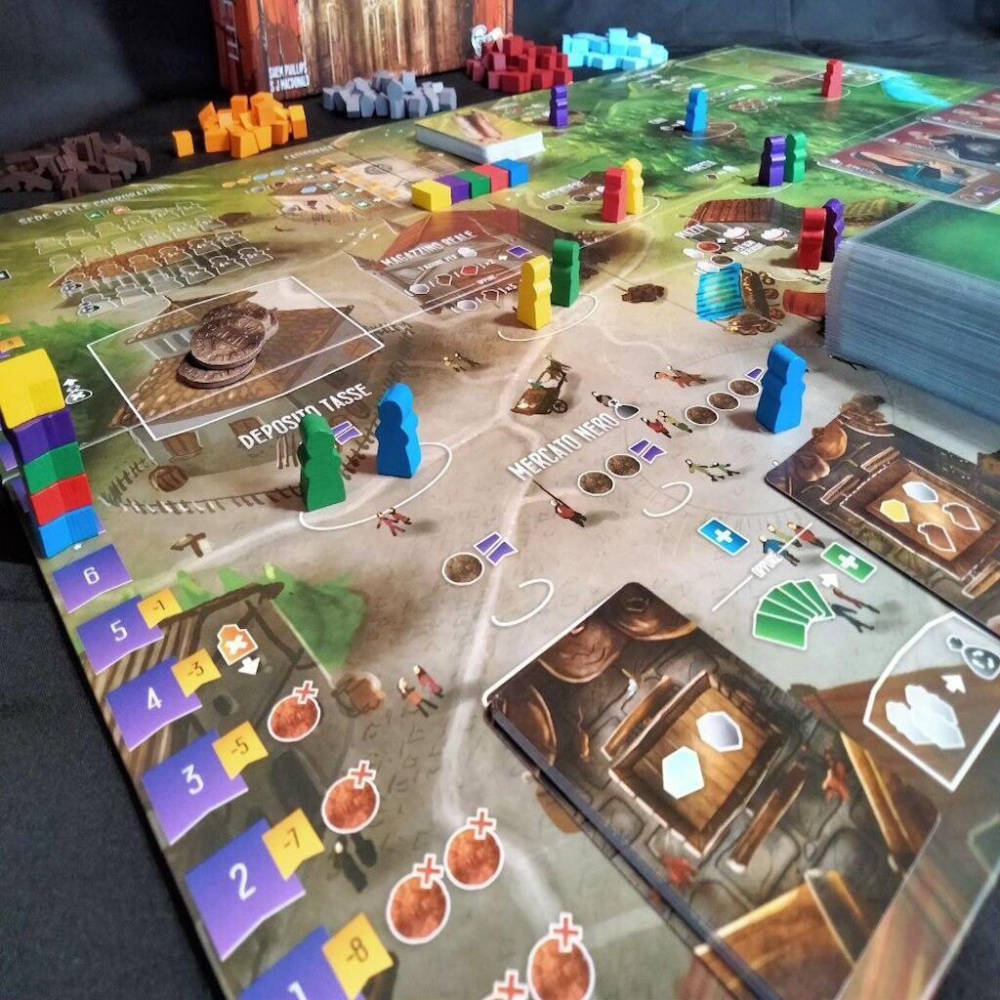

<Setting>

850 d.C., Regno Carolingio. Il Re è in cerca di abili costruttori che possano rifondare il regno in un nuovo territorio. Saranno i giocatori, nelle vesti di Architetti, a sfidarsi per ottenere il favore del Re, raccogliendo materie prime, reclutando apprendisti, costruendo nuovi edifici e partecipando alla costruzione della Cattedrale per mantenere il proprio status nobiliare. Durante i turni di gioco, verranno affrontate scelte di carattere morale che saranno giudicate a fine partita: su qualche operazione illecita si potrebbe chiudere un occhio, ma attenzione a non calcare troppo la mano o si verrà puniti. È tempo di congiure e tradimenti, gli Architetti rivali saranno disposti a tutto per ostacolare i tuoi progetti. Vincerai mantenendo intatta la tua Reputazione o sceglierai di stringere alleanze con ladri e furfanti?

</Setting>

<Rules>

Il turno di gioco consiste nel prendere uno dei propri lavoratori e posizionarlo in uno spazio del tabellone per svolgere l'azione indicata.
Per comodità, raggruppiamo i luoghi in cui si possono collocare i lavoratori in tre categorie: luoghi accessibili a un grande numero di lavoratori (Corpo di Guardia, Deposito Tasse, Magazzino Reale, Piazza), luoghi esclusivi a cui può accedere un solo lavoratore (Mercato Nero) e spazi dai quali i lavoratori non potranno più fare ritorno (Sede delle Corporazioni - l’azione che vi permetterà di costruire e fare punti).
A seconda del luogo nel quale si decide di piazzare il proprio meeple, si ottengono effetti differenti:

<ul>
  <li>    La <strong>Cava</strong>, la <strong>Foresta</strong>, la{" "}
    <strong>Miniera</strong> e l’<strong>Argentiere</strong> permettono di
    ottenere risorse: quando un giocatore colloca un Lavoratore in uno di questi
    luoghi, guadagna un numero di risorse pari al numero dei propri Lavoratori
    presenti. I restanti luoghi (Corpo di Guardia, Deposito Tasse, Magazzino
    Reale e Piazza) consentono di fare azioni speciali, come scambiare risorse;
    ingaggiare Apprendisti; ottenere nuovi progetti di Edifici; rubare dalle
    tasse del Regno; arrestare lavoratori (anche i propri, se necessario) e
    visitare la prigione per consegnare o liberare prigionieri.</li>
  <li>    Il <strong>Mercato Nero</strong> è uno speciale luogo nel quale è possibile
    ottenere un gran numero di risorse in breve tempo. Attenzione, però, perché
    in precisi momenti della partita, è possibile innescare la{" "}
    <em>Pulizia del Mercato Nero</em>, cioè il trasferimento in prigione di
    tutti i lavoratori presenti e l’ottenimento di un Debito. In sintesi, è un
    luogo che fornisce numerose risorse a un costo elevato sulla lunga durata.</li>
  <li>    La <strong>Sede delle Corporazioni</strong> è il luogo in cui i giocatori
    collocano i Lavoratori per costruire edifici o la Cattedrale. In entrambi i
    casi, è previsto il pagamento di risorse per fronteggiare i costi di
    costruzione, in cambio di punti a fine partita e piccole ricompense
    immediate.</li>
</ul>
La partita termina quando viene occupato un certo numero di spazi lavoratore nella
Sede delle Corporazioni.

</Rules>

<Feedback>

Architetti del Regno Occidentale è un piazzamento lavoratori (come <Link to="/reviews/everdell/">Everdell</Link>) con una particolarità: nel corso della partita non è prevista una fase in cui si recuperano i propri lavoratori, ma un’azione sul tabellone permette di recuperare alcuni dei propri meeple e imprigionare quelli degli altri. Questo crea un’interazione diretta tra i giocatori che, durante la partita, si scambieranno più e più volte il “favore” di imprigionare l’uno i lavoratori dell’altro, per limitare le azioni degli avversari.
Altro elemento che aggiunge tensione al tavolo è la Pulizia del mercato nero, una fase che penalizza il giocatore con il maggior numero di Lavoratori in prigione. Vedrete che prima di questa fase ci sarà un gran via vai di arresti e scarcerazioni. 
Architetti del Regno Occidentale è, quindi, un <Link to="/mechanisms/piazzamento-lavoratori/">Piazzamento lavoratori</Link> con quel qualcosa in più che rende sorprendente e imprevedibile ogni partita. Di per sé il gioco base ha un’elevata rigiocabilità, ma nel caso in cui le partite iniziassero a sembrarvi troppo simili tra loro, è possibile rinnovare il gioco grazie alle due espansioni: L’Era degli Artigiani e L’Epoca delle Meraviglie.
Per gli amanti del solitario, l’ultima espansione introduce sei diversi avversari e un nuovo mazzo che migliora le scelte e le mosse dell’automa rispetto alla variante per giocatore singolo nel gioco base.

</Feedback>

