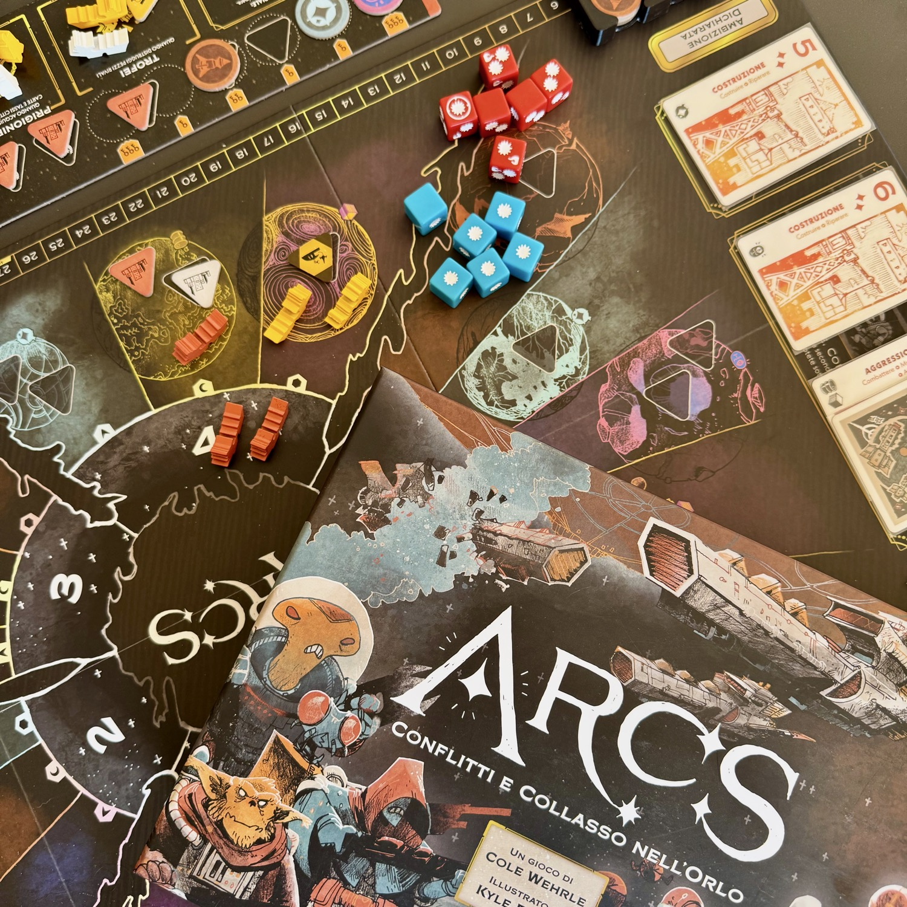
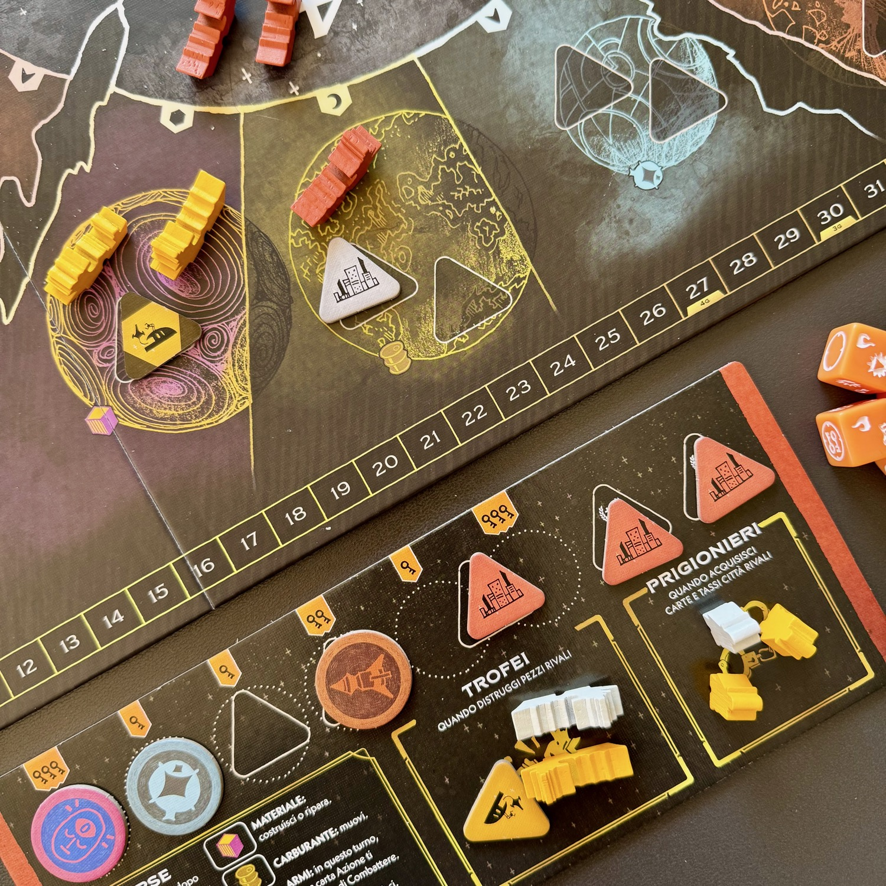
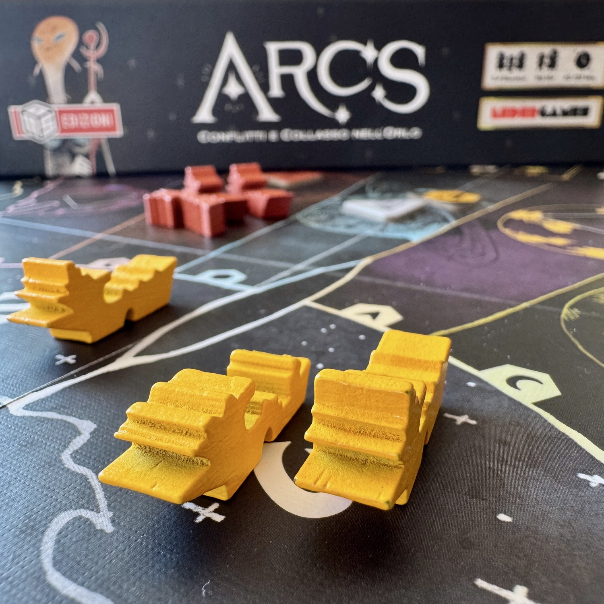

<Setting>

Un tempo, <strong>l’Orlo</strong> era un luogo di progresso e speranza. Le sue stelle brillavano come promesse di un futuro radioso, e le grandi casate guidavano il destino della galassia con saggezza e ambizione. Ma qualcosa è andato storto. I nostri antenati hanno tradito i propri ideali, lasciandoci solo rovine, disillusione e frammenti di ciò che era stato. L’impero è crollato, e con esso l’equilibrio fragile che teneva uniti mondi lontani.

Ora, in un’era di incertezza, le fazioni superstiti si preparano a scrivere un nuovo capitolo. Saremo capaci di imparare dal passato? Oppure siamo condannati a ripetere gli stessi errori, in un ciclo eterno di ambizione e rovina?

</Setting>

<Rules>

Arcs si sviluppa in una serie di Capitoli, ognuno scandito da una sequenza di turni.

Il vero cuore del gioco sono le carte, per cui entriamo subito nel dettaglio di come sono composte: ciascuna presenta un <strong>seme</strong> (Costruzione, Mobilitazione, Amministrazione o Aggressione) che definisce quali azioni si potranno svolgere giocandola; mostra un certo numero di <strong>rombi</strong>, che indicano quante volte quell’azione potrà essere eseguita; riporta un <strong>valore</strong> numerico, utile esclusivamente per determinare se una carta può superarne un’altra; e infine include un simbolo Ambizione, che permette al giocatore con l’Iniziativa di dichiarare una delle modalità con cui si assegneranno i punti in quel Capitolo.

All’inizio di ogni turno, il giocatore con l’<strong>Iniziativa</strong>, deve <strong>Guidare, </strong>ovvero giocare una carta scegliendo il "seme" ed eseguire le azioni elencate sulla carta stessa un numero di volte pari alla quantità di rombi presenti.&nbsp;

Gli altri giocatori, in ordine, devono reagire scegliendo una fra tre possibilità:
<ol><li>
possono <strong>Superare</strong>, giocando una carta a faccia in su dello stesso seme della carta Guida ma con valore maggiore: in questo modo si svolgono azioni fino al numero di punti azione indicati sulla propria carta e, potenzialmente, conquistano l’Iniziativa per il turno successivo;
</li><li>
possono <strong>Cambiare</strong>, giocando a faccia in su una carta di qualsiasi valore ma di seme diverso rispetto alla carta Guida: in questo caso potranno svolgere una sola azione tra quelle indicate sulla propria carta;
</li><li>
possono <strong>Copiare</strong>, giocando una qualsiasi carta a faccia in giù: così facendo potranno eseguire una sola azione tra quelle indicate sulla carta Guida. Inoltre, un solo giocatore può aggiungere un'ulteriore carta coperta per rubare definitivamente l'iniziativa, indipendentemente dalla carta giocata.
</li></ol>
Le azioni di <strong>Costruzione</strong> permettono di espandere la propria presenza nello spazio, aggiungendo nuove navi alle flotte o costruendo strutture sui pianeti sotto il proprio controllo.

Con la <strong>Mobilitazione</strong> si influenzano carte gilda presenti nel mercato, inviandovi i propri agenti (carte con benefit), oppure si spostano flotte tra i sistemi e si consolidano posizioni strategiche e si preparano attacchi o difese.

L’<strong>Amministrazione</strong> è il lato più politico ed economico del gioco: consente di tassare i pianeti controllati (ottenere risorse, utili per svolgere delle azioni specifiche oltre a quelle decise dalla carta giocata) e influenzare le corti inviando agenti.

Infine c’è l’<strong>Aggressione</strong>, che permette di attaccare flotte avversarie, assediare pianeti e risolvere scontri attraverso i dadi.&nbsp;

Durante il Capitolo, il giocatore con l’Iniziativa può dichiarare un’<strong>Ambizione</strong>, determinando uno dei parametri che verrà valutato alla fine di quella fase. Le Ambizioni possono riguardare il predominio militare (controllo e distruzione), l’influenza politica (presenza e potere nelle corti) oppure la supremazia economica e produttiva (costruzioni e risorse).&nbsp;

Al termine del Capitolo si verifica ogni Ambizione dichiarata e si assegnano i punti a chi ha primeggiato nei rispettivi ambiti. Dopo che un giocatore ha superato una soglia di punti, oppure dopo 5 Capitoli, la partita termina e vince il giocatore che ha accumulato più punti.

</Rules>

<Feedback>

Ho provato <em>Arcs </em>allo Spiel di Essen l'anno che è stato portato da <Link to="/publishers/leder-games">Leder Games</Link> e ne sono rimasto ammaliato: elegante, tutto sommato semplice e tremendamente spietato. La mano di <Link to="/designers/cole-wehrle">Cole Wehrle</Link>  e l'influenza di <Link to="/reviews/root">Root</Link> si sente… eccome!

<em>Arcs</em> è il classico esempio di gioco <strong>easy to learn, hard to master</strong>. Le regole fondamentali sono lineari e dopo pochi turni tutti al tavolo hanno chiaro cosa si può fare… ma non <strong>quando</strong> farlo. Il sistema di carte è semplice ma estremamente denso nelle implicazioni: ogni carta giocata è una decisione che influenza non solo il proprio turno, ma anche quello degli altri.

A questa struttura si aggiungono le <strong>carte Gilda</strong>, ottenibili influenzando le corti durante la partita. Si tratta di poteri e abilità speciali che rompono leggermente le regole base, permettendo di personalizzare il proprio approccio alla partita. Non sono mai eccessive, ma introducono piccole asimmetrie e opportunità tattiche che rendono ogni partita diversa dalla precedente.

Uno degli elementi centrali è senza dubbio la <strong>lotta per l’Iniziativa</strong>. Rubarla tramite un <strong>Superare</strong> è quello che si vorrebbe fare ad ogni turno… ma la triste realtà è che sarete portati a scartare una carta aggiuntiva per poterla davvero ottenere. Avere l’Iniziativa è estremamente potente: permette di <strong>Guidare</strong>, di fare mediamente più azioni e soprattutto di <strong>dichiarare le Ambizioni</strong>; di contro, chi la ruba spesso consuma più rapidamente la propria mano e finisce per avere <strong>meno turni complessivi nel Capitolo</strong>. È quindi un equilibrio continuo tra controllo del momento e gestione della mano.

Le <strong>Ambizioni</strong> sono probabilmente il meccanismo più brillante del gioco. Dichiarare un'ambizione all’inizio del Capitolo lascia molto spazio agli altri giocatori per reagire e riorganizzarsi. Farlo verso la fine, invece, può essere devastante perché riduce drasticamente la possibilità di risposta degli avversari. Naturalmente, per riuscirci bisogna essere nel posto giusto al momento giusto… e soprattutto avere ancora le carte per farlo: anche qui il tempismo è tutto.

Il conflitto in <em>Arcs</em> ha un sapore quasi da <strong>guerra fredda</strong>. Le battaglie esistono e possono essere molto efficaci, ma non sono quasi mai gratuite. Attaccare significa esporsi e, se si vuole davvero ottenere risultati, spesso bisogna accettare di <strong>perdere navi</strong> lungo il processo. Per questo motivo la presenza militare funziona spesso come <strong>deterrente</strong>: flotte ben piazzate servono tanto a scoraggiare certe mosse quanto a preparare eventuali offensive.

Dal punto di vista decisionale, <em>Arcs</em> è un gioco <strong>estremamente tattico e poco strategico</strong>. Non è il tipo di titolo in cui si costruisce un piano a lungo termine da eseguire passo dopo passo. Al contrario, bisogna continuamente adattarsi alla propria mano, alle mosse degli altri e alle Ambizioni che emergono durante il Capitolo. Più che imporre una strategia, il gioco chiede di <strong>seguire il flow della partita</strong>, cogliendo le opportunità quando si presentano.

Ed è proprio questo che rende <em>Arcs</em> così interessante: ogni Capitolo è una piccola partita a sé, fatta di iniziative strappate all’ultimo momento, obiettivi dichiarati con tempismo chirurgico e posizionamenti sulla mappa che cambiano valore da un turno all’altro. Un gioco teso, interattivo e capace di creare al tavolo una pressione costante fino all’ultima carta.

Non è un gioco per chi cerca controllo totale o pianificazione a lungo termine, ma per chi ama leggere il tavolo, adattarsi e colpire al momento giusto. E quando tutto gira come deve, Arcs riesce a regalare partite tese e memorabili come pochi altri titoli nel suo genere.

</Feedback>

