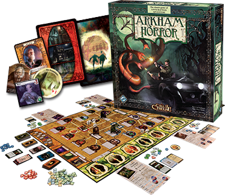
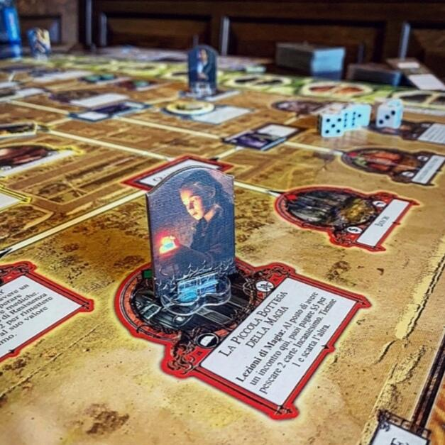

<Setting>

  Arkham. Massachusetts. Primi del '900.
   
  Sono tempi bui per la cittadina di Arkham: un orrore sconvolgente affligge gli
  abitanti, negozi e botteghe del paese faticano a restare aperti, mentre per
  strada aleggia un senso di paura misto a ribrezzo per le visioni notturne
  degli onesti cittadini americani.
   
  Un piccolo manipolo di investigatori sta cercando indizi e segni della
  presenza maligna.
   
  Libri di incantesimi vengono studiati senza sosta in cerca di spiegazioni e di
  un modo per arginare prima possibile la dilagante comparsa di orribili mostri.
   
  Portali interdimensionali si stanno aprendo in giro per la città e ne stanno
  uscendo creature che la sola mente umana non potrebbe immaginare nemmeno nel
  più recondito incubo.
   
  Se così non bastasse, se troppi portali verranno aperti, ne uscirà una
  creatura chiamata il GRANDE ANTICO, pressoché immortale, che metterebbe a dura
  prova anche i più valorosi eroi.
   
  A difenderci da questa piaga imminente, un gruppo di investigatori farà tutto
  quanto in loro potere per fermare l'avanzata delle tenebre e riportare ordine
  e pace nella fredda Arkham.
   
  Tra armi, oggetti incantati e potenti rituali magici le due fazioni di Luce ed
  Oscurità si danno battaglia senza esclusioni di colpi… Ed eccolo là, in
  lontananza nella nebbia… Arrivare il GRANDE ANTICO come risvegliato
  dall'oltretomba, che si fa largo negli stretti vicoli e mira a spegnere
  l'ultimo baluardo di luce della città. Resistere è l'unico imperativo che si
  dicono gli investigatori, Resistere all'abominio fuoriuscito da chissà quale
  mondo e rispedirlo per sempre da dove è venuto… Perché il male non può
  vincere… gli investigatori non possono essere sconfitti… Perché Arkham non può
  cadere…

</Setting>

<Rules>

  Il gioco si articola in un numero variabile di round, fino al raggiungimento
  dello scopo comune, ovvero chiudere e sigillare per sempre i portali
  dimensionali che di volta in volta si apriranno nei luoghi del tabellone o
  alla sconfitta. Durante i vari turni, i giocatori dovranno MUOVERSI verso un
  luogo o una strada della città di Arkham raffigurata sul tabellone e
  raccogliere segnalini indizio utili per chiudere i portali dai quali
  immancabilmente fuoriusciranno mostri che infesteranno la città come una piaga
  mortale. Dopo il movimento è la volta della fase INCONTRI AD ARKHAM, dove i
  giocatori dovranno pescare una carta luogo, in alternativa potranno eseguire
  l'azione speciale del luogo in cui si sono fermati (alcuni di questi luoghi
  consentono di armarsi con oggetti comuni e/o unici, imparare incantesimi,
  arruolare alleati e così via). Se in un luogo o una strada è presente un
  mostro ed il giocatore termina il suo movimento su di esso, dovrà allora
  decidere se FUGGIRE o COMBATTERE. Tutte le prove di combattimento, fuga o
  lancio di incantesimi si risolvono con il tiro dei dadi indicati dall'abilità,
  a meno di eventuali modificatori. Diversa è invece la fase degli INCONTRI NEI
  MONDI ESTERNI, ovvero le mostruose realtà nelle quali i giocatori sono
  chiamati ad addentrarsi ed esplorare, prima di poter rientrare “a casa” e
  sigillare così il portale per sempre. Al termine del round, ovvero quando
  tutti i giocatori avranno completato il proprio turno, è la volta del MALE… I
  Giocatori dovranno pescare e risolvere la prima carta nel mazzo MITI che
  riguarda l'apertura di un nuovo portale dimensionale, la comparsa di nuovi
  mostri, segnalini indizio ed altri effetti specifici di gioco o di round. Il
  ripetersi dei vari round si conclude quando i giocatori hanno chiuso e
  sigillato tutti i portali aperti ad Arkham o quando il Grande Antico si
  risveglia: in tal caso il gruppo dovrà sconfiggere in combattimento il Grande
  Antico o morire provandoci!!

</Rules>

<Feedback>

  Arkham Horror è una corsa contro il tempo per chiudere i portali da dove
  escono mostri su mostri. Giocando, questo “pressing” temporale si avverte
  abbastanza, soprattutto se il gruppo è formato da pochi giocatori. Il
  bilanciamento tra le forze del bene e del male è regolare, anche se un po' di
  cattiveria in più sui mostri viene percepita in fase di combattimento,
  soprattutto nelle abilità speciali. Le tre-quattro ore di gioco filano lisce
  come l'olio se il regolamento viene studiato dettagliatamente in anticipo: è
  un gioco pieno di regole base, ma anche di casi particolari, che spesso e
  volentieri non vengono nemmeno incontrati durante la prima partita… Questo per
  merito delle tante azioni, strategie e diversità di gioco che Arkham Horror
  offre. Purtroppo lo stesso non si può dire del COMBATTIMENTO che risulta a
  lungo andare troppo macchinoso: e prima tiro per il terrore, prima ancora
  posso provare a scappare, poi calcolo i dadi meno il contributo negativo del
  mostro per il tiro di attacco… e bla bla…Troppo macchinoso!! C'è da dire, in
  compenso, che Cthulhu e gli altri Grandi Antichi sono sfidanti, come è giusto
  che sia per non annoiarsi mai. È apprezzabile l'idea di diversificare il mazzo
  incontri nei luoghi della città dal mazzo incontri nei mondi esterni, anche se
  non fa mai piacere beccarsi in testa una pioggia di mostri rivoltanti!! Sul
  fronte dei materiali, se è vero che il tabellone e le schede dei personaggi
  (comprese di Lore) procurano una discreta soddisfazione, questa 2° edizione
  inciampa sulle “pedine” dei personaggi (ovvero un segnalino di cartone da
  mettere su un piedistallo trasparente) che sono troppo fragili e brutte da
  vedere; anche i mostri che dovrebbero far provare paura al solo pensiero sono
  ridotti in due dimensioni sopra un cartoncino colorato. Sarà colpa dell'anno
  di pubblicazione? Dopotutto parliamo del 2005 e della Fantasy Flight Games…

</Feedback>

